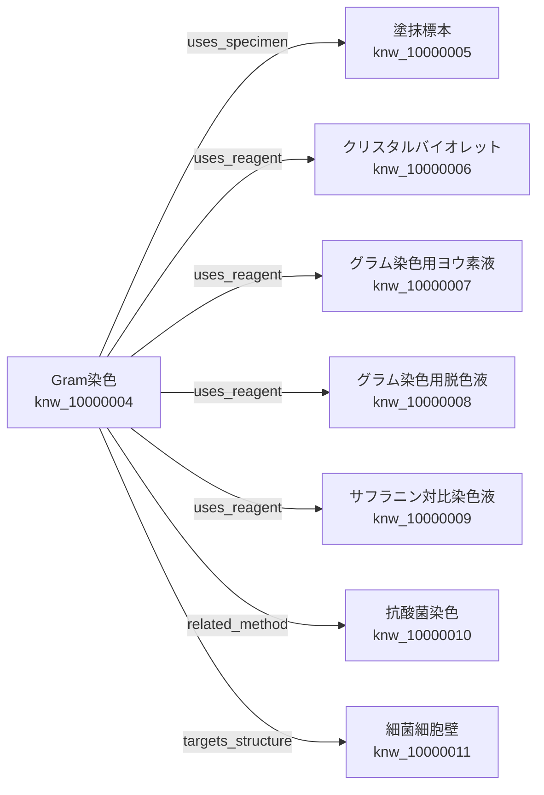

# Phase 5.8 — Production Category: Biological Structure MVP

## 目的

`biological_structure`を最小構成で正式実装し、Gram染色に残っていた`targets_structure → 細菌細胞壁`をKnowledge Growth Engineの索引だけで解決する。

このPhaseはStructure Platform全体の完成ではない。Knowledge、Relation、Growth Engine、Knowledge Networkが1つのVertical Sliceで100%接続できることを証明するMVPである。

## 正式Knowledge

| 項目 | 値 |
|---|---|
| 正式名称 | 細菌細胞壁 |
| `knowledge_id` | `knw_10000011` |
| Category | `biological_structure` |
| Template | `biological_structure_v1.0` |
| Registry Key | `structure.bacterial_cell_wall` |
| 初期Knowledge Version | 1 |
| 初期状態 | `draft` |

`draft`はRegistryへ正式保存済みであることを示すが、医学監修済み・公開承認済みという意味ではない。

## Biological Structure Schema MVP

Category共通Envelopeと、生体構造固有の本文を分離する。

| 保存項目 | JSON上の場所 | MVPでの表現 |
|---|---|---|
| 名称 | `term.canonical_name` | 共通属性 |
| 定義 | `core_facts.definitions` | 独立Claim |
| 概要 | `biological_structure.overview` | 独立Claim |
| 主な機能 | `biological_structure.main_functions` | `function_name`とClaim |
| 主な構成要素 | `biological_structure.main_components` | `component_name`とClaim |
| 存在する生物 | `biological_structure.organisms_present` | `organism_name`とClaim |
| 出典 | `evidence` | Claim単位の根拠参照 |

`structure_class`、`taxon_scope`、外部Ontology IDは未確定の値を仮実装せず、将来Phaseへ延期した。

## Completeness MVP

ユーザー承認済みの最小要件だけを採点する。

| 要件 | 重み | 扱い |
|---|---:|---|
| 定義 | 40 | 必須 |
| 主な機能 | 45 | 必須 |
| 出典 | 15 | Claimへの根拠対応 |

細菌細胞壁の初期Knowledgeは100%である。この点数は必要欄と根拠参照が揃ったことを表し、医学監修や公開承認を意味しない。

## 医学情報と出典

初期Knowledgeは、NCBI Bookshelfの医学微生物学教科書で細胞壁の形態維持、機械的保護、ペプチドグリカン、細胞壁を欠く細菌を確認し、American Society for MicrobiologyのレビューでGram染色と細胞壁構造の関係を補った。

- [Medical Microbiology, 4th edition, Chapter 2: Structure](https://www.ncbi.nlm.nih.gov/books/NBK8477/)
- [The Gram-Positive Bacterial Cell Wall](https://pmc.ncbi.nlm.nih.gov/articles/PMC11086966/)

国内の臨床検査技師国家試験出題基準・教科書との照合と医学監修は未完了である。

## Relation Resolution結果

登録前後でGram染色のKnowledge JSON本文は一致した。変更されたのは独立Relation台帳の既存1件だけである。

| 指標 | 実装前 | 実装後 |
|---|---:|---:|
| Relation総数 | 7 | 7 |
| Resolved | 6 | 7 |
| Unresolved | 1 | 0 |
| Network Completeness | 85.7% | 100.0% |

Resolution Report：

| 項目 | 結果 |
|---|---:|
| 再評価 | 1件 |
| 解決 | 1件 |
| 未解決のまま | 0件 |
| Report ID | `rpt_9f648fcec7f840578981` |

全Knowledge本文は走査していない。Resolution Indexが`biological_structure`、`targets_structure`、正規化済み名称「細菌細胞壁」を持つ未解決Relationだけを選択した。

## 完成版Knowledge Network

## Workbench確認手順

1. 「細菌細胞壁を開く」を押す
2. `Schema OK`、`Biological Structure Completeness 100%`、`knw_10000011`を確認する
3. JSONの定義、概要、主な機能、主な構成要素、存在する生物、出典を確認する
4. 編集時は操作者と変更理由を入力して「Registryへ保存」を押す
5. Registry一覧で「Gram染色」を選び「表示」を押す
6. Relation 7件、解決済み7件、未解決0件、Network Completeness 100.0%を確認する
7. 対象構造カードで`knw_10000011`、`resolved`、Relation v2を確認する

## Architecture Decision

採用した設計：

- Category IDを`biological_structure`とする
- Category共通Envelopeと構造固有本文を分離する
- MVPの各医学的事実へ安定した`claim_key`を付ける
- `targets_structure`の解決対象Categoryを`biological_structure`へ確定する
- Knowledge本文を変えず、既存Relationの`target_knowledge_id`とRelation Versionだけを更新する
- 将来項目を先回り実装せず、MVP契約を小さく保つ

採用しなかった設計：

- `anatomical_entity`と`biological_structure`を併存させる
- `structure_class`や`taxon_scope`へ仮の自由入力値を保存する
- 細菌細胞壁をGram染色本文へ複製する
- AIや曖昧一致でRelationを推測する
- Relation解決時に全Knowledgeを走査する
- PublisherへRelation固有処理を追加する

## Backup・検証

実データ登録前に`registry_20260719_165933.db`を作成した。自動テストではKnowledge Contracts、Workbench、Publisher Coreの188件が成功した。JavaScript構文、Ruff、Mypyも成功した。

Publisher Coreのソースは変更していない。AST、Gram染色、抗酸菌染色、Specimen、Reagent、Biological Structureの回帰経路を確認した。

## Technical Debt

- `structure_class` Vocabularyと分類別Completeness
- `taxon_scope`とNCBI Taxonomy対応
- `biological_process`、`substance`、`microorganism` Category
- Uberon、Cell Ontology、Gene Ontology等の外部Ontology Mapping
- `part_of`、`has_part`、`composed_of`等のRelation Vocabulary
- 国内出典との照合、医学監修、Registry承認
- 複数プロセスでの保存イベント配信、再試行、失敗通知
- Network Completenessは接続率であり、Relationの医学的妥当性を直接評価しない
