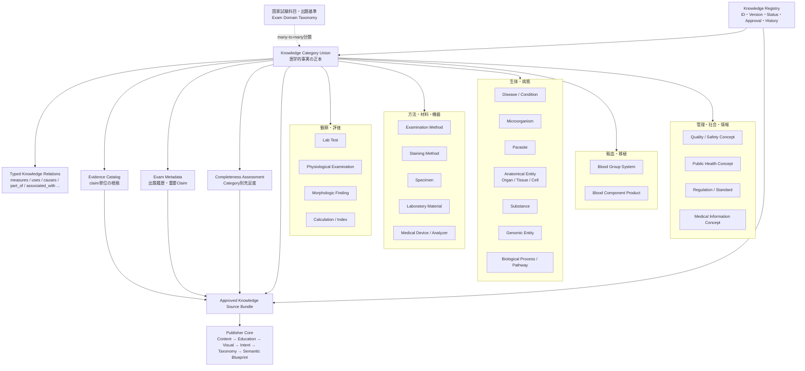
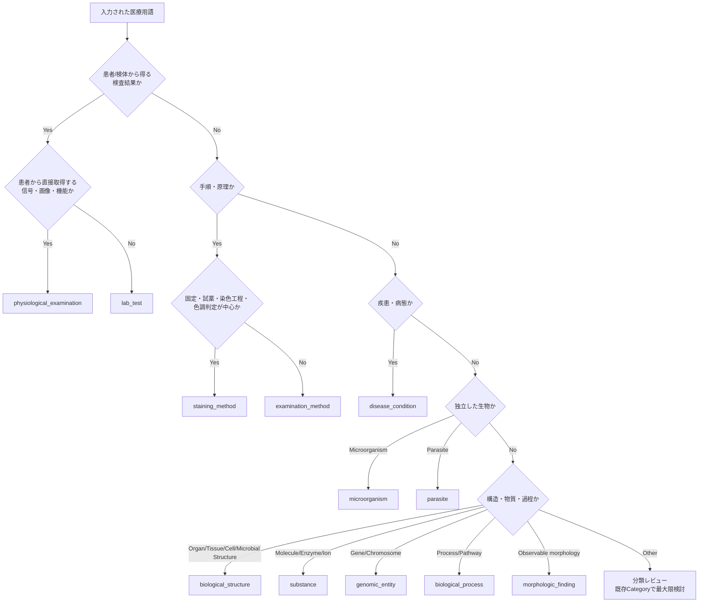

# Phase 5.0 Knowledge Domain Architecture

## 0. 文書情報

| 項目 | 内容 |
|---|---|
| 文書の目的 | 臨床検査技師国家試験で扱う医学知識全体を、10年以上運用できるKnowledge Domainとして整理する |
| 対象 | Medical Knowledge EngineのKnowledge Platform |
| 位置づけ | Category Union実装前の設計資料 |
| 基準日 | 2026-07-18 |
| 状態 | 設計案・プロダクトオーナーレビュー対象 |
| 今回変更しないもの | Knowledge Schema、Registry、Publisher Core、PDF Adapter、各Renderer |

この文書はJSON Schemaの仕様書ではありません。「どの医学用語を、どのCategoryの正本として管理するか」を決める全体設計です。具体的なフィールド型、必須条件、移行方法は、各Categoryを実装するPhaseでこの設計に従って確定します。

> **Phase 5.8追補**  
> [Structure Domain Review](structure_domain_review.md)の設計は承認され、`anatomical_entity`を増設せず`biological_structure`へ置き換えた。Phase 5.8では細菌細胞壁1件だけをMVP実装し、`structure_class`と`taxon_scope`は将来Phaseへ延期している。

---

## 1. 結論

BLUPRNT Labでは、国家試験の**科目**とKnowledgeの**Category**を分離します。

- 国家試験科目・領域は「どこで出題されるか」を示す。1つのKnowledgeが複数領域に属してよい
- Knowledge Categoryは「その用語が何であるか」を示す。1つのKnowledgeは原則1つの主Categoryだけを持つ
- 別Categoryの事実は同じJSONへ複製せず、`knowledge_id`間のRelationで結ぶ
- Exam Metadata、Registry、Evidence、Completeness、Publisher ProfileはKnowledge本文と別の責務として維持する
- Category差分は巨大な任意項目の集合ではなく、Category Unionの専用モデルで表現する

提案するKnowledge Categoryは22種類です。これは22個の独立システムを作るという意味ではありません。共通のKnowledge EnvelopeとClaim契約を使い、Category専用部分だけを切り替えます。

### 1.1 最重要の分類原則

同じ文字列でも、意味が異なれば別Knowledgeです。

| 入力例 | 正本Category | 分離する関連Knowledge |
|---|---|---|
| AST検査 | `lab_test` | ASTという酵素は`substance`、IFCC法は`examination_method`、血清は`specimen` |
| Gram染色 | `staining_method` | crystal violet等は`laboratory_material`、対象菌は`microorganism` |
| ABO | `blood_group_system` | ABO血液型検査は`lab_test`、オモテ検査の手順は`examination_method` |
| PCR | `examination_method` | 特定病原体PCR検査は`lab_test`、標的遺伝子は`genomic_entity` |
| 尿沈渣 | `lab_test` | 尿は`specimen`、赤血球・円柱等は`morphologic_finding` |
| MDS | `disease_condition` | 染色体異常は`genomic_entity`、異形成は`morphologic_finding` |

Workbenchで入力語の意味が一意でない場合は、AIが勝手に統合せず、どのKnowledgeを作るか利用者に選択させる設計が必要です。

---

## 2. 設計の根拠と対象範囲

領域漏れを防ぐ基準として、厚生労働省の「令和7年版臨床検査技師国家試験出題基準」と、臨床検査技師学校養成所指定規則の教育内容を参照しました。

養成所指定規則は、病態、血液、病理、尿・糞便等一般、生化学・免疫、遺伝子・染色体、輸血・移植、微生物、生理、臨床検査総合管理、医療安全に加え、人体構造、保健医療福祉、医療工学・医療情報を教育範囲として示しています。また実習には心電図、肺機能、脳波、超音波、血液型、培養・Gram染色、精度管理、機器メンテナンス、検体採取等が含まれます。

したがって、検査項目・疾患・微生物だけでは国家試験全体を表現できません。方法、検体、形態、装置、品質、制度を独立して再利用できる構造が必要です。

### 2.1 公式資料

- [厚生労働省：令和7年版臨床検査技師国家試験出題基準について](https://www.mhlw.go.jp/stf/seisakunitsuite/bunya/0000088793_00004.html)
- [厚生労働省：臨床検査技師学校養成所指定規則](https://www.mhlw.go.jp/web/t_doc?dataId=80023000&dataType=0&pageNo=1)

---

## 3. Knowledge Domain Map



### 3.1 責務の境界

| コンポーネント | 正本として管理するもの | 管理しないもの |
|---|---|---|
| Knowledge Record | 医学的事実、事実間Relation、根拠への参照 | 出題履歴、承認操作、教材文章、見た目 |
| Knowledge Registry | `knowledge_id`、`claim_id`、`claim_key`、版、状態、承認、履歴、検索用Alias | 医学事実のCategory構造、Publisher表現 |
| Evidence Catalog | 資料と参照位置、支援Claim、根拠の役割 | Claim本文、出題頻度 |
| Exam Metadata | 出題履歴、重要度、重要Claim、誤答傾向 | 医学的事実そのもの |
| Completeness Assessment | Category別の不足、得点、判定理由 | 医学的事実、承認状態 |
| Publisher Profiles | 掲載内容、教育順、図解、配置、デザイン | 医学的事実の新規作成・修正 |

### 3.2 「科目」と「Category」を分ける理由

ASTは生化学だけでなく、病態、酵素測定、精度管理でも問われます。Gram染色は微生物検査、染色法、形態、検体取扱いにまたがります。科目ごとにKnowledgeを複製すると、片方だけが更新されて矛盾します。

そのため、`exam_domain_refs`は複数付与できる分類情報とし、医学的な正本は1件だけにします。

### 3.3 国家試験領域からCategoryへの対応例

| 国家試験・教育領域 | 主に利用するKnowledge Category |
|---|---|
| 血液学的検査 | `lab_test`、`disease_condition`、`biological_structure`、`morphologic_finding`、`substance`、`examination_method` |
| 病理学的検査 | `disease_condition`、`biological_structure`、`morphologic_finding`、`staining_method`、`examination_method` |
| 尿・糞便等一般検査 | `lab_test`、`specimen`、`morphologic_finding`、`parasite`、`examination_method` |
| 生化学・免疫学的検査 | `lab_test`、`substance`、`biological_process`、`examination_method`、`medical_device` |
| 遺伝子・染色体検査 | `genomic_entity`、`examination_method`、`lab_test`、`disease_condition` |
| 輸血・移植検査 | `blood_group_system`、`blood_component_product`、`lab_test`、`examination_method`、`disease_condition` |
| 微生物学的検査 | `microorganism`、`staining_method`、`laboratory_material`、`examination_method`、`specimen` |
| 生理学的検査 | `physiological_examination`、`biological_structure`、`medical_device`、`disease_condition` |
| 臨床検査総合管理・医療安全 | `quality_safety_concept`、`specimen`、`medical_device`、`regulation_standard`、`medical_information_concept` |
| 公衆衛生・保健医療福祉 | `public_health_concept`、`calculation_index`、`regulation_standard`、`disease_condition` |

これは固定の1対1対応ではありません。出題基準改訂時はExam Domain Taxonomyとの対応を更新し、Knowledge Category本体は変更しない方針です。

---

## 4. Category一覧と責務

### 4.1 観察・評価Category

| Category ID | 日本語名 | 目的 | 含む例 | 含めないもの |
|---|---|---|---|---|
| `lab_test` | 検査項目 | 検体から得る検査結果と、その臨床的解釈を表す | AST、HbA1c、ABO血液型検査、尿沈渣 | AST酵素そのもの、一般的なPCR原理、生理検査 |
| `physiological_examination` | 生理検査 | 患者から直接取得する生理信号・画像・機能評価を表す | 心電図、肺機能、脳波、超音波 | 採血後の検体検査、装置そのもの |
| `morphologic_finding` | 形態所見 | 細胞・組織・微生物等の観察可能な形態を再利用可能な知識として表す | Auer小体、過分葉好中球、尿円柱、核異型 | 細胞そのもの、疾患全体、染色手順 |
| `calculation_index` | 計算式・指標 | 入力値から導出される式、単位、前提、解釈を表す | De Ritis比、MCV、eGFR、疫学指標の式 | 生データの検査項目、一般的な統計概念全体 |

### 4.2 方法・材料・機器Category

| Category ID | 日本語名 | 目的 | 含む例 | 含めないもの |
|---|---|---|---|---|
| `examination_method` | 検査法・測定法 | 採取、分離、測定、検出、同定等の再利用可能な方法原理を表す | IFCC法、PCR、ELISA、電気泳動、培養法 | 特定患者の結果、染色法の固有判定 |
| `staining_method` | 染色法 | 固定、試薬、工程、染色結果、判定、精度管理を一体として表す | Gram染色、Ziehl-Neelsen染色、PAS染色 | 色素単体、染色対象の菌・組織 |
| `specimen` | 検体 | 採取される材料と、採取・容器・保存・安定性・拒否条件を表す | 血清、EDTA血、髄液、喀痰、尿 | 検査結果、臓器そのもの |
| `laboratory_material` | 試薬・培地・検査材料 | 検査で使用する混合物・製剤・培地・固定液等の用途と特性を表す | crystal violet液、Lugol液、血液寒天培地、EDTA採血管、緩衝液 | 単一化学物質、生体内物質、製品在庫・ロット管理 |
| `medical_device` | 医療機器・分析装置 | 装置の測定原理、構成、入出力、校正、保守、故障、安全を表す | 分光光度計、自動分析装置、顕微鏡、遠心機 | 装置を使う検査法、個別メーカーの販売情報 |

### 4.3 生体・病態Category

| Category ID | 日本語名 | 目的 | 含む例 | 含めないもの |
|---|---|---|---|---|
| `disease_condition` | 疾患・病態 | 疾患、症候群、病態の定義・原因・病態・所見・診断・鑑別を表す | 巨赤芽球性貧血、MDS、肝細胞障害 | 病原体そのもの、単一形態所見 |
| `microorganism` | 微生物 | 細菌・真菌・ウイルス等の分類、性状、病原性、培養、同定、耐性を表す | 黄色ブドウ球菌、大腸菌、インフルエンザウイルス | 寄生虫、感染症全体、培地単体 |
| `parasite` | 寄生虫 | 原虫・蠕虫・節足動物等の形態、生活環、宿主、感染経路、検査を表す | 蟯虫、マラリア原虫、日本住血吸虫 | 寄生虫症全体、検査法単体 |
| `biological_structure` | 臓器・組織・細胞・微生物構造 | 生体構造を共通Categoryで表し、将来`structure_class`と`taxon_scope`で区別する | 肝臓、骨髄、赤血球、細菌細胞壁 | 疾患、形態異常、分子、過程 |
| `substance` | 生体物質・化学物質 | 分子・イオン・酵素・蛋白・ホルモン・抗原・抗体等の性質と生理的役割を表す | AST酵素、HbA1c、ビリルビン、IgG、Na⁺ | 検査用混合試薬、検査結果 |
| `genomic_entity` | 遺伝子・染色体 | 遺伝子、染色体、座位、変異、核型等の構造と医学的意味を表す | BCR::ABL1、21番染色体、遺伝子変異 | PCR法、疾患全体 |
| `biological_process` | 生物学的過程・経路 | 複数の物質・細胞・臓器が関わる反応・代謝・免疫・凝固等の流れを表す | 解糖系、凝固カスケード、補体活性化、糖化 | 単一物質、教材用の説明順 |

### 4.4 輸血・移植Category

| Category ID | 日本語名 | 目的 | 含む例 | 含めないもの |
|---|---|---|---|---|
| `blood_group_system` | 血液型システム | 抗原・抗体・遺伝・表現型・適合関係を一つの系として表す | ABO、Rh、Kell | ABO血液型検査の操作、輸血副反応 |
| `blood_component_product` | 血液製剤・成分 | 製剤の由来、成分、適応、保存、取扱い、適合、安全性を表す | 赤血球製剤、血小板製剤、FFP | 血液型システム、交差適合試験、輸血副反応 |

「輸血関連」を1つの巨大Categoryにはしません。交差適合試験は`lab_test`または`examination_method`、輸血副反応は`disease_condition`として扱います。HLA遺伝子は`genomic_entity`、HLA抗原は`substance`、組織適合性検査は`lab_test`へ分け、Relationで結びます。

### 4.5 管理・社会・情報Category

| Category ID | 日本語名 | 目的 | 含む例 | 含めないもの |
|---|---|---|---|---|
| `quality_safety_concept` | 品質管理・安全管理 | 精度、誤差、管理規則、是正、検査室安全、リスク管理を表す | 内部精度管理、外部精度評価、Westgard rule、標準予防策 | 個別装置の保守手順、法令全文 |
| `public_health_concept` | 公衆衛生概念 | 疫学、予防、スクリーニング、保健統計、環境・職業衛生、保健制度の概念を表す | 罹患率、コホート研究、ポピュレーション戦略 | 計算式そのもの、時点依存の法令本文 |
| `regulation_standard` | 法令・規格・指針 | 管轄、版、施行期間、要求事項、適用対象を持つ規範的知識を表す | 保健衛生法規、検査室規格、公式ガイドラインの要求事項 | 一般的な医学的事実、引用元の書誌情報 |
| `medical_information_concept` | 医療情報・データ概念 | 医療情報システム、データ形式、情報安全、信号・データ処理の概念を表す | LIS、標準コード、情報セキュリティ、AD・DA変換 | 装置本体、法令、個別患者データ |

### 4.6 Category境界ルール

| 迷いやすい境界 | 判断規則 |
|---|---|
| 検査項目 / 検査法 | 得られる結果と臨床解釈が主なら`lab_test`、複数検査で再利用する原理・手順が主なら`examination_method` |
| 検査法 / 染色法 | 固定・複数試薬・順序・色調判定を一体で扱う場合は専用の`staining_method`を優先する |
| 生体物質 / 検査材料 | 分子や単一化学物質としての性質は`substance`、検査用に調製された溶液・培地・製剤・器材は`laboratory_material` |
| 正常細胞 / 形態所見 | 細胞そのものは`biological_structure`、観察される異常形態や識別所見は`morphologic_finding` |
| 病原体 / 感染症 | 生物そのものは`microorganism`または`parasite`、患者の疾患・病態は`disease_condition` |
| 公衆衛生概念 / 計算式 | 疫学的意味・用途は`public_health_concept`、再利用可能な数式と変数定義は`calculation_index` |
| 品質概念 / 法令・規格 | 管理の意味・判定・是正は`quality_safety_concept`、発行主体・版・有効期間を持つ要求は`regulation_standard` |

専用Categoryが一般Categoryの一種に見える場合も、1件のKnowledgeへ2つの主Categoryを付けません。共有できるProcedure StepやQualifierは内部の共通部品として合成し、Category discriminatorは一意に保ちます。

---

## 5. 全Category共通属性

全Categoryは、共通EnvelopeとCategory専用Contentを合成します。共通Envelopeは「どのCategoryでも意味が同じもの」だけを持ちます。

### 5.1 Knowledge Common Envelope

| 属性群 | 主な項目 | 役割 | 正本の所有者 |
|---|---|---|---|
| Contract | `schema_version`、`category_profile_version` | 読み取り契約とCategory定義の版 | Knowledge Contracts |
| Identity | `knowledge_id`、`primary_category` | 永続IDと主Category | RegistryがID正本、Knowledgeは参照 |
| Version reference | `knowledge_version` | どのKnowledge版の内容か | Registry |
| Terminology projection | `canonical_name`、`display_name`、`scientific_name`、`abbreviations`、`aliases` | 表記揺れと曖昧性を識別する可搬スナップショット | Registry/用語辞書が正本 |
| Classification | `entity_kind`、`exam_domain_refs`、`external_codes` | Category内の種類、複数試験領域、外部語彙への参照 | Knowledge |
| Definition | 1つ以上の原子的Definition Claim | そのKnowledgeが何かを事実として定義する | Knowledge/Claim Registry |
| Relations | `relation_type`、`target_knowledge_id`、`claim_id`、方向、条件 | 別Knowledgeを重複せず結ぶ | Knowledge/Claim Registry |
| Evidence refs | Claimごとの`evidence_id`参照 | 事実の根拠を追跡する | Evidence Catalogが書誌正本 |
| Qualifiers | 対象集団、検体、方法、条件、地域、時点等 | 「いつ・何に対して正しいか」を限定する | 各Claim |

### 5.2 Claimの共通契約

すべての医学的事実は、PublisherとExam Metadataが必要な事実だけを取得できる粒度に分けます。

最低限、各Claimは次を識別できる必要があります。

- `claim_id`：Registryが発行する内部の永続ID
- `claim_key`：医学的意味に対する安定キー
- `claim_version`：医学的意味の版
- Category内の保存位置または意味型
- 構造化された値
- 必要なQualifier
- 支えるEvidenceへの参照
- Relationの場合は相手の`knowledge_id`

配列全体へ1つのClaimを付けません。たとえば「高値疾患5件」は、疾患ごとに独立Claimとします。1件だけ廃止・訂正しても他のリンクが切れないためです。

### 5.3 共通Envelopeへ入れないもの

| 入れない情報 | 管理先 | 理由 |
|---|---|---|
| 出題回、出題頻度、重要度 | Exam Metadata | 医学的事実と更新理由が異なる |
| 承認状態、操作者、履歴 | Registry | 運用情報であり医学知識ではない |
| Completeness Score、不足一覧 | Completeness Assessment | 評価規則の版をKnowledgeから分離する |
| 読み物としての`summary` | Publisher | 共通Envelopeには原子的なDefinition Claimを置き、読みやすい要約文は用途別に生成する |
| PDF/note/動画の文章 | Publisher | 表示・教育表現であり正本ではない |
| `publish_targets`、掲載優先順 | Content/Education Profile | Phase 3以降の責務分離によりKnowledgeでは不要。既存項目は将来移行対象 |
| 色、座標、図、画像、Prompt | Publisher/Asset/Renderer | 医学的事実ではない |
| URLや書誌情報の完全な複製 | Evidence Catalog | 同じ資料を複数Claimから再利用するため |

### 5.4 正本とPublisher用Projection

正本の重複を避けても、Publisherが何度も別データを探す必要はありません。Medical Knowledge Engineが承認済みSource Bundleを組み立てる際、Relation先の必要なClaimを読み取り専用Projectionとして同梱できます。

例としてAST教材では、`lab_test`がIFCC法の`knowledge_id`を参照し、測定原理の正本は`examination_method`が所有します。Source BundleにはIFCC法の承認済み原理Claimを展開できるため、Publisherは医学的意味を推測せずに表示できます。

- 正本：各事実を最も適切なCategoryに1回だけ保存
- Projection：出力に必要な承認済みClaimをBundleへ読み取り専用で展開
- 更新：元Claimが変わればProjectionを再生成
- 禁止：Projectionを編集して正本へ逆流させること

---

## 6. Category専用属性

以下は「保存場所を決めるための論理属性」です。実装時のJSON名を確定するものではありません。

### 6.1 観察・評価

| Category | Category専用属性 |
|---|---|
| `lab_test` | 検査目的、測定対象`substance`参照、検体参照、方法参照と検査固有条件、単位、基準範囲と条件、高値/低値の病態・疾患Relation、組合せ検査、比較検査、干渉物質、前分析/分析/後分析上の注意、結果解釈。一般的な測定原理の正本は参照先`examination_method`が持つ |
| `physiological_examination` | 検査目的、対象臓器/機能、患者準備、体位、センサー/プローブ、実施手順、取得信号/画像、測定指標、正常所見、異常所見、アーチファクト、禁忌、安全上の注意 |
| `morphologic_finding` | 観察対象、検体、観察方法/染色、形・大きさ・色・分布・構造、鑑別所見、関連疾患/微生物/寄生虫、偽所見・アーチファクト |
| `calculation_index` | 式、変数と参照Knowledge、入力単位、出力単位、適用条件、前提、丸め、基準/閾値、解釈、適用不能条件、代表計算例の事実値 |

### 6.2 方法・材料・機器

| Category | Category専用属性 |
|---|---|
| `examination_method` | 方法種別、目的、原理、入力/対象、必要検体、試薬、装置、工程、検出方式、出力、校正、精度管理、干渉、限界、安全、適用する検査項目 |
| `staining_method` | 目的、対象、適切な検体/標本、前処理、固定法、試薬と役割、順序付き工程、各工程の目的、陽性/陰性または色調判定、対照、精度管理、失敗像、注意、関連染色法 |
| `specimen` | 由来部位、採取法、必要量、容器、添加剤、患者準備、搬送条件、保存温度/時間、安定性、前処理、拒否条件、感染性/安全、適用検査 |
| `laboratory_material` | 材料種別、成分、作用/役割、調製、使用条件、保存、安定性、対象、期待反応、品質確認、危険性、代替/類似材料。商品名やロットは別運用データ |
| `medical_device` | 装置種別、目的、動作/測定原理、主要構成、入力、出力、消耗品、校正、保守、精度管理、エラー/故障、干渉、安全、利用する方法 |

### 6.3 生体・病態

| Category | Category専用属性 |
|---|---|
| `disease_condition` | 疾患種別、病因、危険因子、病態生理、影響臓器、症候、代表検査所見、形態所見、診断上の要点、鑑別、合併症、経過。治療詳細は国家試験上必要な範囲のみ |
| `microorganism` | 分類、形態、Gram性/構造、酸素要求性、発育条件、生化学性状、培地、同定試験、病原因子/毒素、感染症、感染経路、検体、検出法、薬剤感受性、耐性機構、感染対策 |
| `parasite` | 分類、形態、各発育段階、宿主、寄生部位、生活環、感染形態、診断形態、感染経路、疾患、検体、検査法、地理/疫学、鑑別、安全上の注意 |
| `biological_structure` | MVPは概要、主機能、主な構成要素、存在する生物。将来`structure_class`、Taxon範囲、上位/下位構造、位置、正常形態を追加し、臓器・組織・細胞・微生物構造は`part_of`等で結ぶ |
| `substance` | 物質種別、構造/組成、産生部位、存在部位、代謝/排泄、生理作用、反応、半減期等の性質、関連経路、関連疾患、測定する検査。検査値は`lab_test`へ保存 |
| `genomic_entity` | `entity_kind`、位置/座位、構造、正常機能、遺伝形式、代表変異/異常、関連疾患、検出方法、命名体系、解釈上の条件 |
| `biological_process` | 過程種別、開始条件、入力、順序付き段階、関与物質/細胞/臓器、調節、出力、阻害/促進、異常時の結果、関連検査/疾患 |

### 6.4 輸血・移植

| Category | Category専用属性 |
|---|---|
| `blood_group_system` | 抗原、対応抗体、遺伝子/遺伝形式、表現型、検査反応、亜型、適合規則、臨床的意義、関連疾患/副反応、関連検査法 |
| `blood_component_product` | 製剤種別、原料/成分、製造・処理、適応、用量に関する原則、保存、使用期限の根拠、取扱い、血液型適合、照射/洗浄等、リスク、副反応Relation |

### 6.5 管理・社会・情報

| Category | Category専用属性 |
|---|---|
| `quality_safety_concept` | 概念種別、対象工程、目的、指標、管理限界、判定規則、エラー種別、検出、是正/予防、記録、責任、安全リスク、関連規格 |
| `public_health_concept` | 概念種別、対象集団、定義、分子/分母または評価方法、適用場面、解釈、バイアス/交絡、予防段階、制度上の役割、関連指標 |
| `regulation_standard` | 種別、正式名称、発行主体、管轄、版/改訂、発効日、失効日、適用対象、要求事項、例外、更新確認日。条文全文は保存せず参照する |
| `medical_information_concept` | 概念種別、目的、入力データ、処理、出力、データ型/形式、相互運用、機密性・完全性・可用性、リスク、関連装置/システム/規格 |

---

## 7. Completeness設計

### 7.1 Schema Validationとの違い

- Schema Validation：Categoryとして形が正しいか
- Category Completeness：そのKnowledgeを国家試験教材の医学的正本として使うための情報が揃っているか
- Exam Completeness：過去問、頻度、重要Claim等の国家試験データが揃っているか
- Approval：人が根拠を確認し、正本として承認したか

これらは別判定です。`Schema OK / Category 38% / Exam 70% / draft`は正常な状態として表現できます。

### 7.2 全Category共通の登録ゲート

| ゲート | 条件 |
|---|---|
| Draft登録 | 永続ID、主Category、正式名、Definition Claimがある |
| Owner Reviewへ | CategoryのCritical項目が入力済みまたは不足理由が記録される |
| Medical Reviewへ | Critical/Required Claimが原子的で、主要ClaimにEvidence参照がある |
| Approved | Schema OK、Critical不足0、Required不足0、または医学監修者が`not_applicable`を理由付き承認。Registry Validation OK |
| Publisher利用 | `approved`のClaimのみ。用途別にExam Completeness等の追加ゲートを適用 |

`unknown`と`not_applicable`は区別します。`unknown`は不足として残り、推測で埋めません。`not_applicable`は理由・判定者・日時がある場合だけ分母から除外できます。

### 7.3 Category別の最低完成条件

以下の「最低完成条件」はApprovedへ進むためのCritical/Required候補です。任意項目はCompleteness改善候補には出しますが、存在しない事実を作りません。

| Category | 正式登録に最低限必要な情報 |
|---|---|
| `lab_test` | 目的、測定対象、検体、少なくとも1つの方法参照、参照先から取得可能な測定原理、結果/単位、基準または判定方法、代表的な高/低・陽/陰解釈、注意 |
| `physiological_examination` | 目的、対象臓器/機能、準備、標準手順、取得情報、正常/異常判定、主なアーチファクト、安全 |
| `morphologic_finding` | 観察対象、検体、観察法、定義的形態、鑑別、代表的関連Knowledge |
| `calculation_index` | 式、全変数、単位、適用条件、出力解釈、適用不能条件 |
| `examination_method` | 目的、原理、入力、必須材料/装置、順序、検出/出力、QC、限界 |
| `staining_method` | 目的、対象、固定、全必須試薬と役割、順序付き工程、判定結果、対照/QC、代表的失敗 |
| `specimen` | 由来、採取、容器/添加剤、保存/搬送、安定性、拒否条件、安全 |
| `laboratory_material` | 種別、成分または定義、役割、使用条件、保存、品質確認、安全 |
| `medical_device` | 目的、原理、主要構成、入力/出力、校正/QC、保守、代表エラー、安全 |
| `disease_condition` | 定義、病因/成立機序、主要病態、代表所見、代表検査所見、診断要点、主要鑑別 |
| `microorganism` | 分類、形態/構造、発育性状、培地、同定試験、主要病原因子、代表感染症、検体/検出、耐性または非該当理由 |
| `parasite` | 分類、主要形態、宿主/寄生部位、生活環、感染形態、診断形態、感染経路、検体/検査、代表疾患 |
| `biological_structure` | MVPは定義、主機能、出典。将来は構造分類ごとに上位構造、位置、正常構造等のCompletenessを分岐する |
| `substance` | 種別、構造/性質、産生/存在、主作用、代謝または消失、関連検査/病態 |
| `genomic_entity` | 種別、位置、正常構造/機能、代表異常、関連疾患、検出法 |
| `biological_process` | 開始/入力、順序付き段階、主要参加者、調節、出力、異常時の影響 |
| `blood_group_system` | 主要抗原、抗体、遺伝、表現型、反応、適合、臨床的意義、検査 |
| `blood_component_product` | 成分、適応、保存、取扱い、適合、安全/副反応、主要加工 |
| `quality_safety_concept` | 定義、対象工程、目的、判定規則、異常時対応、記録/追跡、安全上の意味 |
| `public_health_concept` | 定義、対象集団、算定/評価方法、適用場面、解釈、主要バイアスまたは限界 |
| `regulation_standard` | 正式名、発行主体、管轄、版、発効/有効状態、適用対象、主要要求、参照URL、確認日 |
| `medical_information_concept` | 定義、目的、入力、処理、出力、リスク/安全、関連規格またはシステム |

### 7.4 採点方針

- 重みはCategoryごとの版付きCompleteness Profileで管理する
- Critical不足はスコアだけでなくBlockerとして表示する
- Required不足は大きく減点し、Approvedを止める
- Optionalは少量加点または改善候補に使い、承認を止めない
- Evidenceの有無と医学内容の有無を別々に報告する
- Category追加時は、共通エンジンを変更せずCompleteness Profileを追加する
- 100%という数字だけで承認しない。人の医学レビューとRegistry statusが最終ゲート

---

## 8. Publisher接続設計

### 8.1 共通原則

Knowledge CategoryはPublisherを知りません。Publisher側がCategory Adapter/Profileを持ち、承認済みClaimを次の順で利用します。

1. Content Profile：掲載するClaim型を選ぶ
2. Education Profile：学習目的に合わせて順序・深さを決める
3. Visual Profile：図解候補を選ぶ
4. Diagram Intent：図で理解させる意味を選ぶ
5. Diagram Taxonomy：図解分類IDを参照する
6. Semantic Blueprint：Conceptへ承認済みClaimを推測なしで割り当てる

### 8.2 Category別接続表

| Category | Content | Education | Visual | Diagram Intent | Taxonomy | Semantic Blueprintの主Concept/Relation |
|---|---|---|---|---|---|---|
| `lab_test` | 目的・検体・方法・原理・解釈・比較 | 定義→最重要→比較→方法→注意 | reaction、comparison、organ distribution | Measurement Principle、Comparison、Diagnostic Flow | measurement、comparison | sample→reaction→detection→result、compares |
| `physiological_examination` | 準備・手順・波形/画像・判定・artifact | 準備→取得→正常→異常→注意 | waveform、organ、workflow | Laboratory Workflow、Organ Relationship、Diagnostic Flow | physiology、workflow | patient→sensor→signal→finding |
| `morphologic_finding` | 観察条件・特徴・鑑別・関連疾患 | 見分け方→鑑別→落とし穴 | annotated specimen、comparison | Cell Morphology、Comparison | morphology | specimen contains finding、finding compares finding |
| `calculation_index` | 式・変数・単位・条件・解釈 | 意味→式→代入→解釈→例外 | formula flow、comparison | Calculation Flow、Comparison | calculation | inputs→derivation→result |
| `examination_method` | 原理・材料・工程・検出・QC・限界 | 目的→原理→工程→判定→誤差 | workflow、reaction、device | Measurement Principle、Laboratory Workflow | method | input→process→detection→output |
| `staining_method` | 固定・試薬・工程・色調・QC | 目的→原理→工程→判定→失敗 | staining process、cell wall、comparison | Laboratory Workflow、Biochemical Reaction、Comparison | workflow.staining | specimen→fixation→reagents→stain result |
| `specimen` | 採取・容器・保存・拒否 | 採取→搬送→保存→不適例 | tube、workflow、timeline | Laboratory Workflow、Comparison | preanalytics.specimen | patient/source→collection→transport→test |
| `laboratory_material` | 成分・役割・使用・保存・安全 | 何に使う→作用→扱い→注意 | reagent role、comparison | Biochemical Reaction、Laboratory Workflow | material | material acts_on target、used_by method |
| `medical_device` | 原理・構成・入出力・校正・故障 | 原理→構成→操作→QC→安全 | device block、signal flow | Measurement Principle、Laboratory Workflow | device | sample/signal→device→measurement |
| `disease_condition` | 病因・病態・所見・検査・鑑別 | 原因→病態→所見→検査→鑑別 | disease mechanism、organ、comparison | Disease Mechanism、Diagnostic Flow、Comparison | disease | cause→damage→finding→diagnosis |
| `microorganism` | 分類・形態・培地・同定・毒素・耐性 | 形態→培地→同定→病原性→耐性 | cell、culture、ID flow | Cell Morphology、Laboratory Workflow、Disease Mechanism | microorganism | organism grows_on medium、produces toxin、causes disease |
| `parasite` | 形態・生活環・宿主・感染・診断 | 感染形態→生活環→診断形態→検査 | life cycle、morphology、host map | Life Cycle、Cell Morphology、Diagnostic Flow | parasite | stage→host→site→diagnostic stage |
| `biological_structure` | 構造・位置・機能・階層 | 全体→部位→機能→関連病態 | organ、cell、microbial structure、hierarchy | Organ Relationship、Cell Morphology | anatomy / cellular component | part_of、contains、performs |
| `substance` | 性質・産生・作用・代謝・関連検査 | 由来→作用→代謝→検査 | molecule、pathway、organ distribution | Biochemical Reaction、Signal Pathway | substance | produced_by、converted_to、measured_by |
| `genomic_entity` | 位置・機能・異常・疾患・検出 | 正常→異常→影響→検出 | chromosome、gene flow、comparison | Signal Pathway、Disease Mechanism、Measurement Principle | genomics | variant affects process、detected_by method |
| `biological_process` | 入力・段階・調節・出力・異常 | 正常フロー→調節→破綻→所見 | pathway、cascade、feedback | Signal Pathway、Biochemical Reaction、Disease Mechanism | pathway | activates、inhibits、converted_to、flows_to |
| `blood_group_system` | 抗原・抗体・遺伝・反応・適合 | 抗原→抗体→判定→適合→例外 | reaction、inheritance、compatibility table | Biochemical Reaction、Comparison、Diagnostic Flow | transfusion.blood_group | antigen reacts_with antibody、compatible_with |
| `blood_component_product` | 成分・適応・保存・適合・リスク | 製剤選択→適合→取扱い→副反応 | product comparison、workflow | Comparison、Laboratory Workflow | transfusion.product | product contains component、indicated_for、risk_of |
| `quality_safety_concept` | 指標・規則・異常・是正 | 監視→逸脱→原因→是正→予防 | control chart、decision flow | Laboratory Workflow、Diagnostic Flow | quality | observation exceeds limit→action |
| `public_health_concept` | 定義・集団・評価・解釈・限界 | 集団→測定→比較→介入 | population flow、study comparison | Comparison、Diagnostic Flow、Timeline | public_health | population→measure→interpretation |
| `regulation_standard` | 適用対象・要求・期限・例外 | 適用範囲→要求→実務→注意 | hierarchy、compliance flow | Laboratory Workflow、Comparison | governance | standard requires action、applies_to |
| `medical_information_concept` | 入力・処理・出力・安全 | データ入力→処理→保存→利用→保護 | data flow、system architecture | Laboratory Workflow、Signal Pathway | medical_information | system receives data、transforms、sends |

### 8.3 接続時の禁止事項

- Content ProfileがCategory不足を文章で補完しない
- Education Profileが語呂や覚え方をKnowledgeへ書き戻さない
- Visual Profileが医学的Relationを新しく推測しない
- Diagram TaxonomyをKnowledge Categoryの代わりに使わない
- Semantic Blueprint Resolverが未承認Claimまたは一致しないClaimを割り当てない
- Publisher都合で`claim_key`を作り直さない

---

## 9. Category間Relation

Categoryを分けるだけでは知識が断片化します。Relationを医学的事実としてClaim単位で管理することが重要です。

### 9.1 初期Relation Vocabulary候補

| Relation | 例 |
|---|---|
| `is_a` | 好中球 is_a 白血球 |
| `part_of` | 肝小葉 part_of 肝臓 |
| `contains` | 赤血球製剤 contains 赤血球 |
| `measures` | AST検査 measures AST活性 |
| `uses_specimen` | HbA1c検査 uses_specimen EDTA全血 |
| `uses_method` | AST検査 uses_method IFCC法 |
| `uses_material` | Gram染色 uses_material crystal violet液 |
| `uses_device` | 吸光度測定 uses_device 分光光度計 |
| `produced_by` | AST produced_by 肝細胞等 |
| `converted_to` | 基質 converted_to 生成物 |
| `causes` | 毒素 causes 病態 |
| `associated_with` | 過分葉好中球 associated_with 巨赤芽球性貧血 |
| `indicates` | 所見 indicates 病態 |
| `detected_by` | 遺伝子異常 detected_by PCR等 |
| `grows_on` | 微生物 grows_on 培地 |
| `reacts_with` | 抗原 reacts_with 抗体 |
| `compatible_with` | 製剤 compatible_with 血液型条件 |
| `compared_with` | AST compared_with ALT |

Relation名を自由文字列にはしません。Relation Registryで意味、向き、許可するCategory組合せ、逆Relation、廃止ルールを版管理する必要があります。ただし、その実装は今回の対象外です。

### 9.2 Relationの所有ルール

- 原則として事実を主張する側に1件だけ保存する
- 逆向き表示はPublisherまたはQuery層が導出する
- 両側へ同じ事実を複製しない
- Relationにも`claim_id`、Evidence、Qualifierを持たせる
- Relation先がdeprecatedの場合はRegistryの転送先を解決し、参照切れをValidationする

---

## 10. Category実装優先順位

優先順位は医学的重要度の順位ではありません。依存関係と手戻り削減を基準にしています。

### 10.1 推奨実装Wave

| Wave | 対象 | 理由 | 完成ゲート |
|---|---|---|---|
| 0 | Category Union共通契約、Category Registry、Relation契約、Completeness Profile契約 | Categoryごとに別実装を始める前に、識別・版・関係のルールを固定する | 既存`lab_test` v1.0を壊さず読める。未知Categoryを安全に拒否できる |
| 1 | `staining_method` | Phase 4.1で固定・試薬・工程・QCの不足が実データで証明済み | Gram染色24 Claimを意味損失なく保存し、既存Publisher経路を通る |
| 2 | `specimen`、`substance`、`laboratory_material`、`biological_structure`、`examination_method` | ほぼ全Categoryから参照される基礎語彙。先にIDを安定させると重複を防げる | AST・Gram染色・HbA1cで文字列参照をKnowledge Relationへ置換できる |
| 3 | `microorganism`、`parasite` | 同定・耐性と生活環という異なる構造を検証できる | 黄色ブドウ球菌・蟯虫をCompleteness付きで登録できる |
| 4 | `disease_condition`、`morphologic_finding`、`biological_process` | 病態・所見・経路を分離し、疾患JSONの肥大化を防ぐ | 巨赤芽球性貧血・MDSの所見と機序をRelationで表現できる |
| 5 | `genomic_entity`、`physiological_examination`、`medical_device` | PCR/染色体と生理波形/装置という別タイプの検証 | PCR、心電図、分析装置を混同せず登録できる |
| 6 | `blood_group_system`、`blood_component_product` | 輸血領域を血液型・検査・製剤・副反応へ正規化する | ABOとABO検査、製剤、適合関係が別IDでつながる |
| 7 | `quality_safety_concept`、`calculation_index` | 全検査の品質・計算を共通知識として外出しする | QC規則と代表式を複数Categoryから再利用できる |
| 8 | `public_health_concept`、`regulation_standard`、`medical_information_concept` | 時点・管轄・データ概念という追加Qualifierを最後に検証する | 公衆衛生・法規・医療情報を医学事実と混ぜずに登録できる |

### 10.2 最初に実装した最小単位

**Phase 5.1：First Production Category — Staining Method**として実装しました。

実装範囲は次だけに絞ります。

- 既存`lab_test`を残したCategory discriminator
- Category RegistryとCategory profile version
- `staining_method`専用モデル
- Staining Completeness Profile
- Gram染色24 Claimの正式KnowledgeとWorkbench永続保存
- Registry/Exam Metadata/PublisherのID契約が変わらないことのRegression Test

微生物、疾患、Renderer、図解生成は同時に実装せず、Gram染色でCategory Unionの実装方法と移行方法を1本完成させました。標準手順は[Knowledge Category実装ガイド](category_implementation_guide.md)へ分離しています。

---

## 11. Category判断フロー



分類不能だからという理由ですぐ新Categoryを追加しません。少なくとも複数の実例で、既存Categoryでは意味損失が起きることをCoverage Validationで証明してから追加します。

---

## 12. Architecture Decisions

### AD-5.0-01：Exam DomainとKnowledge Categoryを分離する

- 採用：1つの主Category + 複数`exam_domain_refs`
- 不採用：生化学Schema、血液Schema、病理Schemaのような科目別Knowledge
- 理由：同じ医学知識が複数科目で出題され、科目別複製は矛盾を生むため

### AD-5.0-02：Category Unionを採用する

- 採用：共通Envelope + 明示的なCategory専用モデル
- 不採用：全項目Optionalの巨大Schema、自由なkey-value、Categoryごとの完全別システム
- 理由：型安全性、検証、移行、Publisher取得を保ちながら、Category差分を表現できるため

### AD-5.0-03（Phase 5.7で更新）：生体構造を`biological_structure`へ統合する

- 採用：`entity_kind`と`part_of`による一つの構造階層
- 不採用：臓器Schema、組織Schema、細胞Schemaの分割
- 理由：共通属性と階層Relationが多く、分割すると境界とIDが重複するため

### AD-5.0-04：「輸血関連」を巨大Categoryにしない

- 採用：血液型システム、血液製剤、検査項目、方法、疾患をRelationで結ぶ
- 不採用：輸血に関係する全情報を1つのJSONへ格納
- 理由：交差適合試験や副反応は既存Categoryと意味が重複するため

### AD-5.0-05：形態所見と生物学的過程を独立Knowledgeにする

- 採用：所見・経路を複数疾患から参照する
- 不採用：各疾患JSONへ同じ所見・経路を文章で複製
- 理由：Auer小体、過分葉、凝固・補体等は多数の教材で再利用されるため

### AD-5.0-06：Publisher情報をKnowledge Common Envelopeへ追加しない

- 採用：Publisher Profile側に掲載・教育・図解判断を置く
- 不採用：Knowledge内の媒体別優先順、完成文章、図解Prompt
- 理由：医学的事実の正本と表現方針を分離する既存アーキテクチャを守るため

### AD-5.0-07：Relationも根拠付きClaimとして扱う

- 採用：Relationへ永続`claim_id`とEvidenceを付ける
- 不採用：根拠のない単なるIDリンク、両端への二重保存
- 理由：「AST検査がIFCC法を使う」等の関係自体が、改訂され得る医学的事実だから

---

## 13. CTOレビュー

### 13.1 10年間運用できるか

この境界であれば、1000件を超えてもCategoryごとの専用性と共通IDを両立できます。特に、科目とCategoryの分離、Relationの正本化、Exam Metadata/Publisherの独立は長期運用に有効です。

ただし、現時点で10年間の安全を保証するものではありません。次の3点を実装前に固定しないと手戻りが発生します。

1. Category IDとCategory profile versionの廃止・移行規則
2. Relation Vocabularyと許可するCategory組合せ
3. 同名異義語を別Knowledgeへ分けるIdentity Resolution

### 13.2 最大の手戻りリスク

| リスク | 影響 | 対策 |
|---|---|---|
| 1用語を1レコードとして意味を混ぜる | AST検査とAST酵素、ABOとABO検査が同じIDになり、ClaimとCSVリンクが曖昧になる | 入力時にEntity Typeを確定し、別`knowledge_id`を発行する |
| Category固有事実を汎用`facts[]`へ逃がす | Schemaは通るがPublisherが意味を読めない | 専用モデルとCategory Completenessを使う |
| Relationを自由文字列にする | 表記揺れと向きの不一致が増える | Relation Registryを版管理する |
| 外部分類コードを主IDにする | 外部規格の改訂で内部リンクが揺れる | BLUPRNT Lab IDを主とし外部コードは対応表にする |
| 法令・基準値へ有効期間を持たせない | 古い情報が正しいように見える | 時点・管轄・版・確認日をQualifierとして必須化する |
| Completeness 100%を自動承認と誤解する | 内容が埋まっているだけの誤情報が正本化される | Evidenceと人の承認を別ゲートにする |

### 13.3 Publisherへ与える影響

Publisher Core自体のレイヤー追加は不要です。必要なのはCategoryごとのContent/Education/Visual/Intent mapping profileです。既存のPublisher契約を維持し、入力Source Bundleへ新Categoryが増える形にします。

Semantic Blueprint Resolverは、Category専用ClaimをConceptへ割り当てるAdapterが増えますが、推測禁止・Missing Concept報告という基本責務は変わりません。

---

## 14. プロダクトオーナー確認事項

実装前に、次を確認・承認してください。

1. 国家試験の「科目」と医学用語の「Category」を分ける方針
2. 1つの用語表記が複数の意味を持つ場合、別`knowledge_id`にする方針
3. 臓器・組織・細胞・微生物構造を一つの`biological_structure`として管理する方針
4. 輸血を1つの巨大JSONにせず、血液型・製剤・検査・副反応を結ぶ方針
5. 22 Categoryが初期の全体地図として過不足ないか
6. Phase 5.1をGram染色の正式Category化に限定する方針
7. 法令・規格は有効時点を持つ別Categoryとし、古い版も履歴として残す方針

このPhaseでは各フィールド名の細部より、「どの事実をどの正本へ置くか」を確認することが重要です。

---

## 15. 今やるべきこと / まだやらないこと

### 今やるべきこと

- このDomain Mapと22 Categoryの責務をプロダクトオーナーが確認する
- Category間で意味が重なっていないか、実際の国家試験用語で追加レビューする
- Phase 5.1の`staining_method` Critical項目をGram染色で確定する
- Category/Relation/Completenessの版と移行ルールをADR化する
- 既存`lab_test` v1.0を壊さない互換条件をテストとして先に定義する

### まだやるべきではないこと

- 22 Categoryを一括実装する
- すべての用語をAIで一括生成する
- Renderer、SVG、AI画像生成へ進む
- 自由なRelationや自由なCategoryをWorkbenchから追加できるようにする
- `publish_targets`等の既存項目を移行設計なしに削除する
- 外部標準コードへ内部IDを全面移行する

---

## 16. Technical Debt / 未決定事項

この文書で意図的に確定していない項目です。

- Category Unionの具体的なJSON表現とdiscriminator名
- Category Profile、Relation Vocabulary、Completeness Profileの永続保存方式
- 既存Knowledge JSON v1.0からCategory UnionへのMigration Contract
- `publish_targets`、埋込み`exam_metadata`等の旧項目の廃止時期
- 用語辞書とRegistry Aliasの正本境界
- 外部用語コードとの対応方針とライセンス確認
- 同名異義語・略語のHuman Reviewフロー
- Relationの逆向き検索と循環Validation
- Evidence Catalogの永続化とClaim版変更時の再確認ルール
- 時点依存値（基準範囲、法令、規格、分類）の有効期間モデル
- 形態画像・検査画像のAsset MetadataとKnowledge Relation
- Categoryごとの医学監修者・承認権限
- 22 Categoryが国家試験索引を十分覆うかを定量評価するCoverage Test

---

## 17. ロードマップ上の現在位置

```text
Phase 0   基盤設計                              完了
Phase 1   AI → Knowledge JSON                  完了
Phase 2   Knowledge / Exam / Registry基盤      完了（2.8は確認待ち）
Phase 3   Publisher Core / Semantic基盤         実装済み・確認待ち
Phase 4.0 Cross-Domain Coverage Validation      検証完了・確認待ち
Phase 4.1 Gram染色 Vertical Slice               検証完了・確認待ち
Phase 5.0 Knowledge Domain Architecture         設計完了・確認待ち
Phase 5.1 First Production Category: Staining  実装完了・確認待ち
Phase 5.2 Knowledge Relation Foundation         実装完了・確認待ち
Phase 5.3 Production Category: Specimen         実装完了・確認待ち
Phase 5.4 Knowledge Growth Engine               実装完了・確認待ち
Phase 5.5 Production Category: Reagent          実装完了・確認待ち
Phase 5.6 Existing Category: Acid-Fast Stain    実装完了・確認待ち
Phase 5.7 Structure Domain Review                完了・承認済み
Phase 5.8 Biological Structure MVP              実装完了・確認待ち
```

### 次に進む条件

Phase 5.8の成果物をプロダクトオーナーが確認し、医学監修・承認へ進めるかを判断する。次のCategoryやStructure分類を増やす前に、Workbench上の細菌細胞壁本文、出典、安定ID、Gram染色Network 100%を確認する。
