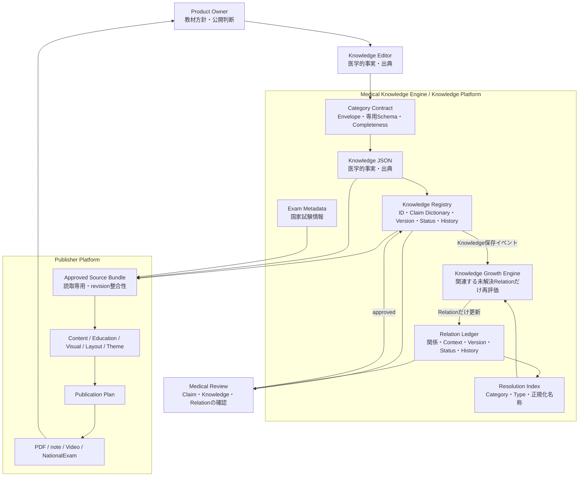

# Phase 5.9 — Knowledge Platform Stabilization

## 目的

Phase 5.8までに完成したKnowledge Platform MVPを、今後1000件以上のKnowledgeを追加する前提でレビューする。

今回は実装を変更しない。現在の基盤で固定できる責務、データ追加だけで対応できる範囲、Platform改修が必要な範囲、Production Readyへ進むための品質ゲートを確定する。

## 現在の実データ

2026年7月19日時点のローカルRegistryを確認した。

| 指標 | 現在値 | 評価 |
|---|---:|---|
| Category Union | 5 Category | `test_item`、`staining_method`、`specimen`、`reagent`、`biological_structure` |
| Registry Knowledge | 10件 | すべて`draft` |
| 永続Knowledge JSON本文 | 8件 | 初期AST・HbA1cの2件はID/Claim台帳のみで本文未移行 |
| Claim | 154件 | すべて`draft` |
| Knowledge Relation | 13件 | Resolved 7件、Unresolved 6件 |
| Registry History | 204件 | 追加・更新・承認等の履歴基盤あり |
| Relation History | 20件 | Relationの版履歴あり |
| Resolution Report | 11件 | 索引再評価の実績あり |

Gram染色はRelation 7件がすべて解決済みで、Network Completeness 100%である。未解決6件は抗酸菌染色から参照される未登録Knowledgeであり、Gram染色の100%と矛盾しない。

## 1. Platform全体レビュー

| 対象 | 現在の責務 | 安定性 | 1000件へ向けた判断 |
|---|---|---|---|
| Category | 共通EnvelopeとCategory専用本文を分離し、SchemaとCompletenessを版管理 | 高い | Category追加手順は固定できる。Category一覧と専用属性は今後増える |
| Registry | `knowledge_id`、`claim_id`、`claim_key`、版、状態、承認、別名、統合、履歴、最新版本文を永続化 | 高い | ID契約は維持できる。全台帳Snapshot読込、正式Migration、同時編集は改善対象 |
| Relation | Knowledge本文と分離し、固定Vocabulary、Context、版、状態、履歴を保持 | 高い | 分離原則は固定できる。Relation Typeと抽出元Categoryは実データに応じて増える |
| Growth Engine | Knowledge保存後、Resolution Indexから関連する未解決Relationだけを再評価 | 高い | 全Knowledge JSON走査を回避できている。保存とRelation更新の再試行保証は未実装 |
| Resolution Index | Category、Relation Type、正規化名称、解決状態で候補検索 | 高い | 1000件規模の方向性は妥当。表記揺れは承認Aliasで吸収し、曖昧推測は行わない |
| Publisher Compatibility | 承認済みKnowledge・Exam Metadata・Registryを読取専用Bundleとして受け取る | 高い | Publisher CoreはCategory非依存。媒体・用途別Profileは継続的に追加する |
| Medical Review | `draft → owner_review → medical_review → approved → deprecated`を履歴付きで管理 | 中程度 | 状態モデルは安定。本人確認、権限、差分レビュー、Relation承認は未成熟 |

### 固定してよい原則

- Knowledge JSONは医学的事実と出典の正本である
- Registryは安定ID、意味Key、版、状態、承認、履歴を管理する
- RelationとRelation ContextはKnowledge本文から分離する
- Growth Engineは未解決Relationの索引候補だけを再評価する
- AIや曖昧一致でKnowledge ID・Claim ID・Relationを確定しない
- PublisherはKnowledgeを変更せず、承認済みSource Bundleだけを読む
- Schema Validation、Knowledge Completeness、Exam Completeness、Network Completeness、医学監修を混同しない

## 2. Knowledge追加時の変更範囲

### 既存Categoryへ新しいKnowledgeを追加する場合

| 場所 | 原則 | 現在の実装上の注意 |
|---|---|---|
| Category Union / Schema | 修正不要 | 既存専用属性で表現できる場合に限る |
| Completeness | 修正不要 | 同じCategoryの登録基準を適用する |
| Registry契約・SQLite Schema | 修正不要 | 新しいID、版、履歴を既存処理で保存できる |
| Relation台帳・Resolution Index | 修正不要 | 既存Relation Typeと解決先Categoryの組み合わせに限る |
| Publisher Core | 修正不要 | 承認済みSource Bundle契約を維持する |
| Knowledge JSON | 追加 | 医学的事実と出典を登録する |
| Alias | 追加可能 | Registryへ承認された別名として追加する |
| Claim Dictionary | 現状は修正が発生し得る | 個別Knowledgeの意味KeyがPythonコードにあるため |
| Workbench | 現状は修正が発生し得る | StarterのURL、ボタン、表示が代表Knowledgeごとに固定されている |
| Publisher Profile | 用途により追加 | 既存Profileの選択規則で足りない場合だけ設定を追加する |

したがって、**基盤契約は再利用できるが、現在の運用画面はまだ「JSONを登録するだけで任意のKnowledgeを増やせる」状態ではない。**

## 3. データ追加だけで増やせる範囲

| 操作 | Platformコード変更 | 条件 |
|---|---|---|
| 既存Knowledgeの医学的事実・出典更新 | 不要 | 既存Schema内、承認・版ルールを守る |
| Knowledge Alias追加 | 不要 | 一意で循環せず、監修者が同義と確認する |
| Claimの表現修正・版更新 | 不要 | 既存`claim_key`を維持し、Registry操作を使う |
| Claim統合・deprecated | 不要 | 人が統合先を判断し、Redirectと履歴を残す |
| 既存Relationの解決 | 不要 | 対象Knowledgeの正式名称またはAliasが完全一致する |
| 既存Relation Context更新 | 不要 | Knowledge本文ではなくRelation側へ保存する |
| Exam Metadata追加 | 契約上は不要 | Provider契約を使用する。ただし本番永続Importは未完成 |
| 既存TemplateによるPublisher利用 | Core変更不要 | Knowledgeと主要Claimが`approved`で、Profileの選択条件を満たす |

### 制限付きでデータ追加だけにできるもの

- 既存Categoryの新Knowledge：現在は安定`registry_key`と`claim_key`をコード外から登録する標準経路が不足している
- Relation追加：現在の自動抽出元は`staining_method`に限定される
- Publisher利用：AST・Gram染色等の既存Profileは再利用できるが、全Category共通Profileは未完成

## 4. Platform改修が必要になるケース

| ケース | 必要になる変更 | 変更しない領域 |
|---|---|---|
| 新Category | Category Union、専用Schema、Completeness、Workbench編集、Claim Policy、テスト | Registry ID契約、Relation台帳、Publisher Core |
| 新Relation Type | Relation Vocabulary、解決先Category Mapping、抽出規則、Index・Validationテスト | Knowledge本文、Publisher Core |
| 既存Relationを別Categoryから抽出 | Category別Relation Extractor追加 | Relation Contract、Resolution Report |
| 新Publisher Profile | Content / Education / Visual / Layout / Themeの設定追加 | Knowledge JSON、Registry |
| 新しい出力媒体 | Publisher AdapterとMedia Profile | Knowledge Platform |
| RelationをPublisherで利用 | 版付きRelation Read ModelをSource Bundleへ追加 | Knowledge本文 |
| 承認役割・組織権限追加 | Identity、Authorization、Workflow Policy | 医学的Claim本文 |
| 複数利用者・クラウド運用 | DB Adapter、楽観ロック、監査、Backup/DR、監視 | 公開Protocolと安定ID |
| 外部Ontology連携 | 外部ID Mapping資産、版・出典・廃止規則 | 内部Knowledge ID |
| 破壊的な医学構造変更 | 新Schema VersionとMigration | 旧版データと履歴 |

## 5. Claim Dictionaryレビュー

### 現在の長所

- JSON配列順ではなく医学的意味で`claim_key`を決める
- `claim_id`と`claim_key`を分離している
- 既存Claimの再利用、統合Redirect、版、承認、履歴を保持できる
- 未知のClaimを無理に既存Claimへ統合しない

### 1000件規模での問題

現在の`claim_key_resolver.py`は、AST、HbA1c、Gram染色、抗酸菌染色、塗抹標本、試薬、細菌細胞壁の名前と個別ルールをPythonコードへ直接持つ。

この方式では、Knowledge追加のたびにコード変更、テスト、配布が必要になる。さらに、既知ルールに一致しないClaimは文章や一部項目からKeyを生成するため、表現変更で別Keyになる可能性がある。1000件規模の正本としては維持できない。

### 推奨改善案（今回は未実装）

`ClaimDictionaryProvider`という交換可能な境界を設け、次を分離する。

1. **Category Claim Policy**  
   Categoryごとの`field_path`、意味Slot、Key命名規則を版付き設定で管理する。
2. **Knowledge Claim Dictionary**  
   `knowledge_id`、`claim_key`、意味Slot、別名、状態、版、承認履歴をRegistry側で管理する。
3. **Deterministic Resolver**  
   AI文章ではなく、登録済みDictionaryと構造化Fieldを使ってKeyを再利用する。
4. **Unknown Claim Queue**  
   一致しないClaimは新Keyを自動確定せず、人が確認する待機一覧へ送る。

Pythonコードにはアルゴリズムだけを残し、個別用語の辞書は版付きデータへ移す。JSON/YAMLはレビューしやすい初期保管先として利用できるが、正式運用ではRegistryの承認・履歴と一体化する。

### 実施優先度

**次のCategoryを大量追加する前のPriority 0**とする。少数のVertical Slice追加より先に、少なくとも新Knowledgeをコード変更なしで登録できるDictionary経路を完成させる。

## 6. 最新Knowledge Platform Architecture

### 責務境界

| コンポーネント | 持つもの | 持たないもの |
|---|---|---|
| Knowledge | 医学的事実、出典 | 承認履歴、媒体表現、関係先IDの運用状態 |
| Registry | ID、意味Key、版、状態、承認、履歴、最新版本文 | 医学的推測、Publisherデザイン |
| Relation | Knowledge間の意味接続、Context、版、状態 | Knowledge本文、表示文章 |
| Growth Engine | 索引候補の決定的再評価、Report | AI推測、医学的承認 |
| Medical Review | 人による正確性・妥当性・公開可否判断 | ID自動生成規則、媒体レイアウト |
| Publisher | 承認済みSourceから成果物を構成 | Knowledge正本の編集・独自医学知識 |

## 7. Platform成熟度

### 総合判定：MVP完成、Production Ready前

| 観点 | 自己評価 | 理由 |
|---|---|---|
| Architecture | Production指向 | 責務分離、版付き契約、Provider境界、読取専用Publisherが成立 |
| Functional MVP | 完成 | Gram染色でKnowledge → Relation → Growth → Network 100%を証明 |
| Data Scale | 未検証 | 10 Knowledge、154 Claimであり、1000件負荷試験は未実施 |
| Medical Governance | 未完成 | KnowledgeとClaimがすべて`draft`。承認済みE2E実績がない |
| Operations | 未完成 | 認証、権限、同時編集、監視、自動Backup/DR、正式Migrationがない |
| Publisher Readiness | 一部完成 | Core契約は安定。ただし承認済み実データでのSource Bundle運用が未確認 |

### Production Readyの最低条件

1. Claim Dictionaryを個別Pythonコードから分離する
2. 任意の既存Category Knowledgeをコード変更なしで登録できる
3. AST・HbA1cを含む全active Registryに最新版Knowledge本文を持たせる
4. 代表Knowledgeを`approved`まで進め、Publisher Source Bundleを実データで通す
5. Knowledge保存とRelation更新の失敗を再実行できる仕組みを持つ
6. 1000 Knowledge相当の負荷・Backup・Restore試験を行う
7. 本人確認、権限、監査責任を確定する
8. SQLite Schemaの正式Migration手順を作る

Enterprise Readyは、複数組織、強制アクセス制御、監査ログの改ざん耐性、高可用性、遠隔Backup、災害復旧、監視、インシデント対応を追加した後に評価する。現時点では該当しない。

## 8. Product Ownerレビュー項目

- 「MVP完成」と「医学的公開可能」を分けて扱うか
- 次のCategory追加よりClaim Dictionary外部化を優先するか
- 最初に承認まで進める代表KnowledgeをGram染色とするか
- 国内教科書・国家試験出題基準を使った監修担当と承認条件を決めるか
- 個人利用のまま進める期間と、複数利用者対応が必要になる時点を決めるか

## 9. Architecture Decision

### AD-5.9-01：Knowledge・Registry・Relation・Growth・Publisherの責務境界を固定する

- 状態：採用
- 理由：Gram染色Vertical Sliceで、Knowledge本文を変更せずNetworkを成長させ、Publisher Coreも変更せず再利用できた
- 方針：今後は新しいLayerを増やす前に、既存契約の設定・Adapter・Category専用実装で解決する

### AD-5.9-02：Claim Dictionaryの個別Python実装を長期正本にしない

- 状態：改善方針を採用、実装は次Phase以降
- 理由：Knowledge数に比例してコード分岐が増え、表現変更でKeyが不安定になる可能性がある
- 方針：個別辞書を版付き・承認可能なデータへ移し、Pythonには決定的Resolverだけを残す

### AD-5.9-03：Platform成熟度をMVP完成とする

- 状態：採用
- 理由：機能的Vertical Sliceは完成したが、全件draft、1000件負荷未検証、認証・権限・Migration未整備である
- 方針：Production ReadyやEnterprise Readyとは表示しない

### AD-5.9-04：SQLiteを直ちにGraph Databaseへ交換しない

- 状態：採用
- 理由：1000 Knowledge規模は現在の索引付きSQLiteで検証可能であり、Graph Database化より辞書・承認・運用の方が先に必要
- 再検討条件：関係探索が製品要件となり、RDBの測定結果で不足が証明された時点

## 10. 次Phaseの推奨

### Phase 5.10候補：Claim Dictionary Externalization

目的は、新しいKnowledgeを追加してもPythonコードへ用語別分岐を追加しない状態を作ることである。

その前に、プロダクトオーナーは本レビューの成熟度判定と優先順位を承認する。新Category、Graph Database、Ontology、AI Relation推測はまだ行わない。

## Technical Debt

Priority 0：

- 個別Knowledgeの`registry_key`・`claim_key`がPythonコードへ埋め込まれている
- AST・HbA1cのRegistry台帳に最新版Knowledge JSON本文がない
- WorkbenchのStarter URL・ボタンがKnowledgeごとに固定されている
- Knowledge保存、Relation同期、Relation解決が一つの再試行可能な処理として保証されていない
- すべてのKnowledge・Claimが`draft`で、承認済みSource Bundleの実運用実績がない

Priority 1：

- 全Registry Snapshotを読み込む処理があり、1000件時の性能を測定していない
- Relation自動抽出元が`staining_method`だけである
- Exam Metadata本番Importの永続保存・承認が未完成
- DB Migrationが`CREATE/ALTER`中心で、明示的なMigration履歴・Rollbackがない
- 認証、役割、承認権限、楽観ロックがない

Priority 2：

- 自動Backup保持期間、遠隔Backup、災害復旧試験がない
- Relation承認をPublisher Sourceへ含める契約が未設計
- 1000 Knowledge / 多数Claim / 多数Relationの負荷試験がない
- 外部Ontology Mapping、Graph Database、複数組織運用は未実装

