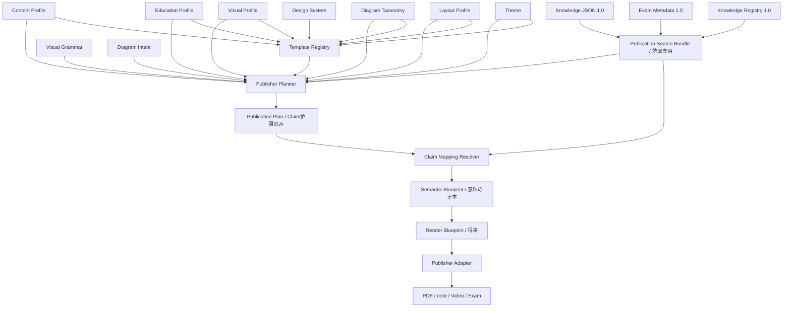

# Publisher Architecture Version 1.5

## 1. 目的

Publisherは、Knowledge JSON、Exam Metadata、Knowledge Registryを変更せず、承認済みの事実を媒体ごとの完成物へ変換するクライアントです。

Phase 3.0では、PDF等を生成する前段の共通Architectureを`Packages/publisher-core/`へ実装します。Knowledge JSON、Exam Metadata、Registryの既存Schema・保存処理・承認処理は変更しません。

## 2. 全体フロー



## 3. 各層の責務

### 3.1 Content Profile

「何を掲載するか」だけを決めます。

- 掲載セクションの意味ID
- 使用する`claim_key`またはRegistryの保存場所
- 使用するExam Metadata項目
- 必須・任意、優先順位、最大件数

本文、見出し文、図、色、位置は保存しません。

### 3.2 Education Profile

「選ばれた医学的事実を、どの目的・深さ・順序・強調で教えるか」を決めます。

- 国家試験、臨床実務、新人教育、初学者、復習、暗記、理解重視等の学習目的
- Basic、Standard、Advancedの情報量上限
- Content Role、教育ブロック、Visual Typeを横断する学習順
- Exam Metadataの重要度・頻度・重要Claimに基づく意味的な強調段階
- 比較内容・比較表の必須化
- Visual候補の優先順位
- 頻出、引っ掛け、誤答、覚え方、比較、出題実績、重要Claimランキングのブロック指示

Education Profileは医学本文、語呂合わせ本文、完成記事、PDF座標、色を保存しません。覚え方は`generation_required`を持つ計画だけを作り、実際の文章は将来Publisher側で生成・レビューします。

### 3.3 Visual Profile

「どの事実を、どの図解として準備するか」を決めます。

- `visual_type`
- 対応する`claim_key`
- priority
- 表示サイズの希望
- caption
- SVG、raster image、Mermaid
- AI生成が必要か
- Providerへ要求する`capability_id`
- 将来Providerの優先候補
- 将来の生成機能を呼ぶためのProvider非依存Capability

Visual Profileは画像本体や完成SVGを保持しません。Phase 3.3用Versionでは構図指示を保持せず、`claim_key`と図解種別だけをVisual Grammarへ渡します。Phase 3.0の旧Versionにある構造化Promptは後方互換のため残しますが、新しい図解設計の正本にはしません。

### 3.4 Visual Grammar

「選ばれた図解を、BLUPRNT Labとしてどう組み立てるか」を決める共通言語です。

- Diagram Type：反応図、比較表、フロー、時系列、臓器、細胞、検査工程、病態、顕微鏡注釈
- Composition Rule：左から右、上から下、中央、放射、2列・3列比較、ステップ
- Node Rule：臓器、細胞、分子、酵素、検体、装置、疾患、検査等
- Connector Rule：矢印、双方向、破線、Group Box、Callout
- Label Rule：位置、番号、補足、Claim参照要否
- Highlight Rule：頻出、重要、警告、陽性、陰性という意味
- Density Rule：Compact、Standard、Detailedと要素数上限
- Illustration Slot：将来の再利用Illustration IDを解決する接続口

Visual Grammarは色、フォント、余白、線幅、座標、画像本体、Provider固有Promptを保持しません。Highlightは「重要」という意味だけを持ち、その色や線はThemeが決めます。図の外側でページ上のどこへ置くかはLayoutが決めます。

### 3.5 Diagram Taxonomy

「医学図解をどの分類へ所属させるか」を永続IDで管理する共通辞書です。

- `taxonomy_id`：意味が変わらない分類ID
- `parent_taxonomy_id`：親分類
- 標準名と検索用Alias
- Active／Deprecatedと置換先
- Rootにだけ定義する後方互換用Intent Type

Taxonomyは医学本文、教育順、構図、色、描画命令を持ちません。Diagram IntentとVisual GrammarはTaxonomy IDを参照するだけで、分類ロジックを持ちません。

### 3.6 Diagram Intent

「選ばれた図解によって、学習者へ何を理解させるか」を定義する意味レイヤーです。

- Taxonomy ID：測定原理、測定技術、染色法、病態型等の分類参照
- Educational Goal：原理理解、比較、流れ、病態、国家試験ポイント
- Semantic Sequence：医学本文を持たない概念IDの意味順
- Required Concepts：図に最低限必要な概念の型
- Claim Mapping Strategy：将来どのRegistry Claimを候補にするかという選択規則
- Illustration Requirement：必要になり得る素材Category

Diagram IntentはClaim本文、Claim ID、完成図、座標、色、AI Promptを保持しません。Visual Grammarの構造と、将来のDiagram Blueprintが行う事実割り当ての間をつなぎます。

### 3.7 Claim Mapping Resolver

Diagram IntentのConceptへRegistry Claimを割り当てます。

- PlanとSourceのKnowledge ID、Revision、Registry Version、Fingerprintを照合
- `approved`かつ未削除のClaimだけを利用
- Intentに明示されたClaim Key PrefixまたはField Path Prefixだけで一致判定
- Exam Priorityは一致済み候補の順位付けだけに利用
- Claim本文、単語一致、類似度、AIを一致判定に利用しない
- 一致しないConceptは不足として残す

### 3.8 Semantic Blueprint

医学図解の意味構造の正本です。

- Blueprint IDと再現用Revision Hash
- Knowledge・Registry・Intentの参照Version
- Taxonomy参照、解決済みPath、Root Intent TypeとSemantic Sequence
- Conceptと割り当て済みClaim参照
- Concept間のSemantic Relation
- Knowledge不足／Intent不足を区別したMissing Concept Report

Semantic BlueprintはClaim本文を複製しません。色、座標、フォント、SVG命令、AI Prompt、Provider設定をSchemaで拒否します。

### 3.9 Layout Profile

「どこへ、どの順序で置くか」だけを決めます。

- 抽象的な表示領域
- 親子領域
- Content・Visualの配置先
- 表示順
- 要素がない場合に省略できるか

色、フォント、A4寸法、解像度は保持しません。

### 3.10 Theme

デザインだけを保持します。

- 色Token
- FontとWeight
- 余白Scale
- Icon Set
- 枠線
- 見出し
- Caption
- テロップ
- キャラクター表示規則
- Component Variant

Themeを新Versionへ差し替えると、Content・Visual・Layoutを変えずにデザインだけを変更できます。

### 3.11 Design System

同じシリーズで毎回デザインを考え直さないための強制規則です。

- シリーズID
- 使用可能なThemeの厳密なVersion
- 出力種別ごとのLayout Version
- 必須Component Variant
- strict consistency mode

Template RegistryはDesign Systemと異なるTheme・Layoutを参照するTemplateを拒否します。

### 3.12 Template Registry

用途ごとに、次の組合せをVersion管理します。

```text
Template
├── Content Profile参照
├── Education Profile参照
├── Visual Profile参照
├── Visual Grammar参照
├── Diagram Intent参照
├── Layout Profile参照
├── Theme参照
├── Design System参照
└── Media Profile参照（予約・未実装）
```

Template IDとVersionの組で過去版を再現できます。既存Versionは上書きせず、新しいVersionとして追加します。

### 3.13 Publisher Interface

媒体固有処理は`PublisherAdapter`を実装します。

- PDF Adapter
- note Adapter
- TrainingVideo Adapter
- NationalExam Adapter

CoreはAdapter固有SDKやファイル形式を知りません。AdapterはPublication Plan、読取専用Source、Resolved Profiles、Visual Asset参照を受け取ります。

### 3.14 Visual Generation Interface

画像生成は`VisualGenerationProvider`を実装します。

```text
Semantic Blueprint
  ↓ 媒体別Render Blueprint（将来）
VisualGenerationProvider
  ↓
Visual Asset Reference
```

GPT Image、Gemini、ImageFX、Napkin、SVG Generator等はProvider Adapterで吸収します。Providerを交換してもVisual Profile、Visual Grammar、Diagram Taxonomy、Diagram Intent、Semantic Blueprintは変更しません。

## 4. Publication Plan

Publication Planは成果物ではなく、生成前の確定指示書です。

- 使用Templateと各ProfileのVersion
- Education ProfileのID・Version、学習目的、難易度
- 学習順、Visual優先、比較必須、試験強調、教育ブロック
- Visual GrammarのID・Versionと、各Visualに解決した内部図解文法
- Diagram IntentのID・Version、教育目的、意味順、必須概念、Claim選択規則
- Illustration Libraryの将来Resolver契約
- Knowledge IDとRevision
- Registry Knowledge Version
- Exam Metadata Revision
- 掲載するClaim参照
- 準備するVisual
- Layout Placement
- Source全体のFingerprint

Claim本文は複製せず、`claim_id`、`claim_key`、Claim Versionを記録します。これによりKnowledgeの正本をPublisher内へ作りません。

Profileが統合前の`claim_key`を参照している場合は、RegistryのMerge Redirectを使って現行の承認済み`claim_id`へ解決します。過去Templateを一括修正せずにリンクを維持できます。

## 5. Media Profileの将来設計

Phase 3.0ではMedia Profileを実装しません。ただしTemplateとPublication Planへ`media_profile_ref`を予約しました。

将来の配置位置は次のとおりです。

```text
Content → Education → Visual → Visual Grammar ↔ Diagram Taxonomy ↔ Diagram Intent → Claim Mapping → Semantic Blueprint → Render Blueprint → Publisher Adapter
```

Media Profileが吸収する予定の項目：

- media type：print、screen、social、video、embed
- width、height、単位、aspect ratio
- DPI、pixel density、safe area、bleed
- page count、slide count、scene duration等の制約
- orientation
- delivery formatと圧縮条件
- accessibility要件
- responsive breakpointまたはfallback規則

A4縦とInstagramカルーセルは同じLayoutの抽象領域を、別Media Profileの物理Canvasへ割り当てます。物理制約で成立しない場合は、Media Profileに対応した別Layout VersionをTemplate Registryから選びます。医学知識やThemeを変更して吸収しません。

## 6. 変更の影響範囲

| 変更 | 変わるもの | 変わらないもの |
|---|---|---|
| Content Profile | 掲載Claim・Exam項目 | 図解、配置、色 |
| Education Profile | 学習順・深さ・試験強調・比較・図解優先 | 医学的事実、色、物理配置 |
| Visual Profile | 図解種別・生成要求 | 掲載本文、配置、色 |
| Visual Grammar | 図の内部構造・意味的強調・密度・Illustration接続 | 医学的事実、色、外部配置 |
| Diagram Intent | 図で伝える意味・教育目的・概念順・将来のClaim選択方針 | 医学本文、Claim割り当て結果、構図、色 |
| Claim Mapping Resolver | Conceptへの承認済みClaim割り当て・不足判定 | 医学的推測、本文生成、描画 |
| Semantic Blueprint | Claim・Concept・意味関係・不足情報 | 色、座標、フォント、SVG、Prompt |
| Layout Profile | 構図・順序 | 掲載事実、図解定義、色 |
| Theme | デザインToken | 掲載事実、図解構成、配置 |
| Design System | シリーズ統一規則 | 医学知識 |
| Media Profile（将来） | 物理寸法・解像度・媒体制約 | 医学知識、Content、Theme |

## 7. Phase 3.0で実装しないもの

- PDF、note、動画、国家試験問題の生成
- AI画像生成API接続
- SVG・Mermaidレンダリング
- Media Profileモデルと解決処理
- Profile編集画面
- Template RegistryのDB永続化
- 完成物の保存、配信、公開、承認

## 8. Phase 3.1 PDF Publisher Adapter MVP

Phase 3.1では、共通Publication PlanをA4 PDFへ変換する最初の媒体別Adapterを`Publishers/PDFPublisher/`へ実装しました。

```text
Publication Plan
  → Plan Reader + 同一Fingerprintの読取専用Source
  → PDF Render Plan
  → A4 Layout Engine
  → Theme Engine
  → Placeholder Visual Renderer
  → PDF Export
```

- Plan Readerは承認済みClaimの本文だけを解決し、Knowledge側を書き換えません。
- PDF Render PlanはPDFが描画する内容を固定し、医学的推測や要約を行いません。
- Layout Engineは国家試験PDF Version 1の抽象領域をA4座標へ割り当てます。
- Theme EngineはTheme Tokenから色、余白、日本語Fontを解決します。
- 図解はVisual Profileの位置、caption、表現形式を示すプレースホルダーです。
- PDF ExportはA4一枚だけを出力し、枠からあふれる内容はエラーにします。
- 同じPlanとProfileからは同じPDF Hashを再生成できます。

Phase 3.1はASTだけを対象とし、固定サンプルは構造レビュー用です。正式な医学監修済み教材、実図解、複数用語、Media Profile、公開承認は次Phase以降で扱います。

## 9. Phase 3.2 Education Profile & Learning Strategy

Publication Plan 1.1へ、Education Profile参照、学習目的、難易度、学習順、教育ブロック、Visual優先、比較優先、国家試験優先を追加しました。Plan 1.0は引き続き読み込めるため、Phase 3.1のPDF再生成は壊れません。

ASTの「国家試験対策 Version 1」は次を実行します。

```text
定義
→ 国家試験頻出ポイント
→ Reaction Diagram
→ Comparison Table
→ 関連検査との比較
→ 測定法
→ 測定原理
→ 誤答・出題実績・重要Claimランキング
```

Education Profileだけを別Versionへ差し替えるRequestをサポートし、Content、Visual候補、Layout、Theme、Design System、Knowledge Sourceを変えずに教材構成を変更できます。Phase 3.2ではPDF Adapterへ教育ブロックを接続せず、欠落したPDFを誤生成しないようEducation PlanのPDF出力を明示的に停止します。

## 10. Phase 3.3 Visual Grammar & Illustration Specification

Publication Plan 1.2へ、Visual Grammar参照、図解ごとの解決済みGrammar、Illustration Libraryの将来接続契約を追加しました。Plan 1.0／1.1はそのまま読み込めます。

ASTでは次の3種類を確認できます。

| 図解 | 内部構図 | 主なNode | Connector | Label |
|---|---|---|---|---|
| Reaction Diagram | 左から右 | 分子、酵素、検出、結果 | Arrow | 下部、Claim参照必須 |
| Comparison Table | 2列比較 | AST、関連検査、比較軸 | Group Box | 上部、Claim参照必須 |
| Disease Mechanism | ステップ | 細胞障害、酵素、検体、検査 | Arrow | 手順番号、Claim参照必須 |

Illustration Libraryはまだ作りません。Visual Grammarは`organ.liver`、`cell.rbc`等を将来解決する`IllustrationSlot`とResolver Capabilityだけを持ちます。素材本体、著作権情報、ファイルPathは将来のLibraryが所有し、Knowledge JSONへ保存しません。

Phase 3.3では画像、SVG、Mermaid、PowerPoint、PDFを生成しません。次段のRendererが必要とする「図の中身をどう組むか」だけを、描画技術に依存しない形で固定します。

## 11. Phase 3.4 Diagram Intent Layer & Semantic Blueprint Preparation

Publication Plan 1.3へ、Diagram Intent参照とVisualごとの解決済みIntentを追加しました。Plan 1.0〜1.2はそのまま読み込めます。

ASTでは次の3種類を確認できます。

| Intent | Semantic Sequence | Required Concepts |
|---|---|---|
| Measurement Principle | Sample → Reaction → Detection → Result | Sample、Analyte、Reagent、Reaction、Detection、Result |
| Comparison | Subject → Comparator → Comparison Axis → Interpretation | Subject、Comparator、Comparison Axis、Interpretation |
| Disease Mechanism | Cause → Tissue → Damage → Biomarker | Cause、Tissue、Damage、Biomarker |

Claim Mapping Strategyは、承認済みClaimのField Path等を将来どの順序で探すかだけを保持します。Claim IDや医学本文はまだ割り当てず、Required Conceptを満たせない場合はDiagram Blueprint生成を停止して不足を報告する方針です。

Publication PlanはIntentを再現するための版付きEnvelopeとして使いますが、医学本文は複製しません。将来のDiagram Blueprint Resolverが、Plan内のClaim参照とRegistryを読み、Conceptへ事実を割り当てます。

Phase 3.4ではDiagram Blueprint、Renderer Contract、SVG、Mermaid、AI画像、PDF Adapterを実装しません。

## 12. Phase 3.5 Semantic Blueprint & Claim Mapping Resolver MVP

Diagram Intent 1.1の明示的なClaim Key Prefix規則を使い、ASTの承認済みRegistry Claimから3つのSemantic Blueprintを生成します。Publication Plan Schemaは1.3のまま利用し、Template 1.4がMapping用Intent Profileを選択します。

| Blueprint | 完全性 | 不足Concept |
|---|---|---|
| Measurement Principle | 不完全 | Sample、Reagent |
| Comparison | 完全 | なし |
| Disease Mechanism | 不完全 | Cause、Tissue |

不足はすべて`origin=knowledge`、`reason=no_matching_claim`として記録されます。将来、対応するClaimがRegistryへ追加・承認されると、コードを変更せず同じPrefix規則で再解決できます。

ResolverはClaimの`assertion`を一切読みません。例えば本文に「血清」と書かれていても、Intentの`ast.specimen`規則とClaim Keyが一致しなければSampleへ割り当てません。未承認Claimしかない場合は`no_approved_claim`、Mapping Rule自体がない場合は`origin=intent`として区別します。

Semantic RelationはDiagram IntentのSequenceからそのまま転記し、Resolverが因果関係を作りません。`causes`、`measures`、`contains`、`compares`、`derived_from`、`flows_to`を含む関係語彙をProvider非依存で利用できます。

Phase 3.5ではRender Blueprint、Renderer Contract、SVG、Mermaid、AI画像、PDF Adapterを実装しません。

## 13. Phase 3.6 Diagram Taxonomy

図解の分類をDiagram IntentとVisual Grammarから分離し、`diagram_taxonomy.medical@1.0.0`へ集約しました。Nodeは永続`taxonomy_id`と`parent_taxonomy_id`を持つ平坦な台帳です。重複、孤立、循環、廃止参照、置換先不整合を読み込み時に拒否します。

Taxonomy対応Diagram Intent 1.1は`taxonomy_id`だけを保持し、`intent_type`を保持しません。Visual Grammar 1.1は対応可能な祖先または同一Taxonomy IDだけを参照します。Template Registryが両者とTaxonomy Versionの一致を検証します。

AST測定原理は次の階層へ解決されます。

```text
taxonomy.measurement                    Measurement Principle
  └─ taxonomy.measurement.enzyme        Enzyme Assay
       └─ taxonomy.measurement.enzyme.absorbance  UV Absorbance
```

Template 1.5はPublication Plan 1.4を生成し、VisualごとのTaxonomy ID、Root、Path、Root Intent Typeを固定します。Semantic Blueprint 1.1も同じ参照を引き継ぎます。旧Template 1.0〜1.4、Publication Plan 1.0〜1.3、Semantic Blueprint 1.0は変更せず利用できます。

Phase 3.6ではBlueprint Review、Render Blueprint、SVG、AI画像、PDF Adapter、Provider固有Promptを実装しません。
