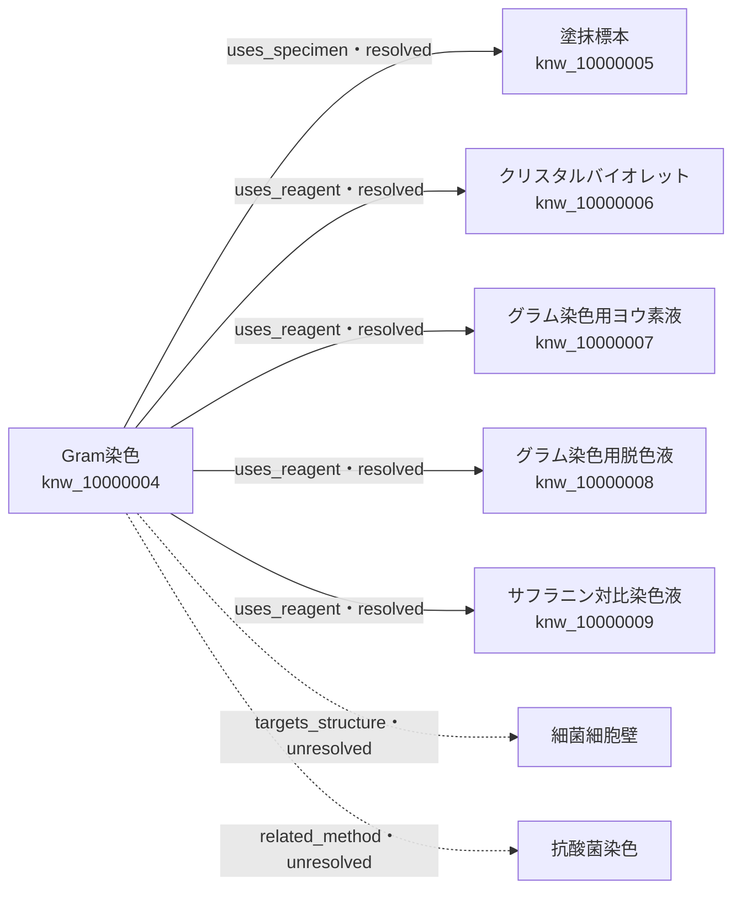

# Phase 5.5 — Production Category: Reagent

## 目的

Gram染色用試薬を正式Knowledgeとして保存し、Phase 5.4のKnowledge Growth Engineが複数Categoryで同じように機能することを確認します。Knowledge本文、Relation、Context、Publisherの責務分離は維持します。

```text
Reagent Knowledge保存
        ↓
正式名・aliases・Category = reagent
        ↓
Relation Resolution Index
        ↓ 該当する未解決uses_reagentだけ
Relationのtarget_knowledge_idを更新
        ↓
Resolution Report + Gram染色Network Summary
```

## 正式Knowledge

| 正式名称 | knowledge_id | reagent_kind | Relation照合用alias |
|---|---|---|---|
| クリスタルバイオレット | `knw_10000006` | `primary_stain` | グラムクリスタルバイオレット |
| グラム染色用ヨウ素液 | `knw_10000007` | `mordant` | ヨウ素液 |
| グラム染色用脱色液 | `knw_10000008` | `decolorizer` | 脱色液、アルコールまたはアセトン系脱色液 |
| グラム染色用サフラニン対比染色液 | `knw_10000009` | `counterstain` | サフラニン、対比染色液、サフラニンなどの対比染色液 |

正式名称は特定製品や一律の組成へ固定せず、医学監修時に用途を判断しやすい名称にしています。濃度、作用時間、保管温度は製品差があるため断定せず、製品添付文書、SDS、施設の標準作業書を確認する構造です。

初期下書きは[CDC Core Microbiology Skills: How to Perform a Gram Stain](https://reach.cdc.gov/sites/default/files/video-transcripts/How%20to%20Perform%20a%20Gram%20Stain.pdf)と[ASM Gram Stain Protocols](https://asm.org/protocols/gram-stain-protocols)を確認して作成しました。国内の上位資料、製品添付文書、SDSによる医学監修は未完了です。

## Reagent Schema

共通Category Envelopeから試薬固有の`reagent_v1.0`を分離します。

| 項目 | 役割 |
|---|---|
| `reagent_kind` | 一次染色、媒染、脱色、対比染色、その他を区別 |
| `purposes` | 検査・染色における用途 |
| `targets` | 使用する標本や対象 |
| `usage_steps` | 使用工程、適用方法、条件 |
| `cautions` | 品質、安全、判定への影響 |
| `storage_conditions` | 製品・施設手順に依存する保管条件 |

各医学的事実は独立した`claim_id`を持ちます。試薬を使用するGram染色側の条件は、試薬本文へ逆流させずRelationまたは染色法Knowledgeに置きます。

## Reagent Completeness

| 要件 | 重み | 扱い |
|---|---:|---|
| 定義 | 15 | 必須 |
| 用途 | 15 | 必須 |
| 使用対象 | 10 | 推奨任意 |
| 使用工程 | 20 | 重要必須 |
| 注意事項 | 15 | 重要必須 |
| 保管条件 | 10 | 推奨任意 |
| 出典 | 15 | 重要必須 |

4件の初期下書きは構造上100%です。この点数は情報欄の充足度であり、医学的正確性、国内運用への適合、承認済みであることを意味しません。

## Network更新結果

登録前のGram染色は7 Relation中、塗抹標本だけが解決済みでした。

| 状態 | Resolved | Unresolved | Network Completeness |
|---|---:|---:|---:|
| Reagent登録前 | 1 | 6 | 14.3% |
| Reagent登録後 | 5 | 2 | 71.4% |

4つの保存イベントはそれぞれ`再評価1件・解決1件・未解決0件`です。合計では再評価4件、解決4件、未解決0件です。残る未解決は`細菌細胞壁`と`抗酸菌染色`です。



## Workbenchでの確認

1. 正式Knowledge編集欄で試薬を選び、「選択した試薬を開く」を押す
2. Schema OK、Reagent Completeness、JSON、出典を確認する
3. 操作者と変更理由を確認し、「Registryへ保存」を押す
4. Resolution Reportを確認する
5. RegistryでGram染色を開き、「関連Knowledge」を確認する
6. 4試薬の名称、Knowledge ID、`uses_reagent`、`resolved`、Relation v2を確認する
7. Network Completeness 71.4%を確認する

## 境界と未実装

- Knowledge本文はRelation解決で変更しない
- `relation_type`は既存Vocabularyの`uses_reagent`を再利用する
- Publisher Coreは変更せず、RelationもまだPublisherへ渡さない
- AIや文字列類似度でRelationを推測しない
- 製品別組成、調製法、有効期間、SDS識別子の標準化は未実装
- Reagentの国家試験実データ、医学監修、承認は未実装
- Graph Database、Renderer、SVG、AI画像生成は未実装

## Architecture Decision

採用したのは、試薬を独立Knowledgeとし、Gram染色との接続を独立Relationへ置く方法です。Gram染色本文へ試薬IDを直接埋め込む方法、登録時に全Knowledgeを再走査する方法、類似語をAIで自動統合する方法は採用していません。

これにより、試薬の安全情報や保管条件を一か所で更新でき、Gram染色以外の染色法や検査法から同じKnowledgeを再利用できます。保存先を将来Database Providerへ交換しても、Category Contract、Relation Contract、Growth Engineの接続口は維持できます。
