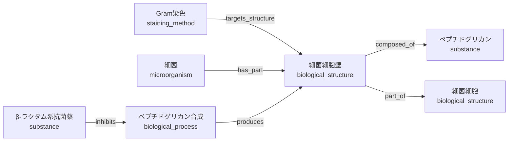

# Phase 5.7 — Structure Domain Review

## 0. 文書情報

| 項目 | 内容 |
|---|---|
| 目的 | Structure系KnowledgeのCategory境界を、1000件以上のKnowledgeへ拡張できる形で決める |
| 対象 | 細菌構造、細胞・細胞内構造、組織、臓器、解剖学的構造 |
| 状態 | 設計承認済み・Phase 5.8 MVPへ反映 |
| 実装 | なし |
| 変更していないもの | Category Union、Schema、Workbench、Registry、Relation、Publisher |
| 基準日 | 2026-07-19 |

この文書は実装仕様ではなく、どの構造をどのKnowledgeの正本として扱うかを決める設計レビューである。フィールド名、JSON Schema、Completeness配点、Relation Vocabularyの追加は、設計承認後の別Phaseで決める。

---

## 1. 結論

Structure系Knowledgeの主Categoryとして、`biological_structure`（生体構造）を推奨する。

- 臓器・組織・細胞・細胞内構造・微生物構造を1つのCategoryで扱う
- 「人か細菌か」はCategoryではなく`taxon_scope`で区別する
- 「臓器か細胞壁か」は版付き`structure_class_id`で区別する
- BLUPRNT Labの`knowledge_id`を正本とし、Uberon、Cell Ontology、Gene Ontology、FMA等は外部対応として保持する
- 分子、化学物質、観察所見、過程、生物そのものは既存Categoryへ分離する
- Structure同士の階層や他Knowledgeとの接続はKnowledge本文へ埋め込まずRelationで管理する

Phase 5.0で計画した`anatomical_entity`は本実装せず、Phase 5.8で計画上の名称と範囲を`biological_structure`へ置き換えた。二重Categoryは作らない。

---

## 2. Structure Domain候補一覧

| 候補 | 長所 | 問題 | 判断 |
|---|---|---|---|
| 既存`anatomical_entity`を拡張 | Phase 5.0との連続性が高い | 日本語の「解剖」は人・動物の臓器を強く連想し、細菌細胞壁や芽胞まで含む境界が分かりにくい | 名称を維持したままの拡張は不採用 |
| `anatomical_structure` | 臓器・組織・解剖学的部位に自然 | 細菌構造と分子複合体を含めると意味が広がりすぎる | 外部分類・下位概念として利用 |
| `cellular_structure` | 細胞膜、核、ミトコンドリア、細菌細胞壁に強い | 組織・臓器を含められない | `biological_structure`の下位分類として利用 |
| `microorganism_structure` | 細菌細胞壁、莢膜、鞭毛等が明確 | 細胞膜・リボソームが真核細胞と重複し、真菌・寄生虫との境界も増える | 独立Categoryとして不採用 |
| 構造を3Categoryに分割 | 専用Completenessを作りやすい | 同じ「細胞膜」「リボソーム」が複数Categoryへ重複し、Relationの接続先Categoryも曖昧になる | 不採用 |
| `biological_structure`へ統合 | 種をまたぐ共通構造を1つのIDで扱え、臓器から細胞内まで同じRelation方式を使える | 内部分類と条件別Completenessを明確にしないと巨大Categoryになる | 推奨 |
| `microorganism`本文へ保存 | 実装が短い | 細胞壁が菌種ごとに複製され、Gram染色や抗菌薬から共通利用できない | 不採用 |
| `substance`へ保存 | ペプチドグリカン等の組成を扱いやすい | 構造物と構成物質を混同する | 不採用 |
| `morphologic_finding`へ保存 | 顕微鏡所見とつなぎやすい | 正常構造と観察された所見を混同する | 不採用 |

---

## 3. 推奨Category：`biological_structure`

### 3.1 Categoryの目的

生物を構成し、位置・全体部分関係・構成・機能を持つ、再利用可能な物理的構造を表す。

含む範囲は次のとおり。

- 解剖学的領域、器官系、臓器
- 組織
- 細胞・細胞型
- 細胞内構造・細胞小器官
- 細胞膜、細胞壁、莢膜等の境界構造
- 鞭毛、線毛等の表面構造
- 芽胞等の特殊構造
- リボソーム等の安定した巨大分子複合体

### 3.2 構造を分類する二つの軸

Categoryを増やさず、次の二軸を分離する。

#### `structure_class_id`：何階層・何種類の構造か

```text
structure
├── gross_anatomy
│   ├── organ_system
│   ├── organ
│   └── anatomical_region
├── tissue
├── cell
└── cellular_component
    ├── organelle
    ├── membrane
    ├── cell_envelope_component
    ├── surface_appendage
    ├── dormant_structure
    └── macromolecular_complex
```

これは初期分類案であり、自由入力にはしない。分類IDは表示名が変わっても維持する。階層をJSONへ複製せず、版付きVocabularyとして管理する案を次Phaseで検討する。

#### `taxon_scope_refs`：どの生物群に成立するか

- Homo sapiens
- Metazoa
- Eukaryota
- Bacteria
- 特定の属・種
- 複数Taxon
- Taxon非依存

Category名へ`microorganism`や`human`を入れず、内部の安定参照とNCBI Taxonomy等の外部コードを対応付ける。外部Taxonomy IDをBLUPRNT Labの主IDにはしない。

### 3.3 外部標準との対応

| 構造範囲 | 主な外部対応候補 | BLUPRNT Labでの扱い |
|---|---|---|
| 動物の臓器・組織 | Uberon | `external_codes`として保持 |
| 人体解剖の詳細 | FMA | 必要な場合の補助対応 |
| 動物の細胞型 | Cell Ontology | `cell`分類の補助対応 |
| 細胞内・微生物構造 | Gene Ontology Cellular Component | `cellular_component`分類の補助対応 |
| 対象生物群 | NCBI Taxonomy | `taxon_scope_refs`の外部対応 |

外部標準は担当範囲が異なるため、どれか1つをBLUPRNT LabのCategoryや主IDとして採用しない。外部標準の統合・廃止・改訂があっても、内部`knowledge_id`は維持する。

---

## 4. Category境界

### 4.1 対象用語の分類

| 用語 | 主Category | `structure_class_id`例 | 境界上の注意 |
|---|---|---|---|
| 細菌細胞壁 | `biological_structure` | `structure.cellular_component.cell_envelope_component` | ペプチドグリカン自体は`substance` |
| 細胞膜 | `biological_structure` | `structure.cellular_component.membrane` | 脂質・蛋白は`substance` |
| 莢膜 | `biological_structure` | `structure.cellular_component.cell_envelope_component` | 莢膜多糖は`substance` |
| 細菌型鞭毛 | `biological_structure` | `structure.cellular_component.surface_appendage` | 真核生物の鞭毛とは別Knowledge |
| 細菌線毛・性線毛 | `biological_structure` | `structure.cellular_component.surface_appendage` | 「線毛」だけの入力は意味選択が必要 |
| 芽胞 | `biological_structure` | `structure.cellular_component.dormant_structure` | 芽胞形成は`biological_process` |
| 核 | `biological_structure` | `structure.cellular_component.organelle` | 核異型は`morphologic_finding` |
| ミトコンドリア | `biological_structure` | `structure.cellular_component.organelle` | TCA回路等は`biological_process` |
| リボソーム | `biological_structure` | `structure.cellular_component.macromolecular_complex` | rRNA・蛋白は`substance` |
| 細胞小器官 | `biological_structure` | `structure.cellular_component` | 下位構造をまとめる抽象Knowledgeとして扱う |
| 組織 | `biological_structure` | `structure.tissue` | 組織像や異形成は`morphologic_finding` |
| 臓器 | `biological_structure` | `structure.gross_anatomy.organ` | 臓器障害は`disease_condition` |
| 解剖学的構造 | `biological_structure` | `structure.gross_anatomy` | 上位分類Knowledgeとして扱う |

### 4.2 含めないもの

| 対象 | 正本Category | 例 |
|---|---|---|
| 生物そのもの | `microorganism` / `parasite` | 黄色ブドウ球菌、蟯虫 |
| 分子・化学物質 | `substance` | ペプチドグリカン、リン脂質、リボソームRNA |
| 組立・合成・分解 | `biological_process` | ペプチドグリカン合成、芽胞形成 |
| 正常から外れた観察像 | `morphologic_finding` | 核異型、封入体、過分葉 |
| 疾患・病態 | `disease_condition` | ミトコンドリア病、細胞膜障害 |
| 採取物 | `specimen` | 組織標本、細胞診標本 |
| 検査・染色 | `lab_test` / `staining_method` | Gram染色、PAS染色 |

### 4.3 同じ日本語を自動統合しない例

- 細菌型鞭毛と真核生物の鞭毛は構造・運動機構が異なるため別`knowledge_id`
- 細菌線毛とヒト上皮の線毛は別`knowledge_id`
- 細菌細胞壁、真菌細胞壁、植物細胞壁は別`knowledge_id`
- 「細胞壁」「鞭毛」「線毛」だけの入力では、Workbenchが対象生物を選ばせる

Aliasは表記揺れに使い、医学的に異なる意味を1件へ統合するためには使わない。

---

## 5. 設計上必要な属性とCompleteness案

今回はSchemaを実装しない。次Phaseで検討する論理属性は次のとおり。

### 5.1 共通属性

- BLUPRNT Labの安定`knowledge_id`
- 正式名、英名、Alias
- 原子的な定義Claim
- `structure_class_id`
- `taxon_scope_refs`
- 外部標準コードと対応精度
- 正常な位置・存在範囲
- 主な機能
- 構成物・下位構造へのRelation
- 上位構造・所属生物へのRelation
- 国家試験上の関連検査・疾患・微生物へのRelation
- Claim単位のEvidence

### 5.2 条件別Completeness

| 構造分類 | 正式登録に必要な追加情報案 |
|---|---|
| 臓器・組織 | 位置、上位構造、主機能、代表的構成 |
| 細胞 | 細胞型、所属組織、主機能、識別特徴 |
| 細胞内構造 | 親細胞/区画、構成、主機能、関連過程 |
| 微生物構造 | 対象Taxon、位置、構成、機能、同定・染色・病原性上の意味 |
| 巨大分子複合体 | 構成物、局在、機能、Taxon差 |

1つのCompletenessへ全項目を必須化しない。`structure_class_id`に応じたProfileを選び、「非該当」と「未入力」を区別する。

---

## 6. Gram染色への影響

### 6.1 最も自然な接続先

```text
Gram染色（staining_method）
  └── targets_structure
        └── 細菌細胞壁（biological_structure）
```

Gram染色の対象は、菌種そのものでもペプチドグリカン分子単体でもなく、染色性を決める細胞壁構造である。このため`biological_structure`が最も自然である。

### 6.2 将来実装時の互換方針

- Gram染色Knowledge JSON本文は変更しない
- 現在の`target_label = 細菌細胞壁`を維持する
- `relation_id`、根拠`claim_id`、Relation履歴を維持する
- 派生Indexの期待Categoryを`anatomical_entity`から`biological_structure`へ移行する
- 「細菌細胞壁」Knowledge登録後に索引候補1件だけを再評価する
- 解決時に`target_knowledge_id`とRelation Versionだけを更新する

Category期待値は派生Indexの検索条件であり、Gram染色の医学的事実ではない。したがって移行時もGram染色のKnowledge Versionを上げない。

今回は上記を実装しないため、Gram染色のNetwork Completenessは85.7%のままである。

---

## 7. Knowledge Networkとの整合性

### 7.1 推奨ネットワーク



### 7.2 Relationの責務

- `targets_structure`：検査・染色が直接利用する構造
- `part_of` / `has_part`：構造階層。正本は一方向に保存し、逆向きは読み取りViewで導出する案を優先
- `composed_of`：構造と構成物質を分離する
- `produces`：過程の生成物を結ぶ
- `inhibits`：抗菌薬を構造へ直結させず、阻害する過程へ結ぶ

将来Relation Vocabularyへ追加する場合は自由入力にせず、既存のRelation Ontologyとの対応を確認する。Relation自体の根拠Claim、版、承認、履歴を維持する。

### 7.3 この設計で可能になる再利用

- Gram染色と抗酸菌染色が異なる構造を参照できる
- 複数菌種が同じ細胞壁Knowledgeを参照できる
- 細胞壁の組成を菌種JSONへ複製しない
- 抗菌薬教材と微生物教材が同じペプチドグリカン合成Knowledgeを利用できる
- PDF、動画、問題が同じ承認済みStructure ClaimをSource Bundleから取得できる

---

## 8. Knowledge Domain全体との整合性

Phase 5.0の`anatomical_entity`は臓器・組織・細胞を1つに統合する判断だった。その「構造を階層とRelationで管理し、臓器ごとのSchemaへ分割しない」という原則は維持する。

Phase 5.7で変更するのは、計画Categoryの**名称と上限範囲**だけである。

| Phase 5.0 | Phase 5.7推奨 | 維持される思想 |
|---|---|---|
| `anatomical_entity` | `biological_structure` | 1つの主Category、階層Relation、外部コードは補助 |
| organ / tissue / cell | organ / tissue / cell / cellular component | 分割Schemaを増やさない |
| 主に人・動物構造 | Taxonを別軸にして全生物へ拡張 | 科目とCategoryを分離 |

既存22 Categoryのうち`anatomical_entity`を置換するため、総Category数を増やさない。`microorganism`、`substance`、`biological_process`、`morphologic_finding`との境界も維持できる。

---

## 9. Product Ownerレビュー事項

次Phaseへ進む前に、以下の判断が必要である。

1. 主Category名を`biological_structure`（生体構造）とするか
2. 計画中の`anatomical_entity`と併存させず置き換えるか
3. 微生物固有構造を独立Categoryにせず`taxon_scope_refs`で区別するか
4. 細菌型鞭毛と真核生物鞭毛、細菌線毛とヒト線毛を別Knowledgeにするか
5. ペプチドグリカンを`substance`、細胞壁を`biological_structure`へ分けるか
6. 外部標準コードを主IDではなく対応表として利用するか
7. Structure階層と構成をKnowledge本文ではなくRelationで管理するか

今回確認すべきなのはJSON項目名ではなく、「どの事実をどの正本へ置くか」である。

---

## 10. CTOレビュー

### 長期運用評価

`biological_structure` 1Category + 構造分類 + Taxon範囲の分離は、現時点で最も手戻りが少ない。

- 臓器と微生物構造でID・Relation・Evidence・Registryを共通利用できる
- Taxonの追加でCategoryが増えない
- 外部オントロジーの担当範囲差を吸収できる
- 既存`targets_structure`の意味を変更しない
- Publisher Coreへ医学分類を持ち込まない

### 主なリスク

最大のリスクは、1Categoryへ多くの構造を入れた結果、全項目Optionalの巨大Schemaになることである。対策はCategory分割ではなく、共通のStructure Contractと`structure_class_id`別Completeness Profileの組合せである。

二つ目のリスクは、外部オントロジーの用語を無条件に同一視することである。対応は`exact`、`broader`、`narrower`、`related`等の精度を持たせ、人が確認する必要がある。

三つ目のリスクは、Taxon範囲を名前文字列で持つことである。内部安定参照と外部Taxonomy IDを分離し、外部改訂時に内部Knowledge IDを変えない設計が必要である。

---

## 11. Architecture Decision案

### AD-5.7-01：Structure系を`biological_structure`へ統合する

- 採用案：臓器、組織、細胞、細胞内構造、微生物構造を1Categoryへ統合
- 不採用：`anatomical_structure`、`cellular_structure`、`microorganism_structure`の主Category分割
- 理由：細胞膜、リボソーム等の重複と接続先Categoryの曖昧化を避けるため
- 状態：承認済み・Phase 5.8 MVP実装

### AD-5.7-02：構造分類とTaxon範囲を直交させる

- 採用案：`structure_class_id`と`taxon_scope_refs`を別にする
- 不採用：`bacterial_structure`等をCategory名や自由タグへ埋め込む
- 理由：同種構造の種横断比較と、微生物固有構造の明示を両立するため
- 状態：承認済み・詳細実装は将来Phase

### AD-5.7-03：構造物と構成物質・所見・過程を分離する

- 採用案：細胞壁はStructure、ペプチドグリカンはSubstance、合成はProcess、染色像はFinding
- 不採用：細胞壁Knowledgeへ分子・合成・観察結果をすべて保存
- 理由：複数教材から同じ事実を再利用し、更新の重複を避けるため
- 状態：承認済み・詳細実装は将来Phase

### AD-5.7-04：外部Ontologyを主IDにしない

- 採用案：BLUPRNT Lab IDを維持し、Uberon、CL、GO、FMA、NCBI Taxonomyを版付き対応として保持
- 不採用：単一の外部Ontology IDをKnowledge IDとして使用
- 理由：外部標準ごとに範囲が異なり、改訂・統合・廃止の影響を内部リンクへ伝播させないため
- 状態：承認済み・詳細実装は将来Phase

---

## 12. 次に進む条件

Phase 5.8で`biological_structure`の最小実装を完了した。

最小Vertical Sliceとして「細菌細胞壁」1件を正式登録した。

```text
Category Union追加
↓
biological_structure最小Schema
↓
Structure Completeness
↓
Registry登録
↓
targets_structure Index移行
↓
Gram染色の既存Relation解決
↓
AST・Gram染色・抗酸菌染色・Specimen・Reagent回帰
```

実装結果は[Biological Structure Category](biological_structure_category.md)へ記録した。Publisherは変更していない。

---

## 13. Technical Debt / 未決定事項

- `structure_class_id` Vocabularyの正式IDとVersion契約
- 構造分類別Completenessの必須・非該当ルール
- 外部Ontology Mappingの対応精度、版、ライセンス、廃止ID管理
- Taxon範囲の内部IDとNCBI Taxonomy対応
- `part_of`、`has_part`、`composed_of`等のRelation Vocabularyと逆向きView
- 既存Resolution Indexの`anatomical_entity`期待値からの移行契約
- 「細菌細胞壁」の正式名とGO用語とのMapping粒度
- 抽象概念「細胞小器官」と具体構造「ミトコンドリア」のCompleteness差
- 細菌型/真核型鞭毛、細菌線毛/ヒト線毛の入力時Disambiguation UI
- 正常構造と形態所見を誤分類しないレビュー規則
- 薬剤・薬剤クラスを現行`substance`で扱う範囲

---

## 14. 参照した標準資料

- [OBO Foundry Anatomy Portal](https://obofoundry.org/community/anatomy.html) — 粗大解剖、細胞、細胞内構造を異なるOntologyが分担する全体像
- [Uberon multi-species anatomy ontology](https://obofoundry.org/ontology/uberon.html) — 動物の種横断的な解剖構造
- [Cell Ontology](https://obofoundry.org/ontology/cl.html) — 動物を中心とする細胞型
- [Gene Ontology documentation](https://geneontology.org/docs/ontology-documentation/) — 細胞膜、細胞小器官、巨大分子複合体を含むCellular Component
- [Gene Ontology: peptidoglycan-based cell wall](https://amigo.geneontology.org/amigo/term/GO%3A0009274) — 細菌細胞壁の外部Mapping候補
- [NCBI Taxonomy](https://www.ncbi.nlm.nih.gov/taxonomy?db=Taxonomy) — 対象生物群の外部参照
- [OBO Relation Ontology](https://obofoundry.org/ontology/ro) — `part_of`等の共有Relation

外部OntologyはKnowledgeの正本ではなく、対応先として利用する。採用時には用語粒度、版、ライセンス、廃止・統合履歴を別途確認する。
