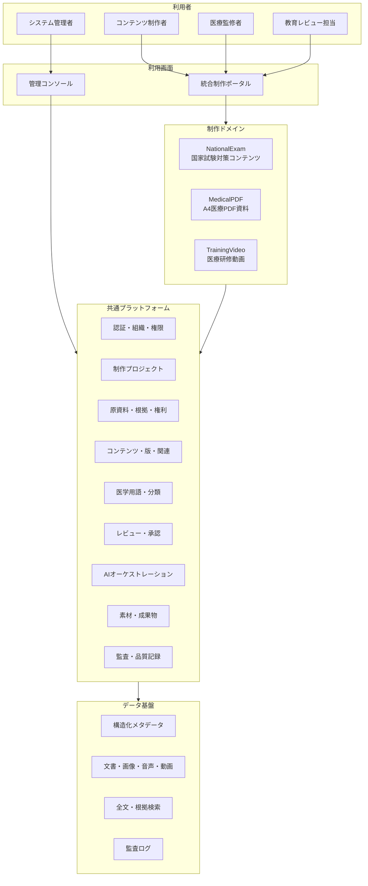
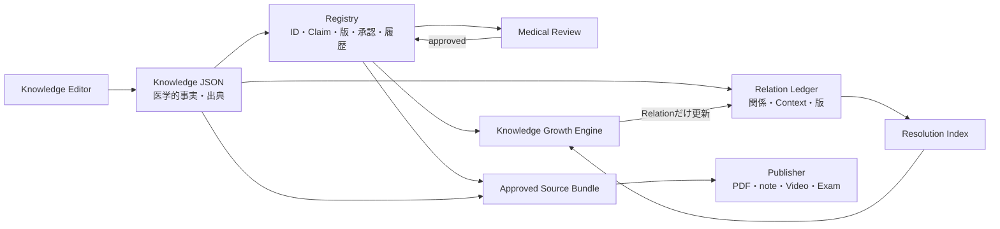
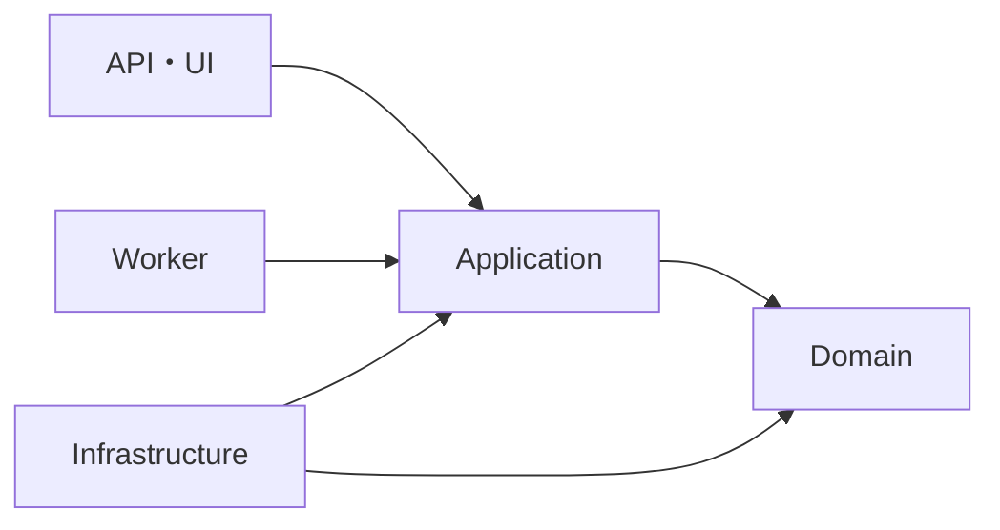
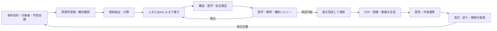

# BLUPRNT Lab システム構成

この文書は、BLUPRNT Lab 全体の論理構成、各フォルダの責務、データの流れ、システム間の境界を定義します。

BLUPRNT Lab は、Medical Knowledge Engineが管理する標準化医療知識JSONから、国家試験対策、医療PDF、note記事、医療研修動画を制作する**医療教育コンテンツ制作基盤**です。診断・治療判断を行う医療機器や電子カルテではありません。

> 2026年7月現在、`Prototypes/KnowledgeWorkbench/` と `Packages/knowledge-contracts/` にKnowledge JSON 1.0、Exam Metadata 1.0、Registry、Relation、索引型Knowledge Growth Engineを実装しています。正式Categoryは`staining_method`、`specimen`、`reagent`、`biological_structure`、`disease`、`laboratory_test_item`です。`Packages/publisher-core/`には4媒体共通のPublication Plan基盤、Education Profile、Visual Grammar、Diagram Taxonomy、Diagram Intent、Claim Mapping Resolver、Semantic Blueprintを実装しています。Phase 5.9では基盤を「MVP完成・Production Ready前」と評価し、Phase 5.10では鉄欠乏性貧血、Phase 5.11ではフェリチンを正式登録し、Phase 5.12ではDisease Relation Vocabulary 7語を固定しました。旧 `MedicalPDF/` は初期検証の履歴であり、知識の正本ではありません。

---

## 1. 文書の位置付け

設計文書の優先順位は次のとおりです。

1. ルート `README.md` — プロジェクトの目的と最上位設計
2. `Docs/*.md` — 全システム共通の構成・開発ルール
3. 各システムの `README.md` — ドメイン固有の要件と設計
4. 各システムの `docs/` — 詳細仕様、品質基準、運用手順
5. `Docs/adr/` — 個別の技術判断と採用理由

下位文書が上位文書と矛盾する場合は、実装を進めず、上位方針の変更または下位文書の修正を行います。

---

## 2. システムの構成

BLUPRNT Lab は、3つの制作ドメインと共通プラットフォームで構成します。



### 2.1 NationalExam

国家試験の出題基準と学習目標に沿って、問題、選択肢、正答、解説、根拠、問題セットを制作します。

主な責務：

- 出題設計と分野・難易度の分類
- 一問一答、多肢選択、臨床問題などの問題制作
- 正答と誤答選択肢の根拠管理
- 医学的・教育的レビュー
- 問題セットと外部出力形式の生成

### 2.2 MedicalPDF

疾患名を入力として、根拠付きのA4縦・1ページの医療教育PDFを制作します。

主な責務：

- 疾患名の正規化と同定
- 信頼済み情報源からの根拠取得
- 固定構造へのコンテンツ生成
- A4一枚へのレイアウト
- ページ数、文字切れ、出典の検証
- ドラフト・監修済みPDFの版管理

詳細は `MedicalPDF/README.md` を参照します。

### 2.3 TrainingVideo

学習目標から研修動画の台本、絵コンテ、字幕、素材、動画成果物を制作します。

主な責務：

- 研修目的と対象者の定義
- 根拠付き台本と絵コンテの制作
- ナレーション、画面要素、字幕の管理
- 医学的・映像的レビュー
- 動画、字幕、サムネイル、配布資料の生成

### 2.4 共通プラットフォーム

3ドメインで重複する機能を提供します。

- Identity：ユーザー、組織、チーム、役割、権限
- Projects：制作案件、担当者、期限、状態
- Source Registry：原資料、根拠位置、著作権、利用許諾
- Content Registry：コンテンツID、種類、版、派生・参照関係
- Taxonomy：医学用語、疾患、診療科、国家試験区分、難易度
- Review Workflow：レビュー依頼、指摘、修正、承認
- AI Orchestration：プロンプト、モデル、ジョブ、評価、コスト
- Asset Management：画像、PDF、音声、動画、字幕、成果物
- Audit：操作、生成、レビュー、公開、削除の監査記録

### 2.5 Shared-First Architecture

NationalExam、TrainingVideo、Medical Knowledge Engine は別々の製品として業務ルールを保ちますが、同じ意味を持つ基礎機能は重複実装しません。

共通化の優先候補：

- コンテンツID、版、状態、作成者、日時
- 原資料、出典、根拠位置、権利情報
- 医学用語、別名、国家試験分類
- レビュー、修正依頼、承認、失効
- AIジョブ、プロンプト版、JSON Schema、評価結果
- 共通エラー、相関ID、監査ログ
- ファイル、成果物、保存先、チェックサム
- 認証、組織、権限、プロジェクト
- PDF、問題、動画で再利用するコンテンツ部品

共通ライブラリと共通サービスを区別します。

- **共通ライブラリ**：状態を持たず、各システム内で同じ規則を実行する小さな部品
- **共通サービス**：原資料、承認、監査など、正本となるデータと履歴を一元管理する機能

共通化しないもの：

- NationalExam固有の問題・選択肢・採点ルール
- TrainingVideo固有のシーン・時間軸・映像処理
- Medical Knowledge Engine固有の用語分類・カテゴリ別テンプレート判断

「同じコードに見える」ことより、「同じ意味と変更理由を持つ」ことを共通化の条件にします。

### 2.6 Long-Term Architecture

10年以上の運用を前提に、次をすべての共通部品と外部接続へ適用します。

- 公開契約、データ、イベント、プロンプトに版を付ける
- 破壊的変更には移行手順と旧版の廃止期間を設ける
- AI、ストレージ、検索、PDF、動画などを交換可能な接続境界に置く
- 正式データを特定ベンダーだけの形式で保存しない
- エクスポート、バックアップ、復元、再生成を可能にする
- 共通部品には所有者と保守責任を定める
- 依存ライブラリと実行環境の更新手順を持つ
- 設計判断、制約、代替案をADRへ残す
- 障害調査に必要な監査・ログ・相関IDを保つ
- 小さなモジュールから開始し、運用上必要な場合だけサービスへ分離する

### 2.7 Knowledge Platformの現在責務（Phase 5.9）



- Knowledgeは医学的事実と出典を持つ
- Registryは安定ID、意味Key、版、状態、承認、履歴を持つ
- RelationはKnowledge間の接続とContextを独立して持つ
- Growth Engineは索引から関連する未解決Relationだけを再評価する
- Medical Reviewは人が医学的妥当性と公開可否を判断する
- Publisherは承認済みSourceを読み、Knowledgeを変更しない

1000件運用に向けた安定領域、変更領域、成熟度、Claim Dictionary改善方針は[Knowledge Platform Stabilization](knowledge_platform_stabilization.md)を正とします。

---

## 3. フォルダの役割

### 3.1 現在のトップレベル

| フォルダ／ファイル | 役割 |
|---|---|
| `README.md` | BLUPRNT Lab の目的、対象、上位設計 |
| `Docs/` | 全システム共通の設計・開発・医学・AIルール |
| `Packages/knowledge-contracts/` | Knowledge JSON、Exam Metadata、Exam Importの版付き共通契約と検証 |
| `Packages/publisher-core/` | Content・Education・Visual・Visual Grammar・Diagram Taxonomy・Diagram Intent・Claim Mapping・Semantic Blueprint・Layout・Theme・Template Registry |
| `Prototypes/KnowledgeWorkbench/` | AI入力・JSON確認・国家試験CSV Importの試験画面 |
| `Publishers/PDFPublisher/` | Publication PlanからA4 PDFを生成する媒体別Adapter、Layout・Theme・Placeholder処理 |
| `Publishers/PresentationEngineAdapter/` | Presentation Requestと外部Presentation Engine間のProvider非依存Adapter・Result・Validation・監査 |
| `Publishers/ProviderPayloadResolver/` | 承認済み正本のID解決、最小送信Payload、Data Egress Policy、Traceable Response・監査 |
| `Publishers/PresentationPromptBuilder/` | Provider Payloadから外部AI非依存のPresentation Promptを生成・検証・監査 |
| `MedicalPDF/` | 旧PDF生成プロトタイプ。将来PDF Publisherへ移行 |
| `NationalExam/` | 国家試験対策コンテンツ制作ドメイン |
| `TrainingVideo/` | 医療研修動画制作ドメイン |
| `Assets/` | プロジェクト共通の画像・フォント・ブランド素材とライセンス |
| `Templates/` | 複数システムで再利用する文書・画面・出力テンプレート |

### 3.2 Docs内の文書

| ファイル | 役割 |
|---|---|
| `Docs/system.md` | システム構成、フォルダ責務、データフロー |
| `Docs/roadmap.md` | 開発優先順位、フェーズ、将来機能 |
| `Docs/coding_rules.md` | コーディング、命名、構造、保守ルール |
| `Docs/medical_rules.md` | 医学情報、根拠、国家試験最適化のルール |
| `Docs/prompt_rules.md` | AIプロンプト、JSON、API連携のルール |
| `Docs/prototype_phase1.md` | AI → Knowledge JSONプロトタイプの範囲と正式版への境界 |
| `Docs/knowledge_json_v1.0_category_design.md` | Version 1.0のカテゴリ別Knowledge構造と完全性評価の設計 |
| `Docs/knowledge_domain_architecture.md` | Phase 5.0の国家試験全体Knowledge Domain、Category責務、Completeness、Publisher接続 |
| `Docs/category_implementation_guide.md` | 新しいKnowledge Categoryを正式追加する標準手順とProduction完了条件 |
| `Docs/knowledge_platform_stabilization.md` | Phase 5.9の安定性レビュー、責務図、変更区分、成熟度、Claim Dictionary改善方針 |
| `Docs/disease_category.md` | Phase 5.10のDisease Schema、鉄欠乏性貧血、Completeness、Registry、運用判断 |
| `Docs/laboratory_test_item_category.md` | Phase 5.11の検査項目Schema、フェリチン、Completeness、Registry、移行判断 |
| `Docs/publisher_architecture.md` | Publisher共通層、Profile、Template Registry、Media Profile拡張点 |
| `Docs/presentation_contract.md` | Phase 5.15のPresentation Request、Profile、安全Policy、Traceability |
| `Docs/presentation_engine_adapter_contract.md` | Phase 5.16のProvider非依存Adapter、Result、Validation、Approval Gate、監査 |
| `Docs/provider_payload_and_response_traceability.md` | Phase 5.17の承認済みPayload解決、送信Policy、Fingerprint、Traceable Response |
| `Docs/presentation_prompt_and_gemini_sandbox.md` | Phase 5.18のProvider非依存Prompt、Gemini Sandbox、Response Mapping、監査 |

### 3.3 実装時に追加するトップレベル

以下は予定構成です。必要になるまで空フォルダを作成しません。

| フォルダ | 役割 |
|---|---|
| `Apps/` | 統合制作ポータル、管理コンソールなどの利用画面 |
| `Platform/` | 認証、原資料、レビュー、AI、監査などの共通機能 |
| `Packages/` | 実装開始済み。ID、版、出典、API契約、検証など、状態を持たない共有パッケージ |
| `Prototypes/` | 正式版と境界を分けた、短期間の技術・製品検証 |
| `Infrastructure/` | 環境、データベース、ストレージ、監視、セキュリティ |
| `Tests/` | システム横断テスト、受入テスト、契約テスト |

### 3.4 各ドメイン内部の標準構成

```text
<Domain>/
├── README.md
├── docs/
├── src/
│   └── <package>/
│       ├── api/
│       ├── application/
│       ├── domain/
│       ├── infrastructure/
│       ├── validation/
│       └── config/
├── templates/
├── schemas/
├── tests/
│   ├── unit/
│   ├── integration/
│   ├── contract/
│   ├── golden/
│   └── security/
├── samples/
└── pyproject.toml
```

すべてのドメインに同じフォルダを機械的に作成しません。用途が発生したフォルダだけを追加します。

---

## 4. 依存関係の方向

各ドメインでは、依存関係を外側から内側へ向けます。



- `domain` は、Web、DB、AI提供者、PDF・動画エンジンへ依存しません
- `application` はユースケースと処理順序を管理します
- `infrastructure` は外部サービスの実装詳細を隠します
- `api` と `worker` は入力を検証してユースケースを呼び出します
- ドメイン間で相手の内部モジュールやテーブルを直接参照しません
- 共有が必要な情報は、共通契約または公開済みコンテンツとして受け渡します

---

## 5. 共通データモデル

| データ | 意味 | 所有者 |
|---|---|---|
| Organization | 利用組織 | Platform |
| User / Role | 利用者と権限 | Platform |
| Project | 制作案件 | Platform |
| Source Asset | 原資料 | Platform |
| Evidence Reference | 原資料中の根拠位置 | Platform |
| Content Item | 論理コンテンツ | 各ドメイン |
| Content Version | コンテンツの固定版 | 各ドメイン |
| Review Task | レビュー依頼と指摘 | Platform |
| Approval Decision | 承認判断 | Platform |
| AI Job | AI処理の入力・設定・結果 | Platform |
| Export Artifact | PDF、問題セット、動画など | 各ドメイン |
| Audit Event | 操作と状態変更 | Platform |

各データには、安定したID、作成日時、更新日時、作成者、版、状態を持たせます。患者情報やユーザー名を識別子へ埋め込みません。

---

## 6. 共通データフロー

### 6.1 コンテンツ制作フロー



### 6.2 AI処理データフロー

1. 利用者入力を型・長さ・権限で検証する
2. 入力と外部資料を「命令」ではなく「データ」として分離する
3. データ分類に基づき、外部AIへ送信可能か判定する
4. `厚生労働省 → 日本臨床衛生検査技師会 → 日本医学会・各学会ガイドライン → 国家試験出題基準 → 教科書 → PubMed → AI補完` の順で確認する。AI補完は出典にはしない
5. 版付きプロンプトとJSON SchemaでAI処理を依頼する
6. JSON構造、必須値、出典対応、禁止内容を検証する
7. 不足・矛盾・低信頼の場合は人のレビューへ送る
8. モデル、プロンプト版、根拠、結果、評価を監査記録へ保存する

AI出力を直接データベースの承認済み領域や公開先へ書き込みません。
AI補完は検索候補、整理、要約、不足指摘に限定し、医学的な出典としては扱いません。

### 6.3 国家試験CSV Importフロー

`CSV → Validation → Registryコピー上のPreview → 人による確認 → 確定Import → 列名Mapping → Normalized Exam Record → knowledge_id Mapping → claim_key解決 → claim_id Mapping → Exam Metadata → Exam Completeness`

CSV列名、用語別名、claim対応、重要度計算は版付きMappingで管理します。Previewは一時的なRegistryコピーだけを書き換え、本物のRegistryは確定Importまで変更しません。Preview後にRegistryが変わった場合は指紋の不一致でImportを止め、再Previewを要求します。Claim MappingはAI生成順やJSON配列位置を参照せず、`ast.ifcc`のような意味キーをRegistryで内部IDへ解決します。画像本体はKnowledge JSONへ保存せず、画像不足はWarningとします。

### 6.4 Knowledge Registryフロー

`AI下書き → 意味の解決 → Claim Dictionary照合 → 既存claim_key・claim_id再利用／新規Claim発行 → Registry Validation → Knowledge JSONへ反映`

RegistryのID台帳はKnowledge JSON本文と論理的に分離し、Knowledge・ClaimのID、意味キー、版、状態、承認情報、別名、変更履歴を管理します。Phase 5.1では同じSQLite内の別テーブルへ、Schema検証済みの最新版Knowledge JSON本文も永続保存します。アプリケーションは`KnowledgeRegistry`の接続口だけに依存するため、将来はID台帳とKnowledge Document Repositoryを別Database Providerへ分離できます。配列の並び替えでは版を上げず、医学的事実の変更時にKnowledge Versionを更新します。

Claim統合では統合先`claim_id`を維持し、統合元Claimを削除せず`deprecated`にします。Registryは`旧claim_id → 現行claim_id`の転送を保持し、既存CSVや将来Publisherから古いIDを受け取っても現行Claimへ解決します。統合、承認、Version変更は日時・操作者・コメント付きで履歴へ保存します。SQLiteは日付時刻付きファイルへ世代Backupし、Restore直前にも安全Backupを自動作成します。

### 6.4.1 Knowledge Relationフロー

`Knowledge内の明示文字列 → Relation Resolver → 登録済みKnowledgeだけを決定的に照合 → resolved／unresolved_relation → Relation Validation → 独立Relation台帳`

Knowledge Relationは`relation_id`、元・先`knowledge_id`、固定`relation_type`、根拠`claim_id`、状態、Relation Version、履歴を管理します。Version 1.1ではRelation固有の修飾語と前処理を`context`へ追加しました。対象Knowledgeが存在しない場合は文字列を残し、`target_knowledge_id`を作らず`unresolved_relation`にします。AIや類似度で補完しません。`uses_specimen`だけは、登録済みSpecimen正式名が元文字列末尾へ一意に現れる場合に解決し、前置修飾をContextへ分離します。Phase 5.12では既存Version 1.0／1.1を変更せず、疾患用7語を許可するVersion 1.2と、意味、方向、利用Category、例付きの独立Catalogを追加しました。Relation実体とResolverはまだ追加していません。

MVPではKnowledge・Claim・Relationを一括Backupできるよう同じSQLiteファイルを使いますが、`knowledge_relations`と`knowledge_relation_history`はKnowledge本文・ID台帳と別テーブルです。Phase 5.4では未解決Relationを対象名、Relation Type、Categoryで検索する`knowledge_relation_resolution_index`を追加しました。Knowledge保存後は索引候補だけを再評価し、結果を`knowledge_relation_resolution_reports`へ永続保存します。Phase 5.5では同じ処理を`reagent` Categoryで再利用し、4件の`uses_reagent`を各1候補だけの再評価で解決しました。Phase 5.6では既存`staining_method`へ抗酸菌染色を追加し、`related_method` 1候補だけを解決しました。Knowledge本文は変更しません。アプリケーションは`KnowledgeRelationRepository`という別接続口へ依存するため、将来のDatabase Providerへ交換できます。Publisher Coreはこの解決・保存処理へ依存しません。

### 6.5 Publisher共通フロー

`承認済みKnowledge JSON + Exam Metadata + Registry → Content Profile → Education Profile → Visual Profile → Visual Grammar ↔ Diagram Taxonomy ↔ Diagram Intent → Claim Mapping Resolver → Semantic Blueprint → 将来のRender Blueprint → 媒体別Publisher Adapter`

Publisher Coreは医学的意味を解釈せず、承認済み`claim_id`・`claim_key`と版を選択・配置します。Publication Planに医学本文を複製せず、正本への参照を保持します。図解生成は`capability_id`と構造化Promptを使う交換可能なProvider境界とし、AI事業者固有処理をVisual Profileへ入れません。物理寸法・解像度・ページ制約は将来のMedia Profileで吸収し、Phase 3.0では参照欄だけを予約します。

Phase 5.13では、GeminiなどのPresentation Engineへ渡す軽量な別経路を追加しました。

`Knowledge JSON + Registry + 任意のExam Metadata → Source Bundle Profile → Source Bundle JSON → 将来のPresentation Engine Adapter`

Source Bundle PublisherはKnowledge本文を生成せず、既存Claimの列挙と選択、教育目的、
対象者、図解要求、出典、版情報の受け渡しだけを担当します。Gemini固有Prompt、画像、PDF、
スライドは保持しません。Source Bundleは再生成できる派生物であり、正本は引き続き
Knowledge・Registry・Exam Metadataです。既存Publisher CoreとPublication Planの経路は
変更しません。

Phase 5.14では、この軽量経路の前へProvider非依存のApproval Gateを追加しました。

`Registry承認履歴 → Approval Snapshot → Source Bundle生成（draft可）→ Approval Gate → 将来のPresentation Engine`

共通状態は`draft → owner_review → medical_review → approved → published`です。既存の
`deprecated`は承認段階ではなく台帳互換の廃止状態として維持します。公開と外部AI送信は
Version 1.0 Policyで`approved`だけを許可します。判定はKnowledge ID、Approval State、
結果、理由、Review Version、日時とともにPublisher監査ログへ保存します。Gemini等の
Adapterはこの判定結果を回避できない接続契約にします。

Phase 5.15では、Source Bundleと外部Presentation Engineの間へAI非依存の
Presentation Contractを追加しました。

`Source Bundle → Approval Gate → Presentation Request Builder → Presentation Request JSON → 将来のPresentation Engine Adapter`

Presentation Requestは成果物の種類、対象者、学習目的、媒体条件、使用するClaim・図解・
出典ID、安全検証条件だけを保持し、Claim本文やSource Bundle全文を複製しません。
Previewはレビュー途中でも生成できますが、Externalは既存Approval Gateを通過した
`approved`だけが生成できます。Registry最新版とのKnowledge Version、Fingerprint、
Approval State、Review Versionが一致しない場合は保存前に停止します。Publisher Core、
Knowledge JSON、Registry、Source Bundle Version 1.0は変更しません。

Phase 5.16では、Presentation Requestの後段へProvider非依存のPresentation Engine
Adapter Contractを追加しました。

`Presentation Request → Presentation Engine Runner（Registry・Approval Gate・Audit） → Adapter Interface → Dummy / 将来Gemini・Claude・OpenAI → Presentation Result`

Dummy AdapterはRequest ID、Request Fingerprint、Claim・Diagram Request・ReferenceのIDと
件数だけを扱い、外部通信や医学本文の生成・変更を行いません。Provider固有SDKとPromptは
将来の個別Adapter内部へ隔離します。

Phase 5.17では、Adapterの直前へ承認済み正本だけを解決するProvider Payload Resolverを
追加しました。

`Registry + Source Bundle + Presentation Request → Provider Payload Resolver（Approval・Stale・Data Egress） → Presentation Payload → Dummy / 将来Provider → Traceable Response`

Resolverは選択されたClaim、Key Message、Diagram Request、Referenceだけを解決し、Claim本文を
要約・言い換え・結合しません。Previewを含め未承認ClaimのPayload生成を停止します。
Payload FingerprintとTrace Mapで正本との対応を固定し、Responseと監査ログには医学本文を
複製しません。既存Adapter InterfaceとPublisher Coreは変更しません。

Phase 5.18では、Provider Payloadと実Providerの間へPresentation Prompt Builderを追加しました。

`Presentation Payload → Provider非依存Prompt Builder → Presentation Prompt 1.0 → Gemini Sandbox Adapter（固有変換・API通信） → Response Mapper → 既存Traceable Response`

Builderは学習目的、対象者、無変更Claim、Key Message、Diagram Request、Referenceと表示・検証方針だけを扱い、Provider名、API URL、認証、モデル固有命令を持ちません。Gemini固有処理はAdapter内部に閉じ込め、外部送信は従来のApproval Gate、Stale検知、Data Egress Policy、Fingerprint検証をすべて通過した場合だけ行います。Knowledge、Registry、Source Bundle、Presentation Request、Provider Payload、Traceable Response、Publisher Coreは変更しません。

Phase 3.1のPDF AdapterはPublication Planと同じFingerprintを持つ読取専用Sourceだけから表示用本文を解決し、PDF Render Planへ固定します。PDF ExportはこのRender Plan、Layout、Themeのみを描画します。Visualは指定位置へプレースホルダーを置き、一枚へ収まらない内容は切り捨てずエラーにします。

Phase 3.2のEducation Profileは、Content Profileが選んだ事実を「どの目的・難易度・順序・強調で教えるか」へ変換します。国家試験の重要度・出題頻度・重要Claim、比較必須、Visual優先順位、頻出・誤答・覚え方等の教育ブロック指示をPublication Plan 1.1へ保存します。覚え方の本文はKnowledgeにもProfileにも保存せず、将来Publisherが承認済みClaimから生成します。Publication Plan 1.0とPhase 3.1 PDFは変更しません。

Phase 3.3のVisual Grammarは、Visual Profileが選んだ図解について「内部をどう組み立てるか」を定義します。構図、Node種別、Connector、Label、色を持たない意味的Highlight、Density、将来のIllustration ID解決口をPublication Plan 1.2へ保存します。Themeの色・フォント・余白・線、Layoutの外部配置、Knowledgeの医学的事実は保持しません。Publication Plan 1.0／1.1とPhase 3.1 PDFは変更しません。

Phase 3.4のDiagram Intentは、図によって学習者へ「何を理解させるか」を定義します。Intent Type、教育目的、医学本文を持たないSemantic Sequence、Required Concept、将来のClaim Mapping Strategy、Illustration CategoryをPublication Plan 1.3へ保存します。Claim本文・Claim ID・画像・Promptは保持せず、Visual Grammarの構造と将来のDiagram Blueprintの事実割り当てをつなぎます。Publication Plan 1.0〜1.2とPhase 3.1 PDFは変更しません。

Phase 3.5のClaim Mapping Resolverは、Diagram Intentに明示されたClaim Key PrefixまたはField Path Prefixだけを使い、Registryの`approved` ClaimをConceptへ割り当てます。Claim本文の単語、AI、類似度から推測しません。Semantic BlueprintはClaim参照、Concept、Semantic Sequence、Semantic Relation、不足Conceptだけを保持し、色・座標・SVG・Promptを拒否します。医学知識の正本はKnowledgeとRegistry、医学図解の意味構造の正本はSemantic Blueprintとして分離します。

Phase 3.6のDiagram Taxonomyは、図解分類を永続`taxonomy_id`と親IDの階層で管理します。新しいDiagram IntentはTaxonomy IDだけを参照し、Visual Grammarは対応可能なTaxonomy IDだけを参照します。分類と親子判定はTaxonomyとTemplate Registryが担当するため、IntentとGrammarへ分類ロジックを複製しません。Publication Plan 1.4とSemantic Blueprint 1.1が解決済みPathとTaxonomy Versionを固定します。Knowledge JSONと旧Publication Plan 1.0〜1.3は変更しません。

### 6.6 MedicalPDF固有フロー

`疾患名 → 標準疾患名の解決 → 根拠取得 → 固定構造へ生成 → 医学・形式検証 → A4レンダリング → 1ページ検証 → ドラフトPDF`

### 6.7 NationalExam固有フロー

`出題設計 → 出題基準との対応 → 根拠取得 → 問題・選択肢・解説案 → 正答一意性と禁忌確認 → 医学・教育レビュー → 問題セット出力`

### 6.8 TrainingVideo固有フロー

`研修目的 → 学習目標 → 根拠取得 → 台本 → 絵コンテ → 素材・音声・字幕 → 医学・映像レビュー → 動画・字幕・配布資料出力`

---

## 7. コンテンツ状態

全ドメインで次の状態を共通利用します。

`planning → draft → in_review → changes_requested → approved → exporting → published → archived`

ルール：

- `approved` は特定のコンテンツ版に対して付与する
- 承認後の変更は新しい版として作成する
- AIが生成・大幅変更した版は人のレビューなしに承認できない
- 出力失敗はコンテンツ承認を取り消さず、成果物の状態として管理する
- 失効した原資料を参照する公開済みコンテンツは再レビュー対象にする

---

## 8. ストレージの責務

| 保存先 | 保存するもの | 保存しないもの |
|---|---|---|
| 構造化DB | メタデータ、版、状態、関係、レビュー | 大容量動画やPDF本体 |
| オブジェクトストレージ | 原資料、画像、音声、動画、生成成果物 | 権限判定の唯一の根拠 |
| 検索インデックス | 検索用テキスト、埋め込み、根拠位置 | 正式な原本、承認状態の正本 |
| 監査ストア | 操作、AI処理、承認、公開の履歴 | 不要な患者情報や秘密情報 |

検索インデックスやキャッシュは再構築可能な派生データとして扱い、正式な内容と承認状態は構造化DBおよび版管理された成果物を正とします。

---

## 9. システム境界ルール

- 3ドメインは共通プラットフォームを経由して連携する
- 他ドメインのDBテーブルへ直接アクセスしない
- 公開契約には版を付け、後方互換性を管理する
- AI提供者固有のモデル名やレスポンス形式をドメインへ漏らさない
- 原資料ファイルを公開URLへ直接置かない
- 生成成果物と制作元データを分離する
- 医学コンテンツと画面・PDF・動画レイアウトを分離する
- 同期処理と長時間処理の境界を明示する
- 外部サービス障害が承認済みデータを破損しない設計にする

---

## 10. 変更管理

次の変更にはADRを作成します。

- 言語、フレームワーク、DB、クラウドの採用・変更
- AI提供者、モデル選定、データ送信方針
- ドメイン境界またはデータ所有者の変更
- 公開APIとイベント形式の変更
- 医学情報源の優先順位や承認要件の変更
- 個人情報・患者情報の取扱い変更
- PDF・動画生成エンジンの変更

システム構成を変更した場合は、実装だけでなく、この文書と関連するドメインREADMEも同時に更新します。
