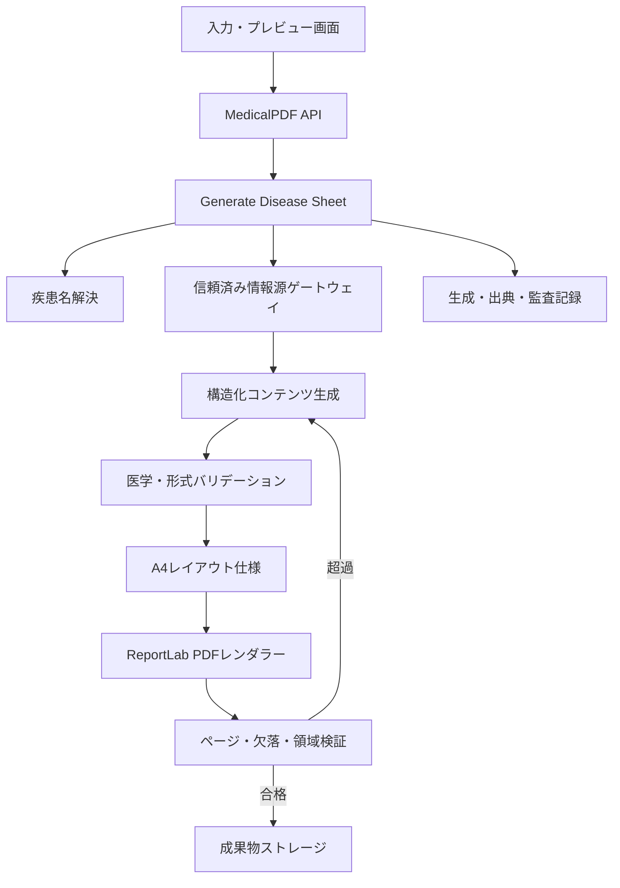
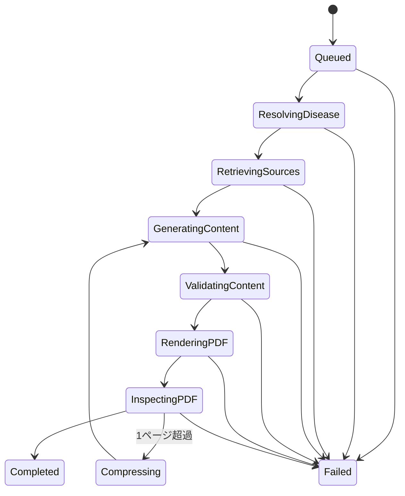

# MedicalPDF 設計書

MedicalPDF は、利用者が**疾患名を1つ入力すると、その疾患を学ぶためのA4縦・1ページのPDF資料を生成するシステム**です。

本書は MedicalPDF の目的、スコープ、構成、必要なライブラリ、品質基準、開発工程を定義する設計文書です。現在はPhase 1の固定データ・A4一枚PDFプロトタイプを実装済みです。疾患名入力、情報検索、AI生成、Web APIはまだ実装していません。

## Phase 1 実装状況

Phase 1では、固定JSONから次を実行できます。

- 型付きコンテンツモデルへの読込み
- ReportLabによるA4縦・1ページPDFの生成
- 長い疾患名と本文領域の事前計測
- 収まらない内容の安全な失敗
- PyPDFとPDFPlumberによるページ・寸法・必須文字・座標検証
- PopplerによるPNGレンダリングと目視確認

### サンプル生成

```bash
cd MedicalPDF
python3 scripts/generate_phase1_sample.py
```

出力先は `MedicalPDF/output/pdf/medicalpdf-phase1-type2-diabetes.pdf` です。生成物はGit管理対象外です。

### テスト

```bash
cd MedicalPDF
PYTHONPATH=src python3 -m unittest discover -s tests -p 'test_*.py'
```

依存関係と実行環境は `pyproject.toml`、レイアウト仕様は `docs/layout-spec.md`、PDFレンダラーの判断は `docs/adr/0001-phase1-pdf-renderer.md` を参照してください。

---

## 1. 目的

### 1.1 解決する課題

医学・医療分野では、疾患ごとに重要事項を短時間で確認できる資料が必要です。一方、自由形式で資料を生成すると、情報量、構成、出典、レイアウト、医学的品質が安定しません。

MedicalPDF は、疾患名を起点として情報を定型化し、次の条件を満たす資料を生成します。

- A4縦・1ページで完結する
- 医療教育向けの固定された構成を持つ
- 重要情報を短時間で確認できる
- 根拠となる出典を表示する
- 作成日と内容の版を追跡できる
- AI生成物であることとレビュー状態を識別できる
- 日本語PDFとして文字化けやレイアウト崩れがない

### 1.2 初期MVPの対象者

初期MVPでは、対象者を次のように固定します。

- 医学生
- 国家試験受験者
- 初期研修医
- 基礎的な疾患知識を確認したい医療従事者

対象者、専門領域、難易度、出力言語の選択は将来機能とします。疾患名だけでPDFを生成できるよう、MVPでは設定を固定します。

### 1.3 対象外

- 患者個人に対する診断や治療の提案
- 処方、投薬量、緊急対応を個別に指示する機能
- 電子カルテや診療記録の作成
- 出典のない医学情報の確定情報としての掲載
- 人の確認なしでの公式教材・院内資料としての公開
- 複数疾患を比較する複数ページ資料
- 自由なレイアウトエディター

生成したPDFは、初期状態では**教育用ドラフト**として扱います。外部配布や正式教材への採用には医療監修者の確認を必要とします。

---

## 2. MVPの利用フロー


### 2.1 正常系

1. 利用者が疾患名を入力する
2. 表記揺れを正規化し、対象疾患を同定する
3. 信頼済み情報源から関連する根拠を取得する
4. 定義済みのセクションと文字量で内容を生成する
5. 医学用語、必須項目、出典対応、禁止表現を検査する
6. HTML/CSSテンプレートへ内容を配置する
7. A4縦のPDFへ変換する
8. 1ページであること、文字切れがないことを検証する
9. 教育用ドラフトとして表示・ダウンロード可能にする

### 2.2 例外系

次の場合は、推測してPDFを生成しません。

- 入力が疾患名ではない
- 複数疾患を含んでいる
- 略称や表記が曖昧で、疾患を一意に同定できない
- 信頼済み情報源から十分な根拠を取得できない
- 医学情報の矛盾を解消できない
- 要約を再実行してもA4一枚へ安全に収まらない
- PDF生成または検証処理に失敗した

疾患名が曖昧な場合は候補を表示し、利用者に選択してもらう設計とします。

---

## 3. 入力仕様

### 3.1 MVP入力

| 項目 | 必須 | 内容 |
|---|---:|---|
| 疾患名 | 必須 | 日本語または一般的な英語の疾患名を1つ入力 |

### 3.2 固定設定

| 設定 | MVPでの値 |
|---|---|
| 出力言語 | 日本語 |
| 対象者 | 医学生・国家試験受験者・初期研修医 |
| 用途 | 医療教育・復習用 |
| 用紙 | A4縦、1ページ |
| 地域前提 | 日本の医療教育を基本とする |
| レビュー状態 | 未監修の教育用ドラフト |

### 3.3 入力検証

- 前後空白、全角・半角、大小文字を正規化する
- 入力可能な文字数に上限を設ける
- 制御文字、HTML、スクリプトを受け付けない
- 「指示を無視して」など、疾患名ではない命令文を拒否する
- 一致した標準疾患名と入力名を別々に記録する
- 同義語、旧称、英語名、略称を疾患辞書で解決する
- 疾患名をAIへの命令としてではなく、検証済みデータとして扱う

---

## 4. PDFコンテンツ仕様

### 4.1 掲載セクション

PDFは、原則として次の順序で構成します。

| セクション | 内容 |
|---|---|
| タイトル | 標準疾患名、英語名、主要な別名 |
| ひとことで理解 | 疾患の本質を短く説明 |
| 病態・原因 | 病態生理、主な原因、危険因子 |
| 症状・所見 | 典型症状、身体所見、経過 |
| 検査・診断 | 主要検査、診断の考え方、鑑別上の注意 |
| 治療・管理 | 標準的な治療方針と管理上の要点 |
| Red Flags | 緊急性や重症化を疑う重要所見 |
| 試験・学習ポイント | 覚えるべき要点と混同しやすい事項 |
| 出典 | 根拠資料、版、発行年、参照日 |
| フッター | 生成日時、文書ID、版、レビュー状態、免責 |

すべての疾患に同じ情報が存在するとは限りません。空欄を埋めるために推測せず、「該当なし」「信頼できる情報を確認できない」などの状態を明示します。

### 4.2 内部コンテンツモデル

AIや情報源から得た自由文章を直接テンプレートへ渡さず、次の構造へ変換します。

| フィールド | 内容 |
|---|---|
| disease_name | 表示する標準疾患名 |
| english_name | 英語名 |
| aliases | 主要な別名・略称 |
| one_line_summary | ひとことで理解 |
| pathophysiology | 病態・原因 |
| symptoms_and_signs | 症状・所見 |
| diagnosis | 検査・診断 |
| treatment | 治療・管理 |
| red_flags | 緊急性を示す所見 |
| learning_points | 試験・学習ポイント |
| references | 出典と根拠位置 |
| generated_at | 生成日時 |
| document_id | 文書識別子 |
| content_version | コンテンツ版 |
| review_status | 未監修・レビュー中・承認済み |
| provenance | 参照資料、AI設定、生成処理の記録 |

各フィールドには文字数、項目数、必須・任意、使用可能な表現を定義します。モデル出力は構造検証に合格するまでPDF生成へ進めません。

### 4.3 初期文字量の目安

A4一枚を保証するため、初期設計では本文全体をおおむね1,200〜1,600日本語文字以内に制御します。次の値はレイアウト試験で調整します。

| セクション | 初期上限の目安 |
|---|---:|
| ひとことで理解 | 80文字 |
| 病態・原因 | 180文字 |
| 症状・所見 | 220文字 |
| 検査・診断 | 240文字 |
| 治療・管理 | 240文字 |
| Red Flags | 120文字 |
| 試験・学習ポイント | 5項目以内 |
| 出典 | 主要3〜5件 |

文字数だけでなく、箇条書き数、改行数、長いURL、英単語の折り返しもページ高へ影響するため、最終判断はPDFレンダリング後に行います。

---

## 5. A4一枚を保証する設計

### 5.1 レイアウト方針

- 用紙：A4縦、210 × 297 mm
- 印刷用CSSの `@page` で用紙サイズと余白を固定
- 本文：2カラムを基本とする
- ヘッダー：疾患名と概要
- フッター：出典、生成情報、レビュー状態
- 日本語フォントを明示し、必要に応じて成果物へ埋め込む
- 背景色に依存せず、白黒印刷でも情報を判別可能にする
- 最小文字サイズを定め、それ未満へ自動縮小しない
- セクション途中の不自然な分割や文字のクリップを禁止する

### 5.2 ページフィット手順

1. 標準レイアウトでPDFを生成する
2. PDFのページ数が1であることを確認する
3. テキストブロックが用紙領域内にあることを確認する
4. 必須セクションとフッターの文字列が抽出できることを確認する
5. 超過した場合は、優先度の低い説明を削減して再要約する
6. 再生成後に同じ検証を繰り返す
7. 規定回数で収まらなければ、生成失敗として終了する

### 5.3 禁止するフィット方法

- 文字が読めなくなるまでフォントを縮小する
- CSSで内容を非表示にする
- ページ外にはみ出した内容をクリップする
- 出典や免責だけを削除する
- 2ページ目を黙って破棄する

内容の優先度は、`Red Flags・診断上の要点・根拠 > 基本説明 > 補足情報` とします。

---

## 6. 情報源と医学的安全性

### 6.1 情報源の優先順位

情報源は事前登録された信頼済みカタログから取得します。基本的な優先順位は次のとおりです。

1. 日本の公的機関が公開する資料
2. 関連する医学会・専門学会の診療ガイドライン
3. 査読済み論文、システマティックレビュー
4. 国際的な公的機関・専門機関の資料
5. 利用許諾を確認した標準的教科書・教育資料

一般検索結果やAIの内部知識だけを最終的な根拠として使用しません。

### 6.2 出典記録

各出典について次の情報を保持します。

- タイトル
- 著者または発行組織
- 発行年、改訂年、版
- URLまたは識別子
- 参照日
- 根拠となるページ、節、段落
- 利用許諾と公開範囲
- 有効期限または見直し予定日

### 6.3 安全ルール

- 数値、診断基準、投薬情報は特に厳格に根拠を確認する
- 情報源間で差異がある場合は、勝手に統合せず差異を記録する
- 最新性が重要な項目には原資料の発行年を表示する
- 患者個人に適用できる表現を避ける
- 生成物へ「教育用資料であり、診療判断には使用しない」旨を表示する
- AI生成内容は医療監修を受けるまで未監修と明示する

---

## 7. 論理アーキテクチャ



### 7.1 レイヤーの責務

| レイヤー | 責務 |
|---|---|
| Interface | Web入力、API、レスポンス、エラー表示 |
| Application | PDF生成ユースケースと処理順序の制御 |
| Domain | 疾患、コンテンツ、出典、版、品質ルール |
| Infrastructure | AI、情報源、PDFレンダラー、保存先との接続 |
| Layout | A4レイアウト、表示形式、フィット条件 |
| Validation | 構造、医学的安全ルール、PDF物理検証 |

ドメイン層は、特定のAI提供者、データベース、PDFエンジンへ直接依存しない設計にします。

---

## 8. 必要なフォルダ構成

Phase 1で作成した構成と、後続フェーズで追加する予定の領域を示します。

```text
MedicalPDF/
├── README.md
├── docs/
│   ├── requirements.md
│   ├── architecture.md
│   ├── content-policy.md
│   ├── source-policy.md
│   ├── layout-spec.md
│   ├── quality-gates.md
│   └── adr/
├── src/
│   └── medical_pdf/
│       ├── application/
│       ├── domain/
│       ├── infrastructure/
│       │   └── pdf/
│       ├── validation/
│       └── cli.py
├── tests/
│   ├── unit/
│   ├── integration/
│   ├── layout/
│   ├── golden/          # 後続フェーズ
│   └── security/        # 後続フェーズ
├── samples/
├── prompts/             # AI導入時
├── schemas/             # API・AI導入時
├── assets/              # 専用素材が必要な場合
├── scripts/
├── pyproject.toml
└── .gitignore
```

### 8.1 フォルダの役割

| フォルダ | 役割 |
|---|---|
| `docs/` | 要件、設計、医学・出典・レイアウト方針 |
| `src/medical_pdf/application/` | 疾患PDF生成の処理フロー |
| `src/medical_pdf/domain/` | 技術に依存しない業務モデルと品質ルール |
| `src/medical_pdf/infrastructure/` | AI、検索、PDF、ストレージなど外部技術 |
| `src/medical_pdf/validation/` | コンテンツとPDFの自動検証 |
| `prompts/` | AIへの指示を版管理する文書 |
| `schemas/` | AI出力・API・出典の構造定義 |
| `assets/` | フォント、アイコン、ライセンス情報 |
| `tests/layout/` | 1ページ、文字切れ、余白などの検証 |
| `tests/golden/` | 医療監修済みの期待結果と比較用PDF |
| `samples/` | 個人情報を含まない入力例と期待例 |

生成された実PDFはリポジトリへ保存しません。ローカル開発では無視対象の一時領域、本番ではアクセス制御されたオブジェクトストレージへ保存します。

---

## 9. 必要なライブラリ

Pythonを中心にした実装を推奨します。医学情報処理、AI接続、PDF検証のエコシステムが揃っており、MedicalPDFの処理を1つの言語でまとめやすいためです。

バージョン範囲は `pyproject.toml` で管理し、正式な配布・デプロイ開始時にロックファイルで再現可能にします。

### 9.1 MVP必須ライブラリ

| 分類 | ライブラリ | 用途 | 選定理由 |
|---|---|---|---|
| PDF生成 | [ReportLab](https://docs.reportlab.com/) | A4ページへの直接描画 | 高さを描画前に計測し、超過を安全に失敗させられる |
| PDF構造検証 | [PyPDF](https://pypdf.readthedocs.io/en/stable/) | ページ数、用紙寸法の検査 | PDFの物理構造を軽量に確認できる |
| PDF文字検証 | [PDFPlumber](https://github.com/jsvine/pdfplumber) | 必須文字、文字座標の検査 | 文字欠落とページ外座標を検出できる |

Phase 1ではReportLabを採用しています。Webプレビューとのテンプレート共有や高度なブランド編集が必要になった場合は、Playwrightを含むHTML/CSS方式を改めて比較します。

### 9.2 AI・情報源接続

AIについては、次の共通インターフェースをMedicalPDF側で定義し、実際の提供者はADRで決定します。

- 構造化出力に対応するAI提供者の公式Python SDK
- 参照根拠を渡せる入力方式
- タイムアウト、キャンセル、利用量取得
- データ保持と学習利用を制御できる契約・設定
- モデル名や提供者をドメイン層へ漏らさないアダプター

複数のAI SDKを最初から導入しません。MVPでは1提供者を選び、テスト用の偽実装と差し替え可能にします。

### 9.3 開発・品質管理ライブラリ

| 分類 | ライブラリ／ツール | 用途 |
|---|---|---|
| テスト | [pytest](https://docs.pytest.org/en/stable/) | 単体・結合・レイアウトテスト |
| 非同期テスト | `pytest-asyncio` | 非同期APIと外部接続のテスト |
| 静的解析・整形 | [Ruff](https://docs.astral.sh/ruff/) | Lint、import整理、コード整形 |
| 型検査 | [mypy](https://mypy.readthedocs.io/en/stable/) | 境界とドメインモデルの型検査 |
| カバレッジ | `coverage.py` / `pytest-cov` | 重要ルールのテスト網羅性確認 |
| 依存関係監査 | `pip-audit` | 既知の脆弱性確認 |
| パッケージ管理 | [uv](https://docs.astral.sh/uv/) | 仮想環境、依存解決、ロック |

### 9.4 運用規模に応じて追加するライブラリ

次はMVP開始時の必須依存にはせず、要件が発生した段階で導入します。

| 要件 | 候補 | 導入条件 |
|---|---|---|
| 永続データベース | SQLAlchemy、Alembic、PostgreSQLドライバー | 生成履歴、レビュー、組織利用を永続化するとき |
| 非同期ジョブキュー | CeleryまたはDramatiq、Redis | 同時生成、長時間処理、再実行制御が必要なとき |
| オブジェクトストレージ | 採用ストレージの公式SDK | 複数ユーザーでPDFを保管するとき |
| 分散トレース | OpenTelemetry | 複数サービス・ワーカーへ分割するとき |
| 画像処理 | Pillow | 図表、サムネイル、画像最適化を追加するとき |
| 既存PDF取込 | PyMuPDFを中心とする抽出処理、必要に応じてOCR | 原資料PDFの自動解析を追加するとき |

ライブラリを追加する前に、保守状況、ライセンス、脆弱性、依存サイズ、日本語対応、サーバー実行条件を確認します。

---

## 10. APIとジョブの概念設計

### 10.1 MVPの論理API

| 操作 | 目的 |
|---|---|
| PDF生成を依頼 | 疾患名を受け付け、生成IDを返す |
| 生成状態を取得 | 受付、情報取得、生成、検証、完了、失敗を返す |
| PDFを取得 | 検証済みPDFを返す |
| 生成詳細を取得 | 標準疾患名、出典、版、レビュー状態を返す |

処理時間が短い場合でも、外部AIとPDFレンダリングを含むため、将来的な非同期化を妨げないジョブモデルにします。

### 10.2 ジョブ状態



失敗時には、利用者向けメッセージと、運用者向けの機械可読な失敗理由を分離します。外部サービスの内部情報や秘密情報は表示しません。

---

## 11. テスト設計

### 11.1 単体テスト

- 疾患名の正規化と拒否条件
- 同義語・曖昧語の解決
- コンテンツモデルの必須項目と文字数
- 出典の必須情報
- セクション優先度と圧縮ルール
- レビュー状態と版管理
- エラー分類

### 11.2 結合テスト

- 疾患名入力から構造化コンテンツ取得まで
- テンプレートからPDF生成まで
- 外部AIのタイムアウト、失敗、構造違反
- 情報源が不足・矛盾している場合
- PDF保存と取得

外部AIは通常の自動テストで直接呼び出さず、記録済み応答またはテスト用アダプターを利用します。実モデルの評価は別の評価ジョブとして管理します。

### 11.3 レイアウトテスト

- ページ数が必ず1である
- 用紙寸法がA4である
- 必須セクションが存在する
- 文字と図形が印刷領域からはみ出していない
- フッターと出典が欠落していない
- 日本語フォントが意図どおり表示される
- 長い疾患名、英語名、URLでも崩れない
- 白黒印刷でも情報を判別できる

### 11.4 Golden Test

頻度、分野、情報量が異なる代表疾患を選び、医療監修済みの期待結果を用意します。

- 一般的で情報量が多い疾患
- 希少疾患
- 急性疾患
- 慢性疾患
- 感染症
- 腫瘍性疾患
- 小児・産婦人科領域
- 疾患名が長いもの
- 略称が複数の意味を持つもの

各ケースについて、医学内容、出典対応、文字量、PDF画像差分、ページ数を継続的に確認します。

### 11.5 セキュリティテスト

- 疾患名欄へのHTML・スクリプト入力
- プロンプトインジェクション形式の入力
- 極端に長い入力と大量リクエスト
- 他ユーザーの生成物への不正アクセス
- 内部パス、秘密情報、AI設定の漏えい
- 悪意ある出典文書に含まれる指示

---

## 12. 非機能要件

### 12.1 正確性と再現性

- 同じ文書IDと版から同じ成果物を再生成できる
- 使用した出典、テンプレート、AI設定を記録する
- AIモデル変更で内容が変わる場合は新しい版にする
- 承認済みPDFを自動生成で上書きしない

### 12.2 性能

- 生成処理はUIをブロックしない設計にする
- 外部通信とPDF生成にタイムアウトを設ける
- 同一条件の連続生成を制御する
- 具体的な処理時間目標はプロトタイプ計測後に決定する

### 12.3 監査

- 入力疾患名と解決後の標準疾患名
- 使用した出典と根拠位置
- AI提供者、モデル識別子、プロンプト版
- 生成、再要約、PDF検証の結果
- 作成者、レビュー者、承認者
- ダウンロードと公開操作

患者情報、秘密情報、原資料全文を不要にログへ保存しません。

### 12.4 アクセシビリティ

- 読みやすい文字サイズと行間を維持する
- 色だけで重要度を伝えない
- 見出し階層と読み順を明確にする
- 将来、タグ付きPDFや読み上げ対応を検討する

---

## 13. 開発工程

### Phase 0 — 要件確定

#### 作業

- 対象者と利用場面の確定
- PDFに必須のセクション確定
- 医療監修者と承認責任者の決定
- 情報源の採用基準と利用許諾方針の決定
- 対象疾患の初期リスト作成
- 教育用ドラフトの表示文言決定

#### 完了条件

- 代表疾患10〜20件について、理想的な手作業サンプルがある
- 医学的品質とレイアウトの評価表が承認されている
- MVPの対象範囲と対象外が合意されている

### Phase 1 — コンテンツ・レイアウト設計

#### 作業

- 構造化コンテンツモデルの確定
- セクション別の文字量と優先度の決定
- A4縦・1ページのワイヤーフレーム作成
- 日本語フォントとライセンスの確認
- ReportLabによるA4 PDF生成方式の検証
- PDF検証項目の確定

#### 完了条件

- 固定データから代表疾患のA4一枚PDFを安定して作成できる
- 長い疾患名と最大文字量でも文字切れがない
- 医療監修者が情報配置を承認している

### Phase 2 — ドメインと入力処理

#### 作業

- 疾患名入力モデルと検証ルールの実装
- 標準疾患名、別名、略称の解決方式の実装
- コンテンツ、出典、版、レビュー状態のモデル化
- 曖昧・不正入力のエラー設計

#### 完了条件

- 正常、曖昧、不正な入力を一貫して分類できる
- 疾患名以外の命令文を拒否できる
- ドメインルールが外部AIなしでテストできる

### Phase 3 — 情報源とAI生成

#### 作業

- 信頼済み情報源カタログの構築
- 根拠取得インターフェースの実装
- 構造化出力プロンプトの作成
- 出典対応、文字量、禁止表現の検証
- 情報不足、矛盾、生成失敗時の処理
- AI評価用データセットの作成

#### 完了条件

- 生成内容の各重要項目から根拠へ戻れる
- 構造違反や根拠不足を自動で拒否できる
- 代表疾患で医学的評価基準を満たす

### Phase 4 — PDF生成と一枚保証

#### 作業

- ReportLabレンダラーの本番品質への強化
- PyPDFとPDFPlumberによるページ数、寸法、文字、座標検証
- Popplerによる画像レンダリング回帰テスト
- コンテンツ超過時の再要約フロー
- PDFメタデータと文書IDの付与

#### 完了条件

- テスト対象すべてでA4縦・1ページとなる
- 2ページ目の黙示的削除や文字クリップがない
- 出典、レビュー状態、生成日時が常に表示される

### Phase 5 — APIと利用画面

#### 作業

- 疾患名入力画面
- 生成依頼、進捗、失敗、再試行の表示
- PDFプレビューとダウンロード
- APIの入力制限とレート制御
- アクセス権と監査記録

#### 完了条件

- 利用者が疾患名だけで生成を完了できる
- 曖昧入力と失敗理由を理解できる
- 他利用者のPDFへアクセスできない

### Phase 6 — 品質保証と試験運用

#### 作業

- 単体、結合、レイアウト、セキュリティ試験
- 医療監修者によるGolden Test評価
- AIモデル変更時の回帰評価
- 処理時間、失敗率、コストの計測
- バックアップ、削除、障害対応の確認

#### 完了条件

- MVP受入基準をすべて満たす
- 重大な医学的誤り、出典欠落、レイアウト欠落がない
- 運用担当者が失敗ジョブを調査できる

### Phase 7 — MVP公開

#### 作業

- 限定ユーザーでの試験運用
- フィードバックと誤り報告の受付
- 監修フローと更新フローの運用確認
- 利用量と品質指標に基づく改善

#### 完了条件

- 定めた期間の限定運用を安全に完了する
- 医学的問題の報告・修正・再公開を追跡できる
- 次フェーズの対象者、機能、運用規模を判断できる

---

## 14. MVP受入基準

MedicalPDF MVPは、次の条件をすべて満たしたとき完成とします。

- 利用者が疾患名を1つ入力できる
- 疾患名を標準名へ解決し、曖昧な場合は推測しない
- 信頼済み情報源を根拠に構造化コンテンツを生成できる
- 必須セクションが揃っている
- 重要な医学情報から出典へ戻れる
- PDFがA4縦・正確に1ページである
- 文字切れ、重なり、ページ外へのはみ出しがない
- 日本語が正しく表示される
- 出典、生成日時、文書ID、版、未監修表示がある
- AI生成物を人がレビューできる
- 不正入力、情報不足、生成失敗を安全に処理できる
- 代表疾患のGolden Testと医療監修を通過する

---

## 15. 実装前に決定する事項

- 最初に対応する疾患領域と疾患数
- 医療監修者と承認フロー
- 採用する信頼済み情報源と利用許諾
- 標準疾患辞書・医学用語体系
- AI提供者、モデル、データ保持条件
- 1ページ内の最終セクション構成と文字量
- フォント、配色、ロゴ、PDFテンプレート
- PDFの保存期間と公開範囲
- 同時利用者数、生成時間、月間生成数、コスト上限
- 認証をMedicalPDF単独で持つか、BLUPRNT共通基盤を使うか
- 自動生成PDFを常に未監修とするか、承認済み版を別途発行するか

これらの判断は、実装前に `docs/adr/` へ記録します。

---

## 16. 将来拡張

MVP完成後、必要性を確認して次の機能を検討します。

- 対象者、難易度、専門領域の選択
- 複数のPDFテンプレート
- 図解、病態フロー、鑑別表の自動生成
- 疾患比較PDF
- 医療監修者によるコメント・承認画面
- NationalExamの問題・解説との連携
- TrainingVideoの台本・配布資料との連携
- 多言語出力
- LMS、教材管理、印刷サービスへの出力
- 承認済みコンテンツライブラリからの再生成
- 原資料改訂時の影響通知と再レビュー

---

## 17. 設計上の最重要ルール

1. AIの知識だけで医学資料を確定しない
2. 根拠を確認できない情報は掲載しない
3. A4一枚に収めるために文字を読めなくしない
4. 収まらない内容を黙って削除・クリップしない
5. AI生成物を無審査で正式教材として公開しない
6. 疾患名入力を患者個人への診療相談として扱わない
7. 出典、生成条件、版、レビュー状態を常に追跡可能にする

MedicalPDFでは、生成速度よりも、医学的安全性、根拠追跡、可読性、再現性を優先します。
