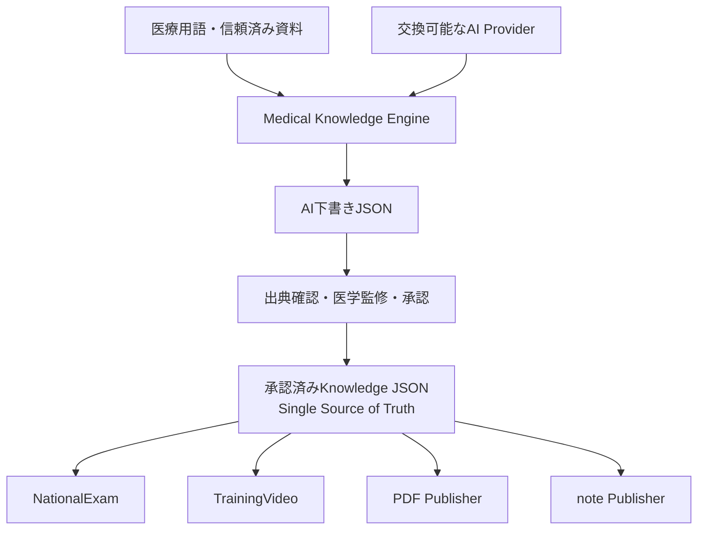
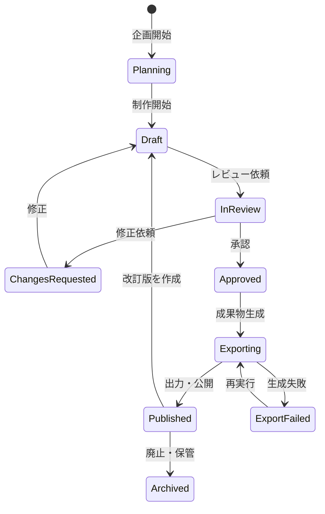
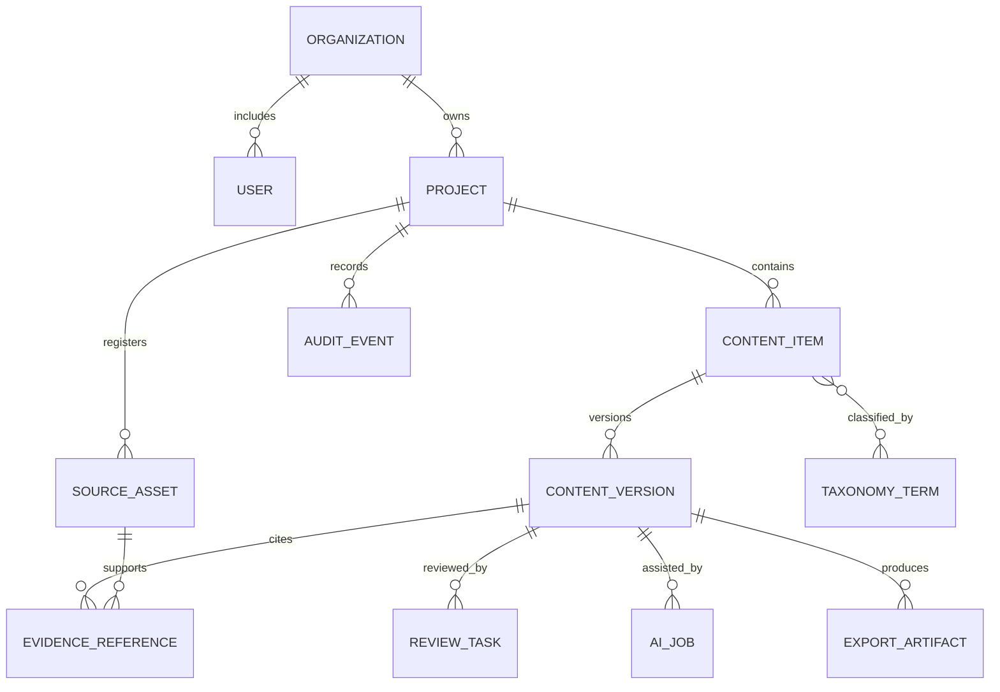

# BLUPRNT Lab

BLUPRNT Lab は、臨床検査技師国家試験を中心とする医療教育コンテンツを、知識生成、医学的レビュー、承認、各媒体への出力まで一貫して管理する**医療教育コンテンツ制作システム**です。

中核は、標準化された医療知識JSONを管理する **Medical Knowledge Engine** です。次のクライアントが同じJSONを利用します。

1. **NationalExam** — 国家試験対策問題・解説
2. **TrainingVideo** — 医療研修動画
3. **PDF Publisher** — A4医療資料
4. **note Publisher** — note向け記事

> **現在の状態**  
> **Phase 5.27「PubMed E-utilities Formal Evidence Provider MVP」を実装しました。** 医療用語または人が選んだDiscovery Candidateを検索HintとしてNCBI公式APIへ再問い合わせし、PubMed Recordを確認できた場合だけ既存Evidence ContractとEvidence Bundleへ変換します。Claim・Knowledge Draft・Registry・Promotion・Approvalは変更しません。詳細は[PubMed Formal Evidence Provider](Docs/pubmed_formal_evidence_provider.md)に記録しています。

---

## 1. プロジェクトの目的

BLUPRNT Lab の目的は、医療教育コンテンツ制作に必要な作業と情報を共通基盤上に集約し、次の状態を実現することです。

- 医学的な正確性と教育的な分かりやすさを両立する
- 原典、引用箇所、監修履歴を追跡可能にする
- AIを制作支援に活用しながら、最終判断は人が行う
- 問題、PDF、動画の間で教材要素を安全に再利用する
- 制作途中の版、レビュー結果、承認済み成果物を明確に分離する
- 個人情報、患者情報、著作権、利用許諾を適切に管理する
- 将来、複数の学校、医療機関、制作チームで利用できる構成にする

### 1.1 対象とする成果物

- 国家試験対策問題、選択肢、解説、学習要点
- 医学・医療分野の講義資料、ハンドアウト、解説PDF
- 医療従事者向け研修動画、講義動画、字幕、補助教材
- 各成果物に付随する出典、レビュー記録、版情報、制作素材

### 1.2 初期段階で対象外とするもの

- 患者の診断、治療方針決定、投薬判断などの診療支援
- AI生成物の無審査での公開
- 出典や権利状態を確認できない資料の自動利用
- 学習管理システム全体の置き換え
- 特定のクラウド、AIモデル、プログラミング言語への早期固定

BLUPRNT Lab は教育コンテンツの**制作・レビュー・出力**を中核とします。受講者への配信、課金、試験実施、LMS機能は、必要性を確認したうえで連携機能または将来機能として設計します。

---

## 2. 設計原則

### 2.1 Source First

コンテンツは、信頼できる原典と結び付けて制作します。AI出力だけを根拠として採用しません。

### 2.2 Human in the Loop

AIは構成案、下書き、要約、分類、チェックを支援します。医学的承認と公開判断は、権限を持つ人が行います。

### 2.3 Content and Presentation Separation

文章、問題、図表、引用、字幕などの内容と、PDFレイアウトや動画画面などの表示形式を分離します。同じ内容を複数の出力形式で再利用できるようにします。

### 2.4 Traceability

原資料、引用箇所、AI処理、編集者、レビュー、承認、出力物を一連の履歴として追跡できるようにします。

### 2.5 Domain Boundaries

Medical Knowledge Engine は知識の生成・検証・版管理を担当します。NationalExam、TrainingVideo、PDF Publisher、note Publisher は、Knowledge JSONを読み取って各媒体へ変換するクライアントです。各クライアントは知識の正本を独自に複製・修正しません。

### 2.6 Privacy and Security by Design

患者情報や個人情報を扱う可能性を前提に、データ分類、最小権限、匿名化、保存期間、外部AI送信可否を設計段階から管理します。

### 2.7 Ten-Year Maintainability

新機能は一時的に動かすことを目的とせず、10年以上の運用、交換、移行、改訂を想定して設計します。外部サービス、AIモデル、保存先、出力方式は交換可能な境界で分離し、API、データ、プロンプト、成果物には版と移行方針を持たせます。

長期運用とは、最初から大規模で複雑な構成にすることではありません。小さく理解できる単位を保ち、必要になった機能だけを追加しながら、将来の変更でデータや利用者を取り残さないことを意味します。

### 2.8 Shared First

NationalExam、TrainingVideo、Medical Knowledge Engine のいずれかで新機能を設計するときは、3システムで共通利用できないかを最初に検討します。共通する意味と責務が安定している場合は、共通ライブラリまたは共通プラットフォームとして提案します。

ただし、見た目が似ているだけの処理や、ドメイン固有の業務ルールを無理に共通化しません。共通化は重複削減だけでなく、責務、版管理、利用側への影響、所有者を説明できる場合に行います。

---

## 3. 利用者と役割

| 役割 | 主な責務 |
|---|---|
| プロジェクト管理者 | 制作プロジェクト、メンバー、期限、公開範囲の管理 |
| コンテンツ制作者 | 問題、PDF原稿、動画台本などの作成・編集 |
| 医療監修者 | 医学的正確性、根拠、表現、安全性の確認 |
| 教育レビュー担当 | 学習目標、難易度、理解しやすさ、評価方法の確認 |
| 権利管理担当 | 著作権、利用許諾、引用条件、素材ライセンスの確認 |
| 制作オペレーター | PDF生成、字幕調整、動画書き出しなどの制作実務 |
| システム管理者 | 組織、権限、セキュリティ、監査、システム設定の管理 |

1人が複数の役割を担当することは可能ですが、重要コンテンツでは「制作者」と「最終承認者」を分けられる権限設計にします。

---

## 4. システム全体像



### 4.1 推奨アーキテクチャ方針

初期段階では、システムを細かいマイクロサービスに分割せず、次の構成を推奨します。

- 1つの統合制作ポータル
- ドメインごとに明確に分割されたバックエンド
- PDF解析、AI生成、動画変換などを実行する非同期ワーカー
- 共通の認証、プロジェクト、原資料、レビュー、監査基盤
- 大容量ファイル向けのオブジェクトストレージ
- メタデータと制作状態を管理するトランザクションデータベース

将来、処理量や運用要件が明確になった時点で、PDF処理、動画処理、AI処理などを独立サービスへ分離できる境界を維持します。

---

## 5. システムの責務

| システム | 主目的 | 主な入力 | 主な出力 |
|---|---|---|---|
| Medical Knowledge Engine | 国家試験向け医療知識の標準化・検証・承認 | 医療用語、信頼済み資料、AI下書き | 版付きKnowledge JSON |
| NationalExam | 国家試験対策コンテンツの企画・制作・監修 | 出題基準、原資料、既存問題、学習目標 | 問題、選択肢、正答、解説、根拠、問題セット |
| TrainingVideo | 医療研修動画の企画・台本・素材・字幕・動画化 | 学習目標、原資料、台本、音声、画像、映像 | 台本、絵コンテ、字幕、動画、補助教材 |
| PDF Publisher | Knowledge JSONをA4資料へ変換 | 承認済みKnowledge JSON、テンプレート | PDF |
| note Publisher | Knowledge JSONを記事へ変換 | 承認済みKnowledge JSON、記事テンプレート | note向け原稿 |

既存の `MedicalPDF/` は初期検証の履歴を残す旧プロトタイプです。今後の知識生成はMedical Knowledge Engineへ、PDF出力はPDF Publisherへ分離します。

### 5.1 NationalExam

#### 目的

国家試験の出題範囲と学習目標に沿った、根拠付きの対策問題と解説を制作します。

#### 主な機能領域

- 試験区分、科目、領域、疾患、難易度による出題設計
- 問題文、選択肢、正答、解説の構造化編集
- 各選択肢が正しい、または誤っている理由の管理
- 原資料と引用箇所の紐付け
- 類似問題、重複問題、表現上の曖昧さの検出
- AIによる問題案、誤答選択肢案、解説案の作成支援
- 医学的レビューと教育的レビュー
- 問題セット、模擬試験、分野別教材への編成
- 将来のQTI、CSV、LMS形式などへの出力

#### 主要な制作単位

- Exam Blueprint：出題方針と構成
- Question Item：問題文、選択肢、正答
- Explanation：正答根拠と学習解説
- Distractor Rationale：誤答選択肢の理由
- Evidence Reference：原典と該当箇所
- Question Set：用途別にまとめた問題群

#### 責務の境界

NationalExam は問題コンテンツの制作と品質保証を担当します。受験者認証、オンライン試験監督、決済、本番試験運営は初期スコープに含めません。

### 5.2 MedicalPDF

#### 目的

医学・医療情報を、学習目的に適した構造、文章、図表、引用を備えたPDF資料として制作します。

#### 主な機能領域

- 制作目的、対象読者、学習目標、ページ数の定義
- 原資料の登録、OCR、テキスト抽出、構造解析
- 章、節、要点、用語、図表、参考文献の編集
- AIによる構成案、要約、本文案、確認項目の作成支援
- 原文ページと編集内容の対応管理
- テンプレートを利用したレイアウト
- 図表、画像、キャプション、代替テキストの管理
- 医学的レビュー、校正、権利確認
- PDF生成前のプリフライトチェック
- 承認済みPDFと制作元データの版管理

#### 主要な制作単位

- Document Brief：目的、対象読者、仕様
- Document Outline：章立てと学習構造
- Content Section：見出し、本文、要点
- Figure / Table：図表、説明、権利情報
- Citation：引用と参考文献
- Layout Template：出力デザイン規則
- PDF Artifact：生成された版付き成果物

#### 責務の境界

MedicalPDF は教育資料の制作とPDF出力を担当します。電子カルテ文書、診療記録、医療機関の法定保存文書を管理するシステムではありません。

### 5.3 TrainingVideo

#### 目的

医療従事者や医療系学習者向けの研修動画を、学習目標から台本、字幕、成果物まで一貫して制作します。

#### 主な機能領域

- 対象者、到達目標、研修時間、配信条件の定義
- 原資料を参照した動画構成と台本の作成
- シーン、ナレーション、画面要素、表示時間の管理
- AIによる構成案、台本案、要約、字幕案の作成支援
- スライド、画像、図表、音声、映像素材の管理
- 音声文字起こし、字幕生成、用語補正
- 医療用語の読み方、表記、略語の統一
- 医学的レビューと映像レビュー
- 動画、字幕、サムネイル、配布資料の出力
- 将来の動画配信基盤やLMSへの受け渡し

#### 主要な制作単位

- Training Brief：研修目的と対象者
- Learning Objective：到達目標
- Script：台本とナレーション
- Storyboard：シーン構成
- Timeline Segment：時間範囲と表示内容
- Caption Track：字幕と話者情報
- Media Asset：画像、音声、映像、BGM
- Video Artifact：生成された版付き成果物

#### 責務の境界

TrainingVideo は動画コンテンツの制作と出力を担当します。ライブ配信、受講者の長期学習履歴、動画配信ネットワーク自体は初期スコープに含めません。

---

## 6. システム間の連携

3システムは直接相手の内部データを変更せず、共通コンテンツモデルと公開済み成果物を通じて連携します。

### 6.1 想定する再利用

- MedicalPDF の承認済み要点を、NationalExam の問題解説に利用する
- MedicalPDF の図表を、権利条件を確認したうえで TrainingVideo に利用する
- TrainingVideo の承認済み台本を、MedicalPDF の配布資料へ展開する
- TrainingVideo の学習目標から、NationalExam の確認問題案を作成する
- NationalExam の頻出テーマを、PDFや動画の制作企画へ反映する

### 6.2 連携ルール

- 再利用元のコンテンツIDと版を記録する
- 下書きではなく、原則として承認済みの版を参照する
- 元コンテンツ更新時に、派生コンテンツへの影響を通知する
- 引用、素材ライセンス、公開範囲の条件を引き継ぐ
- コピーではなく参照を基本とし、変更が必要な場合は派生版として管理する

---

## 7. 共通プラットフォーム

### 7.1 Identity and Access

- ユーザー、組織、チーム、役割の管理
- ロールベースアクセス制御
- プロジェクト単位、コンテンツ単位の権限
- 重要操作に対する再認証や多要素認証の検討

### 7.2 Project Workspace

- 制作案件の目的、担当者、期限、成果物の管理
- 3システムを横断した制作状況の可視化
- コメント、タスク、レビュー依頼の集約

### 7.3 Source and Evidence Registry

- 書籍、論文、ガイドライン、Web資料、既存教材などの登録
- 著者、発行元、発行年、版、URL、識別子の管理
- ページ、段落、表、図、動画時刻などの根拠位置の管理
- 著作権、利用許諾、公開範囲、有効期限の管理
- 原資料の改訂・失効・差し替えの追跡

### 7.4 Content Registry

- コンテンツの共通IDと種類
- 所有者、担当チーム、ステータス
- 版、派生関係、参照関係
- タグ、対象者、難易度、学習目標

### 7.5 Taxonomy

- 医学領域、診療科、臓器、疾患、症候、手技
- 国家試験区分、研修区分、学習レベル
- 医療用語、同義語、略語、表記、読み方
- 将来の標準用語体系とのマッピング

### 7.6 Review and Approval

- 医学、教育、表現、権利、制作品質のレビュー
- 指摘、修正依頼、再レビュー、承認の記録
- 必要なレビュー種別をコンテンツ種類ごとに設定
- 承認後の変更に対する再承認ルール

### 7.7 AI Orchestration

- AIモデルへの統一された接続窓口
- プロンプトとモデル設定の版管理
- 利用可能な原資料とデータ分類に基づく送信制御
- 検索、生成、検証、レビュー依頼のジョブ管理
- 入力、参照根拠、構造化出力、評価結果の記録
- コスト、処理時間、失敗、再実行の管理

### 7.8 Asset and Export Management

- PDF、画像、音声、動画、字幕、テンプレートの保存
- 元素材、中間生成物、承認済み成果物の分離
- 出力設定と再現可能な生成履歴
- ダウンロード、公開、期限付き共有の制御

### 7.9 Audit and Observability

- 閲覧、作成、変更、承認、出力、削除の監査ログ
- AI処理のモデル、プロンプト版、参照資料、実行者の記録
- バッチ処理、外部サービス、エクスポートの状態監視
- 障害調査に必要なログと相関ID

---

## 8. 共通制作ワークフロー



### 8.1 状態の意味

| 状態 | 意味 |
|---|---|
| Planning | 目的、対象者、学習目標、仕様を定義中 |
| Draft | 人またはAIが下書きを制作中 |
| In Review | 承認に必要なレビューを実施中 |
| Changes Requested | 指摘に基づく修正が必要 |
| Approved | 必要な承認が完了し、内容が固定された状態 |
| Exporting | PDFや動画などの成果物を生成中 |
| Published | 配布可能な成果物として確定 |
| Archived | 利用を終了し、履歴として保存 |

AIが作成または大幅に変更したコンテンツにはAI生成フラグを付与し、人によるレビューを通過するまで `Approved` にできないルールを基本とします。

---

## 9. 概念データモデル



### 9.1 共通エンティティ

| エンティティ | 役割 |
|---|---|
| Organization | 学校、医療機関、制作会社などの利用組織 |
| User / Role | 利用者と権限 |
| Project | 制作案件全体 |
| Content Item | 問題、PDF、動画などの論理コンテンツ |
| Content Version | 編集可能な版と公開済み版 |
| Source Asset | 制作根拠となる原資料 |
| Evidence Reference | 原資料中の具体的な引用・根拠位置 |
| Learning Objective | コンテンツが達成すべき学習目標 |
| Taxonomy Term | 医学分類、試験区分、対象者、難易度など |
| Review Task | レビュー依頼、指摘、対応状況 |
| Approval Decision | 誰が何を根拠に承認したか |
| AI Job | AI処理の入力、設定、結果、評価、状態 |
| Export Artifact | PDF、動画、字幕、問題セットなどの成果物 |
| Audit Event | 操作と状態変更の履歴 |

### 9.2 ドメイン固有エンティティ

- NationalExam：Exam Blueprint、Question Item、Choice、Explanation、Question Set
- MedicalPDF：Document Brief、Outline、Section、Figure、Table、Citation、Layout Template
- TrainingVideo：Training Brief、Script、Storyboard、Scene、Timeline Segment、Caption Track、Media Asset

物理データベースの分割方法は実装設計で決定します。ただし、各ドメインが相手の内部テーブルへ直接依存しない構造を維持します。

---

## 10. AI利用方針

### 10.1 AIに許可する役割

- 原資料の分類、構造抽出、要約
- 構成案、問題案、解説案、台本案の作成
- 医療用語と表記の候補提示
- 引用候補、重複、矛盾、抜け漏れの検出
- 字幕作成、章分け、メタデータ付与
- 定義済み品質基準に基づく一次チェック

### 10.2 AIに許可しない役割

- 医学的正確性の最終承認
- 出典不明の事実を確定情報として追加すること
- 利用許諾を確認せず著作物を再利用すること
- 患者情報を許可なく外部モデルへ送信すること
- 承認済みコンテンツを無断で上書きすること
- 人の確認なしに成果物を公開すること

### 10.3 AI処理パイプライン

1. 入力データの形式とデータ分類を確認する
2. 個人情報、患者情報、機密情報を検出する
3. 利用可能な原資料から必要な根拠を検索する
4. 指定された構造で下書きを生成する
5. 必須項目、引用、禁止表現、整合性を機械検証する
6. 生成内容と根拠の対応を記録する
7. 人のレビューへ送る
8. 評価結果をAI設定の改善に利用する

外部資料にはプロンプトインジェクションなどの悪意ある指示が含まれる可能性があるため、資料本文をシステム命令として扱わない設計が必要です。

---

## 11. 医療コンテンツの品質管理

### 11.1 共通品質ゲート

公開前に、少なくとも次の観点を確認します。

- 医学的事実が原典と一致している
- 対象者と学習目標に合っている
- 引用、参考文献、根拠位置が確認できる
- 最新性と原資料の有効期限が確認されている
- 患者情報、個人情報、機密情報が含まれていない
- 著作権、利用許諾、クレジット条件を満たしている
- 誤解を招く断定、差別的表現、危険な省略がない
- AI生成部分が識別され、必要なレビューを受けている
- 変更履歴と承認者が記録されている

### 11.2 NationalExam 品質基準

- 問題文だけで解答に必要な条件が理解できる
- 正答が一意、または複数選択条件が明示されている
- 誤答選択肢が不自然なひっかけになっていない
- 正答と各誤答の理由を説明できる
- 出題基準、難易度、学習目標が設定されている
- 既存問題との不適切な重複や著作権侵害がない

### 11.3 MedicalPDF 品質基準

- 見出し構造、本文、図表、引用が整合している
- ページ参照と参考文献が正しく表示される
- 文字切れ、画像欠落、フォント問題がない
- 読みやすい文字サイズ、配色、余白になっている
- 図表に説明と必要な代替テキストがある
- 配布先を考慮したアクセシビリティ要件を満たす

### 11.4 TrainingVideo 品質基準

- 台本、画面、音声、字幕の内容が一致している
- 医療用語の表記と読み方が正しい
- 字幕の表示時間、改行、可読性が適切である
- 映像・音声素材の権利条件を満たしている
- 画質、音量、ノイズ、フレーム欠落を確認している
- 必要に応じて免責、注意事項、更新日を表示する

---

## 12. セキュリティとデータ保護

### 12.1 データ分類

| 分類 | 例 | 基本方針 |
|---|---|---|
| Public | 公開済み教材、公開ガイドライン | 公開利用可能 |
| Internal | 制作途中の原稿、社内コメント | 認証利用者に限定 |
| Licensed | 購入書籍、許諾済み画像、契約資料 | 契約条件と利用範囲を強制 |
| Sensitive | 個人情報、患者情報、未公開情報 | 原則持込禁止または厳格な隔離・匿名化 |

### 12.2 必須方針

- 保存時と通信時の暗号化
- 最小権限と役割ベースアクセス制御
- 組織およびプロジェクト間のデータ分離
- 重要操作と外部共有の監査記録
- 秘密情報をソースコードや成果物へ含めない
- 外部AIサービスごとの送信可否と学習利用条件の管理
- 保存期間、アーカイブ、削除、法的保留のルール
- 開発、検証、本番環境の分離
- 開発環境への実患者データ持込禁止
- バックアップ、復元、インシデント対応手順の整備

医療機関固有の規程や適用法令は、導入地域、利用組織、扱うデータが確定した段階で個別に評価します。

---

## 13. 非機能要件

### 13.1 信頼性

- 長時間処理は非同期ジョブとして実行する
- 再実行しても重複成果物を不用意に作らない
- ジョブの進捗、失敗理由、再実行履歴を確認できる
- 承認済み版を後続処理から保護する

### 13.2 性能と拡張性

- 大容量PDFと動画をアプリケーションサーバー経由で保持しない
- ファイル処理とAI処理を個別にスケールできるようにする
- 検索対象の増加を想定してインデックスを分離する
- 組織、プロジェクト、ジョブごとの利用量を計測する

### 13.3 可観測性

- リクエストと非同期ジョブを相関IDで追跡する
- エラー率、処理時間、待ち時間、外部API失敗を監視する
- AI利用量、コスト、評価結果を記録する
- 個人情報や原文全文を不要にログへ保存しない

### 13.4 アクセシビリティと国際化

- キーボード操作、配色、見出し構造、代替テキストを考慮する
- 動画には字幕を基本とする
- 日本語を初期言語とし、用語とコンテンツを多言語化できる構造にする
- 日付、時刻、版、引用形式を出力先に合わせられるようにする

具体的な可用性目標、最大ファイルサイズ、処理時間、同時利用者数は、利用規模の確定後に数値化します。

---

## 14. 論理インターフェース

実装方式を固定する前に、次の論理的な境界を定義します。

### 14.1 主なリソース

- Organizations / Users / Roles
- Projects / Tasks
- Sources / Evidence References / Rights
- Content Items / Versions / Relations
- Learning Objectives / Taxonomy Terms
- Reviews / Approvals / Comments
- AI Jobs / Processing Jobs
- Assets / Export Artifacts
- Audit Events

### 14.2 主なドメインイベント

- SourceRegistered
- SourceProcessed
- ContentVersionCreated
- ReviewRequested
- ChangesRequested
- ContentApproved
- ContentSuperseded
- ExportRequested
- ExportCompleted
- ExportFailed
- SourceExpired
- ReferencedContentUpdated

イベント名や通信方式は実装時に決定します。ドメイン間の暗黙的なデータベース依存を避けることが目的です。

---

## 15. 将来のディレクトリ構成

現在の3つのシステムディレクトリをドメイン境界として維持します。以下は設計上の予定であり、現時点でコードや空ディレクトリを追加するものではありません。

```text
BLUPRNT Lab/
├── README.md
├── Docs/
│   ├── Product/
│   ├── Architecture/
│   ├── Security/
│   ├── AIGovernance/
│   └── ADR/
├── NationalExam/
│   ├── Docs/
│   ├── Domain/
│   ├── Application/
│   ├── Interfaces/
│   └── Tests/
├── MedicalPDF/
│   ├── Docs/
│   ├── Domain/
│   ├── Application/
│   ├── Processing/
│   ├── Interfaces/
│   └── Tests/
├── TrainingVideo/
│   ├── Docs/
│   ├── Domain/
│   ├── Application/
│   ├── Processing/
│   ├── Interfaces/
│   └── Tests/
├── Platform/
│   ├── Identity/
│   ├── Projects/
│   ├── ContentRegistry/
│   ├── SourceRegistry/
│   ├── Taxonomy/
│   ├── ReviewWorkflow/
│   ├── AIOrchestration/
│   ├── AssetManagement/
│   └── Audit/
├── Apps/
│   ├── CreatorPortal/
│   └── AdminConsole/
├── Packages/
│   ├── DomainModels/
│   ├── APIContracts/
│   └── SharedUI/
├── Infrastructure/
│   ├── Environments/
│   ├── Database/
│   ├── Storage/
│   ├── Observability/
│   └── Security/
├── Assets/
└── Templates/
```

実装開始前に、ディレクトリ名の大文字・小文字、採用言語の慣例、ビルドツールに合わせて命名規則を確定します。

---

## 16. 環境設計

| 環境 | 目的 | データ方針 |
|---|---|---|
| Local | 開発者のローカル設計・実装・テスト | 合成データのみ |
| Development | チーム統合と自動テスト | 合成または匿名化されたテストデータ |
| Staging | 本番相当のレビューと受入確認 | 制限された検証用データ |
| Production | 実運用 | 承認済みの実データ |

設定値と秘密情報は環境から分離し、リポジトリへ保存しません。外部AI、ストレージ、変換サービスも環境ごとに資格情報とデータ領域を分離します。

---

## 17. 開発ロードマップ

### Phase 0 — 要件とガバナンス

- 利用組織、利用者、制作体制の確定
- 対象コンテンツと対象外範囲の確定
- データ分類、権利管理、AI利用方針の承認
- 用語集、品質基準、レビュー責任者の定義
- 技術選定を記録するADR運用の開始

### Phase 1 — 共通制作基盤

- 認証、組織、プロジェクト、権限の設計
- 原資料、根拠、版、レビュー、承認モデルの設計
- 共通コンテンツモデルと監査モデルの確定
- AI評価用の基準データと評価方法の策定

### Phase 2 — MedicalPDF MVP

- 原資料から根拠付き教育文書を制作する流れを確立
- 引用、レビュー、PDF出力、版管理を検証
- 共通コンテンツ基盤の実用性を確認

### Phase 3 — NationalExam MVP

- 出題設計、問題編集、解説、根拠、レビューを構築
- MedicalPDFとのコンテンツ再利用を検証
- 問題品質評価を運用可能にする

### Phase 4 — TrainingVideo MVP

- 台本、絵コンテ、素材、字幕、動画出力を構築
- PDF、問題との横断利用を検証
- 大容量非同期処理と映像品質管理を確立

### Phase 5 — 統合と運用高度化

- 横断検索、派生関係、更新影響通知
- LMSや配信先への出力連携
- 品質指標、コスト、処理性能の継続改善
- 組織ごとの設定と運用管理の強化

ロードマップの順序は、最初に制作する実案件と事業優先度に応じて見直します。

---

## 18. 実装前に決定する事項

次の項目は、このREADMEでは固定しません。比較検討後、`Docs/ADR/` に意思決定記録を残します。

- フロントエンドとバックエンドの言語・フレームワーク
- モジュール構成とデプロイ単位
- トランザクションデータベース
- 全文検索・ベクトル検索基盤
- オブジェクトストレージと配信方式
- PDF解析、OCR、PDF生成方式
- 動画変換、字幕、音声処理方式
- AIモデル提供者、モデル選択、切替方針
- クラウドまたはオンプレミス構成
- 組織分離方式と認証方式
- QTI、SCORM、xAPIなど外部教育規格への対応
- バックアップ、保存期間、削除、災害復旧目標
- 想定ユーザー数、ファイル容量、性能目標、予算上限

---

## 19. 完了の定義

コンテンツが「完成」と判断されるためには、少なくとも次の条件を満たす必要があります。

- 学習目的と対象者が明記されている
- 必要な原典と根拠位置が登録されている
- 医学的レビューが完了している
- 教育、表現、権利、制作品質の必要な確認が完了している
- AI生成箇所を含め、責任者が内容を確認している
- 承認対象の版が固定されている
- 成果物の生成チェックに成功している
- 承認者、生成条件、成果物、公開範囲が記録されている
- 将来の改訂に必要な制作元データが保存されている

---

## 20. 用語

| 用語 | 定義 |
|---|---|
| 原資料 | コンテンツ制作の情報源となる文書、書籍、論文、画像、動画など |
| 根拠 | 制作内容を支持する原資料中の具体的な箇所 |
| コンテンツ | 問題、文章、図表、台本、字幕などの教育情報 |
| 成果物 | PDF、動画、問題セットなど、配布可能な形式へ出力されたもの |
| 版 | 特定時点の編集内容を固定し、識別可能にしたもの |
| 派生コンテンツ | 別のコンテンツをもとに制作されたコンテンツ |
| 医学的レビュー | 医学的正確性、最新性、安全性、根拠を確認する工程 |
| 教育的レビュー | 学習目標、難易度、構成、評価方法を確認する工程 |
| AIジョブ | AIを利用した1回の処理と、その入力、設定、出力、評価の記録 |
| ADR | Architecture Decision Record。重要な技術判断と理由を残す文書 |

---

## 21. このREADMEの扱い

このREADMEは、BLUPRNT Lab 全体の目的と設計原則を示す最上位文書です。

- 詳細要件は各システムの `Docs/` に記載する
- 共通仕様は `Docs/Architecture/` に記載する
- セキュリティとAIガバナンスは専用文書として管理する
- 重要な技術判断はADRとして記録する
- 実装が本設計と異なる場合は、実装だけを変更せず文書も更新する

本プロジェクトでは、医学的正確性、出典追跡、人による承認、データ保護を、開発速度より優先します。
